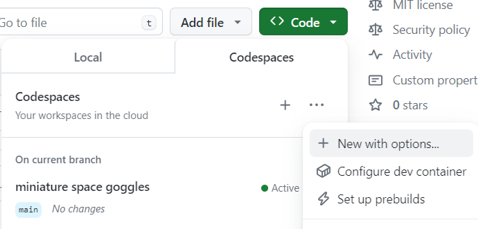

# Lab 1.1 Pre-Flight Checklist: Setting Up GitHub Copilot and your repository
Compare this to "Preparing Your Travel Itinerary, Checking Passport, Printing Boarding Pass". Just as travelers plan their journey, participants will set up their GitHub repository, planning their coding journey. In this Hands-On Lab, you will learn how to navigate GitHub, create a new issue and obtain your own GitHub repo with the code for these hands-on labs. You will be working on your own repo in the following labs.

## Estimated time to complete
- 15 min

## Objectives
- Getting familiar with GitHub Codespace 
- Set up a Codespace for your repository with specific extensions and configurations. 

You can then use this codespace to work on the exercises in the next Labs. 🔨

## Steps

### Step 1: 💻 Create a codespace in your repository

First we are going to create a plain vanilla Codespace that you can use to get familiar. The base image that is used to create a Codespace.

Each Codespace you create is hosted by GitHub in a Docker container, running on a virtual machine. You can choose from a selection of virtual machine types, from 2 cores, 8 GB RAM, and 32 GB storage, up to 32 cores, 64 GB RAM, and 128 GB storage.

By default, Codespaces are created from an Ubuntu Linux image that includes a selection of popular languages and tools, but you can use an image based on a Linux distribution of your choice and configure it for your particular requirements.

- Navigate to your own repository on the URL https://github.com/Microsoft-Bootcamp/attendee-copilot-[yourhandle].


- Locate the `Code` tab near the top menu.
- Click the green `Code` button, then click on `Codespaces`, click the "..." and choose `"New with options"`.

- Keep the defaults, but change the machine type to `4-core` and click `Create Codespace`.



Your Codespace is being created. After a few minutes, you will be able to see your Codespace in the browser.

### Step 2: ✅ Verify Extension Installation
Let's make sure that the extensions we added, are indeed added. When you add extensions to the configuration file, this is noted as Infrastructure as Code. To check this follow these steps.

In the files section of your Codespace, navigate to the `.devcontainer` folder and open the `devcontainer.json` file. Check under the "extensions" section to ensure that the extensions are added.

Add the IDs of extensions you want installed when the container is created.

```json
	"extensions": [
		"ms-dotnettools.csharp",
		"ms-vscode.powershell",
		"humao.rest-client",
		"GitHub.copilot",
		"GitHub.copilot-chat",
		"github.vscode-github-actions"
	]
```

#### Rest Client Extension
This is a very useful extension to quickly execute HTTP requests in your IDE and have all HTTP requests in source control.

You can find the http calls in the `WrightBrothersApi/Examples` folder:

- `Flights.http`
- `Planes.http`
- `Healthcheck.http`

Execute requests as follows:

### Step 3: Verify Functionality

- Verify Copilot functionality. Say Hello to Copilot in Copilot Chat extension
- Verify an autocompletion by typing code
- From the command line, go to the application folder: `cd ./WrightBrothersApi/WrightBrothersApi/`
- Startup the application with `dotnet run` and verify the application is running
- Call to API using the REST examples
- Run existing unit tests with `dotnet test`

### Congratulations you've made it to the end! &#9992;
#### And with that, you've now concluded this module. We hope you enjoyed it! &#x1F60A;