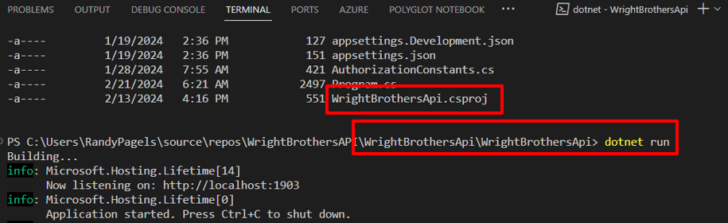
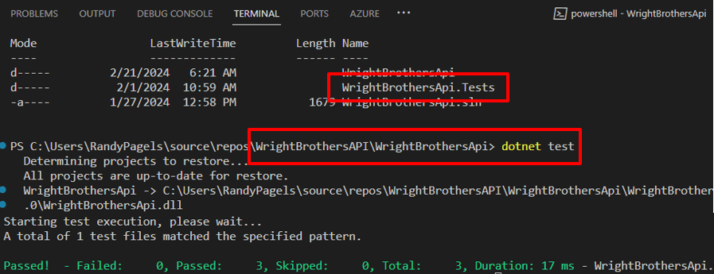

# Lab 1.1 Pre-Flight Checklist: Setting Up GitHub Copilot and your repository
Compare this to "Preparing Your Travel Itinerary, Checking Passport, Printing Boarding Pass". Just as travelers plan their journey, participants will set up their GitHub repository, planning their coding journey. In this Hands-On Lab, you will learn how to navigate GitHub, create a new issue and obtain your own GitHub repo with the code for these hands-on labs. You will be working on your own repo in the following labs.

## Estimated time to complete
- 10 min

## Objectives
- Getting familiar with GitHub Codespace 
- Set up a Codespace for your repository with specific extensions and configurations. 

You can then use this codespace to work on the exercises in the Hands on Labs. 🔨

### Step 1: What is a codespace?
GitHub Codespaces is a feature that allows you to code directly in the browser. It is a cloud-hosted development environment that you can access from anywhere. It is a fully featured development environment that can be used to develop, build, and debug your applications. It is based on Visual Studio Code, so you get all the features of Visual Studio Code, including extensions, IntelliSense, and debugging.

- GitHub hosts each Codespace in a Docker container on a virtual machine, with options ranging from 2 to 32 cores, 8 to 64 GB RAM, and 32 to 128 GB storage. Codespaces default to an Ubuntu Linux image with common languages and tools, but you can customize this with any Linux distribution to meet your specific needs.

### Step 2: 💻 Create a codespace in your repository

- First, we are going to create a plain vanilla Codespace that you will use throughout this bootcamp.

- Navigate to your own repository on the URL `https://github.com/one-thd/Copilot-Bootcamp-`**YourLDAP_thdgit**.

~~- Navigate to your own repository on the URL https://github.com/Microsoft-Bootcamp/attendee-copilot-[yourhandle].~~

- Locate the `Code` tab near the top menu.
- Click the green `Code` button, then click on `Codespaces`, click the "..." and choose `"New with options"`.

- Keep the defaults, but change the machine type to `4-core` and click `Create Codespace`.


Your Codespace is being created. After a few minutes, you will be able to see your Codespace in the browser.

### Step 3: 💻 (Optional) Local setup up Visual Studio Code
Ensure the following for a smooth GitHub Copilot experience in Visual Studio Code:

- [Install Visual Studio Code](https://code.visualstudio.com/)
- [Sign up for a GitHub account](https://github.com/) (if you don't already have one)
- Install GitHub Copilot extensions from the [VS Code Marketplace](https://marketplace.visualstudio.com/):
  - GitHub Copilot v1.143.0 or higher
  - GitHub Copilot Chat v0.12.2023120701 or higher
- Sign in to GitHub within VS Code to enable Copilot features
- Clone the repository to your local machine OR download and unzip the file `Copilot-Bootcamp-main.zip`. 

- If you are cloning the repository, you can do this by running the following command in your terminal:

    ```bash
    git clone https://github.com/XpiritBV/Copilot-Bootcamp.git
    ```

- Open a terminal or command prompt
- Navigate to the folder where you unzipped the file `cd Copilot-Bootcamp-main`
- Open the repository in VS Code
    - navigate to the folder where you cloned the repository `cd Copilot-Bootcamp`
- Maintain a stable internet connection (Copilot relies on cloud-based services)
- Install additional VS Code extensions as needed for your project (languages, frameworks, tools not covered by Copilot)

### Step 4: Verify Functionality

#### Verify Copilot functionality
- Verify Copilot functionality by saying hello.
- Open the Copilot Chat window by clicking on the Copilot icon in the left-hand side of the screen.
- Type `Hello` in the chat window and press `Enter` to see the response from Copilot.

#### Verify the application runs
- Startup the application and verify the application is running.
- From the terminal window, navigate to the application folder: `cd ./WrightBrothersApi/WrightBrothersApi/`
- Run the application by typing the following command in the terminal:

    ```sh
    dotnet run
    ```

>[!Note]
> If you encounter an error message like `Project file does not exist.` or `Couldn't find a project to run.`, it's likely that you're executing the command from an incorrect directory. To resolve this, navigate to the correct directory using the command `cd ./WrightBrothersApi`. If you need to move one level up in the directory structure, use the command `cd ..`. The corrcect directory is the one that contains the `WrightBrothersApi.csproj` file.




#### Verify calling the REST API
#### Rest Client Extension
The REST API client extension is very useful to quickly execute HTTP requests in your IDE and have all HTTP requests in source control.

- Open the `Examples/Flights.http` file, click `Send Request` to execute the `takeFlight` request.

	```
	POST http://localhost:1903/flights/1/takeFlight/75 HTTP/1.1
	content-type: application/json
	```

- You will see that the flight is taking off and the response is `200 OK`.

- Response will be:

    ```json
    HTTP/1.1 200 OK
    Connection: close
    ```
- Stop the application by pressing `Ctrl+C` in the terminal window.

#### Verify the unit tests

- Open the terminal and run the tests with the provided command.
- From the terminal window, navigate to the root folder: `cd ./WrightBrothersApi/`, this is the folder that contains the `WrightBrothersApi.Tests` folder.

    ```sh
    dotnet test WrightBrothersApi.Tests/WrightBrothersApi.Tests.csproj
    ```
- Run existing unit tests with `dotnet test`

>[!Note]
> If you encounter an error message like `Project file does not exist.` or `Couldn't find a project to run.`, it's likely that you're executing the command from an incorrect directory. To resolve this, navigate to the correct directory using the command `cd ./WrightBrothersApi`. If you need to move one level up in the directory structure, use the command `cd ..`. The correct directory is the one that contains the `WrightBrothersApi.Tests` folder.



- The tests should run and pass.

    ```sh
    Starting test execution, please wait...
    A total of 1 test files matched the specified pattern.
    Passed!  - Failed:  0, Passed:  3, Skipped:  0, Total:  3
    ```

### Congratulations you've made it to the end! &#9992;
#### And with that, you've now concluded this module. We hope you enjoyed it! &#x1F60A;