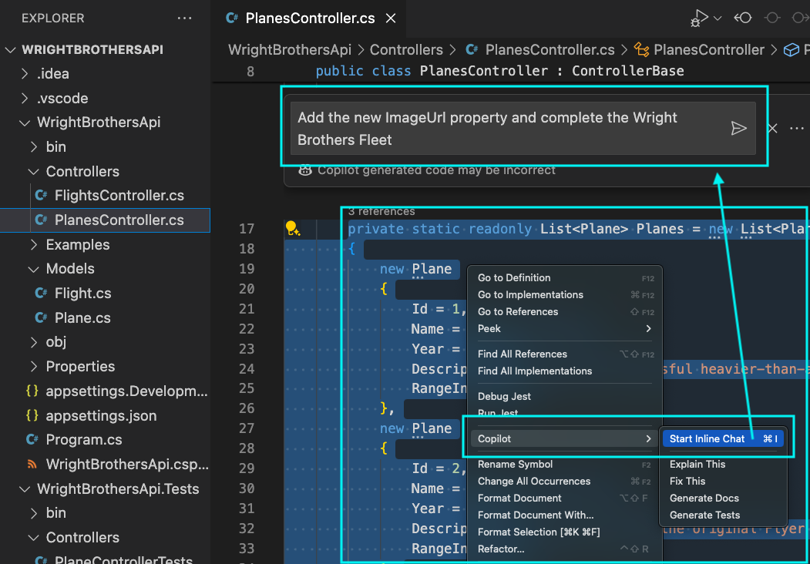

# Lab 2.1 - Flight demonstration: Basic Coding with Copilot Assistance

This module demonstrates how to utilize GitHub Copilot's Chat Extension and its agents (@workspace, @terminal, @vscode) to understand and navigate a codebase, implement REST API methods, generate code from comments, and maintain coding style consistency, culminating in a comprehensive, productivity-enhancing coding experience.

## Prerequisites
- The prerequisites steps must be completed, see [Labs Prerequisites](../Lab%201.1%20-%20Pre-Flight%20Checklist/README.md)

## Estimated time to complete

- 30 minutes, times may vary with optional labs.

## Objectives

- Introduction to GitHub Copilot Chat and its agents for code completion and style adaptation.

    - Step 1 - Plane Inspection - Explain the Codebase with GitHub Copilot Chat
    - Step 2 - Airplane Docking - Add new Flight Model
    - Step 3 - Test Flight - Autocompletion and Suggestions
    - Step 4 - Flight Plan - Code Completion and Style Adaptation
    - Step 5 - Flight Control - Code Navigation and Documentation
    - Step 6 - Visualize the Wright Brothers Fleet

> [!IMPORTANT]  
> Please note that Copilot's responses are generated based on a mix of curated data, algorithms, and machine learning models, which means they may not always be accurate or reflect the most current information available. Users are advised to verify Copilot's outputs with trusted sources before making decisions based on them.

### Step 1: Plane Inspection - Explain the Codebase with GitHub Copilot Chat

- Open GitHub Copilot Chat

- Type the following in the chat window:

Compare the difference between asking the two following things:

GitHub Copilot has the concept of Agents. `@workspace` is an agent that is specialized in answering questions about the currently open workspace.

Compare the difference between asking the two following things:

1) Without @workspace:

```
explain the WrightBrothers API?
```

2) With @workspace:

```
@workspace /explain what is the WrightBrothers API?
```

> [!NOTE]  
> @workspace /explain makes GitHub Copilot analyze your project's code instead of guessing. It scans your VS Code workspace (folder/project), checks relevant files based on names and content, and sends matching parts as extra context. You can review the referenced files in the "Used x references" section in the Chat interface.

> [!IMPORTANT]  
> When asking follow-up questions, the @agent needs to be provided again. For example, if you ask `@workspace` a question and then ask another question, you need to type `@workspace` again.

- There are two other Agents `@terminal` and `@vscode`. They are used to help navigate the terminal and VS Code settings respectively.

- Try `@terminal` agent by typing the following in the chat window:

    ```md
    @terminal how do I run the application?
    ```

- GitHub Copilot might tell you a simple command or that it needs more information `dotnet run`

> [!NOTE]
> `@terminal` agent is used to help navigate the terminal and does not have the context of the codebase. It is used to answer generic questions about how to do things in the terminal.

- Try `@terminal` again by typing the following in the chat window:

```md
@terminal how do I run the backend API application during development?
```

- This is a generic question about running a application in the terminal. Copilot will give a suggestion to run the application in the terminal.

    `To run a .NET application, you can use the dotnet run command in the terminal. This command will build and run the application in the terminal.`

- It will give a suggestion to run the application in the terminal.

- Next, try `@vscode` agent by typing the following in the chat window:

```md
@vscode how to install extensions?
```

- It will provide a corresponding setting or an action button to install extensions.

> [!IMPORTANT]
> The `@vscode` agent does not work in GitHub Codespaces. You will receive a `Bad Request` error message.

### Step 2: Airplane Docking - Add new Flight Model

- Open GitHub Copilot Chat, click `+` to clear prompt history.

- Ask Copilot to explain the `PlanesController.cs` class

    ```
    @workspace what does the PlanesController do?
    ```

> [!NOTE]
> GitHub Copilot will give a brief overview of the `PlanesController.cs` class.

- Now that we know what the `PlanesController` does, let's enhance the REST API.

- Open `WrightBrothersApi` folder located in the `WrightBrothersApi` folder.

- Open the `Controllers/PlanesController.cs` file.

```csharp
public class PlanesController : ControllerBase
{
    /* Rest of the methods */

    private static readonly List<Plane> Planes = new List<Plane>
    {
        // Other planes
        new Plane
        {
            Id = 3,
            Name = "Wright Model A",
            Year = 1908,
            Description = "The first commercially successful airplane.",
            RangeInKm = 40
        } <---- Place your cursor here
    };
}
```

- Let's add a new plane to the list by placing your cursor at the end of the `Planes` list, after the `}` of `Plane` with `Id = 3`, type a `,` then press `Enter`.

- GitHub Copilot will automatically suggest a `new Plane`.

> [!NOTE]
> GitHub Copilot will suggest a new `Plane` object with the next available `Id`. Also notice how Copilot understood that the next Plane is the Wright Model B and it automatically suggested the `Name`, `Year`, `Description`, and `RangeInKm` properties. The underlying LLM also learned from Wikipedia and other sources to understand the history of the Wright Brothers.

- Accept the suggestion by pressing `Tab` to accept this suggestion.

### Step 3: Test Flight - Autocompletion and Suggestions

- Place your cursor at the end of the `HttpPost` method, after the `}` , press `Enter` twice.

```csharp
public class PlanesController : ControllerBase
{
    /* Rest of the methods */

    [HttpPost("setup")]
    public ActionResult SetupPlanesData(List<Plane> planes)
    {
        // Method body
    }

    <---- Place your cursor here

    /* Rest of the methods */

}
```

- GitHub Copilot will automatically suggest the `[HttpPut]` method.

- Accept the suggestion by pressing `Tab` to accept this attribute, then press `Enter`.

- Next, Copilot will automatically suggest the method for the `[HttpPut]` attribute, press `Tab` to accept.

    ```csharp
    // * Suggested by Copilot
    [HttpPut("{id}")]
    public ActionResult Put(int id, Plane plane)
    {
        if (id != plane.Id)
        {
            return BadRequest();
        }

        var existingPlane = Planes.Find(p => p.Id == id);

        if (existingPlane == null)
        {
            return NotFound();
        }

        existingPlane.Name = plane.Name;
        existingPlane.Year = plane.Year;
        existingPlane.Description = plane.Description;
        existingPlane.RangeInKm = plane.RangeInKm;

        return NoContent();
    }
    // * Suggested by Copilot
    ```

> [!WARNING]  
> Copilot is powered by AI, so mistakes are possible.  Try opening the GitHub Copilot Suggestions window by pressing `Ctrl+Enter`. This view will show up to 10 suggestions for you to choose from.

> [!NOTE]
> The reason GitHub Copilot suggests the `[HttpPut]` method is because it understand that the `PlanesController.cs` class is a REST API controller and that the `[HttpPut]` is currently missing. The `[HttpPut]` method is the next logical step in the REST API for updating a resource.

- Let's do it again, place your cursor at the end of the `Put()` method, after the `}`, press `Enter` twice.

- Accept the suggestion by pressing `Tab` to accept this attribute, then press `Enter`.

- Next, Copilot will automatically suggest the method for the `[HttpDelete]` attribute, press `Tab` to accept.

    ```csharp
    // * Suggested by Copilot
    [HttpDelete("{id}")]
    public ActionResult Delete(int id)
    {
        var plane = Planes.Find(p => p.Id == id);

        if (plane == null)
        {
            return NotFound();
        }

        Planes.Remove(plane);

        return NoContent();
    }
    // * Suggested by Copilot
    ```

- Let's do it again, place your cursor at the end of the `Delete()` method, after the `}`, press `Enter` twice.

- Type `[HttpGet("count/{count}")]`, then press `Tab` to accept this attribute, then press `Enter`.

    ```csharp
    [HttpGet("count/{count}")]
    ```

- Next, Copilot will automatically suggest the method for the `[GetByCount]` attribute, press `Tab` to accept.

    ```csharp
    public ActionResult<List<Plane>> GetByCount(int count)
    {
        var planes = Planes.Take(count).ToList();

        return Ok(planes);
    }
    ```

### Step 4: Test Flight Accelerate - Comments to Code

- After the `SetupPlanesData()` method, put your cursor after the last `}`.
place your cursor at the end of the `SetupPlanesData()` method, after the `}`, press `Enter` twice.

- Press `Ctrl + I` and type `Create a method called SearchByName to search planes by name` in the text block, press `Enter`.

```
Create a method called SearchByName to search planes by name.
```

    ```csharp
    public class PlanesController : ControllerBase
    {
        /* Rest of the methods */

        [HttpPost("setup")]
        public ActionResult SetupPlanesData(List<Plane> planes)
        {
            // Method body
        }

        <---- Place your cursor here

    }
    ```

> [!NOTE]
> Using Ctrl + I (Inline Copilot): This explicitly tells Copilot that you want an immediate suggestion for your comment as a function. Copilot treats it as a structured request and generates a more relevant, formatted response.

- GitHub Copilot will automatically suggest the `[HttpGet("search")]` method.

- Accept the suggestion by pressing `Tab` to accept this attribute.

- Press `Enter`, Copilot will now automically suggest the code for this method, press `Tab` to accept.

    ```csharp
    // Search planes by name
    // * Suggested by Copilot
    [HttpGet("search")]
    public ActionResult<List<Plane>> SearchByName([FromQuery] string name)
    {
        var planes = Planes.FindAll(p => p.Name.Contains(name));

        if (planes == null)
        {
            return NotFound();
        }

        return Ok(planes);
    }
    // * Suggested by Copilot
    ```

> [!NOTE]
> The reason GitHub Copilot suggests the `[HttpGet("search")]` method is because it understands that the comment is a description of the method. It also understands that the method is a GET method and that it has a parameter `name` of type `string`.

- Place your cursor before the `if(plane == null)` line, after the `{` of the `Post(Plane plane)` method, press `Enter` twice.

- Type `// Return BadRequest if plane already exists by name` in the comment block. Before the `if(plane == null)` of this method, press `Enter`.

    ```csharp
    // Return BadRequest if plane already exists by name
    ```

    ```csharp
            [HttpPost]
        public ActionResult<Plane> Post(Plane plane)
        {
            <---- Place your cursor here

            if(plane == null)
            {
                return BadRequest();
            }

            Planes.Add(plane);

            return CreatedAtAction(nameof(GetById), new { id = plane.Id }, plane);
        }
    ```

- Copilot will automatically suggest the `if` statement and return `BadRequest` if the plane already exists by name.

    ```csharp
        [HttpPost]
        public ActionResult<Plane> Post(Plane plane)
        {

            // Return BadRequest if plane already exists by name
            if (Planes.Any(p => p.Name == plane.Name))
            {
                return BadRequest();
            }
            
            if(plane == null)
            {
                return BadRequest();
            }

            Planes.Add(plane);

            return CreatedAtAction(nameof(GetById), new { id = plane.Id }, plane);
        }   
    ```

> [!NOTE]
> Typing the comment directly in editor. Copilot passively suggests completions based on the comment, but it won't necessarily recognize that you're specifically requesting inline generation.

### Step 5: Testing your flying style - Logging - Consistency

Let's present a code completion task for adding a logger with specific syntax (e.g., `_logger`). Use this to explain how Copilot adapts to and replicates your coding style.

- Go to the `GetAll` method and inspect the method. Notice the syntax of `✈✈✈ NO PARAMS ✈✈✈`. This is a custom syntax that is used in this codebase to log parameters of a method.

    ```csharp
    public class PlanesController : ControllerBase
    {
        /* Rest of the methods */

        [HttpGet]
        public ActionResult<List<Plane>> GetAll()
        {
            _logger.LogInformation("GET all ✈✈✈ NO PARAMS ✈✈✈");

            return Planes;
        }

    }
    ```

- Go to the `GetById` method and let's add a logging statement with the same syntax.

- Type `_log` and notice the suggestion that GitHub Copilot gives:

    ```csharp
    public class PlanesController : ControllerBase
    {
        /* Rest of the methods */

        [HttpGet("{id}")]
        public ActionResult<Plane> GetById(int id)
        {
            <---- Place your cursor here

            // Method body
        }
    }
    ```

- Accept the suggestion by pressing `Tab` to accept this attribute.

- GitHub Copilot will automatically suggest the `LogInformation` method with the custom syntax.

    ```csharp
    [HttpGet("{id}")]
    public ActionResult<Plane> GetById(int id)
    {
        _logger.LogInformation("GET by ID ✈✈✈ ID: {id} ✈✈✈", id);

        // Method body
    }
    ```

> [!NOTE]
> Copilot learns from the codebase and adapts to the coding style. In this case, it replicates the custom syntax used for logging. This example demonstrates it for logging in particular, but the same applies to other coding styles used in the codebase.

- Now repeat the same steps for the other methods in the `PlanesController.cs` class.

    ```csharp
    [HttpPost]
    public ActionResult<Plane> Post(Plane plane)
    {
        _logger.LogInformation($"POST ✈✈✈ {plane.Id} ✈✈✈");

        // Method body
    }
    ```

- If you have finished step 3, you can then add the logging for the Put and Delete methods as well.

- Go to the `Put` method and let's add a logging statement with the same syntax.

    ```csharp
    [HttpPut("{id}")]
    public IActionResult Put(int id, Plane plane)
    {
        _log <---- Place your cursor here

        // Method body
    }
    ```

- Accept the suggestion by pressing `Tab` to accept this attribute.

- GitHub Copilot will automatically suggest the `LogInformation` method with the custom syntax.

    ```csharp
    [HttpPut("{id}")]
    public IActionResult Put(int id, Plane plane)
    {
        _logger.LogInformation("PUT ✈✈✈ ID: {id} ✈✈✈", id);

        // Method body
    }
    ```

- Go to the `Delete` method and let's add a logging statement with the same syntax.

    ```csharp
    [HttpDelete("{id}")]
    public IActionResult Delete(int id)
    {
        _log <---- Place your cursor here

        // Method body
    }
    ```

- Accept the suggestion by pressing `Tab` to accept this attribute.

- GitHub Copilot will automatically suggest the `LogInformation` method with the custom syntax.

    ```csharp
    [HttpDelete("{id}")]
    public IActionResult Delete(int id)
    {
        _logger.LogInformation("DELETE ✈✈✈ ID: {id} ✈✈✈", id);

        // Method body
    }
    ```

### Step 6: - Visualize the Wright Brothers Fleet

- Open the `Plane.cs` file located in the `Models` folder.

- Add a `ImageUrl` property to the model.

- Type `public string ImageUrl { get; set; }` in the `Plane.cs` file.

```csharp
public string ImageUrl { get; set; }
```

```csharp
public class Plane
{
    public int Id { get; set; }
    public string Name { get; set; }
    public int Year { get; set; }
    public string Description { get; set; }
    public int RangeInKm { get; set; }

    // New property
    public string ImageUrl { get; set; }
}
```

- In the `Controllers/PlanesController.cs` file, select all content of the `Planes` List.

- Right click and select the option `Copilot` -> `Editor inline Chat`.

- Type the following command

    ```
    Add the new ImageUrl property to each plane and add the next 2 additional planes to complete the Wright Brothers Fleet.
    ```



- Accept the suggestion by selecting `Accept` or pressing `Enter`.

> [!NOTE]
> GitHub Copilot goes beyond simple edits—it multitasks efficiently. In one step, it added the new property to each plane, updated the list with the next Wright Brothers aircraft, and even referenced Wikipedia for historical accuracy.

- Pressing Ctrl + I activates `Editor inline Chat`, allowing it to analyze your workspace, detect related files (like models), and ensure seamless property updates across your project. 


### Congratulations you've made it to the end! &#9992; &#9992; &#9992;

#### And with that, you've now concluded this module. We hope you enjoyed it! &#x1F60A;
