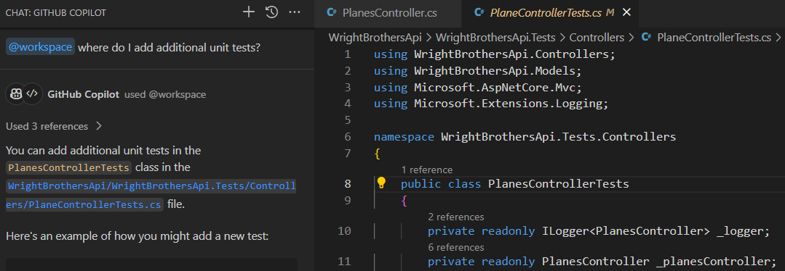
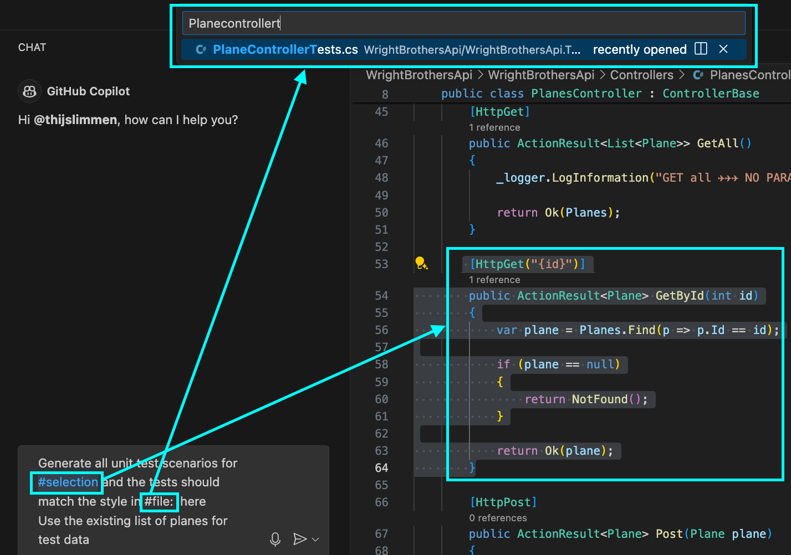

# Lab 2.2 - Taking Off with Code: Clearing the Runway

This lab exercise guides participants through coding exercises using GitHub Copilot to understand its suggestions and capabilities. It involves running and adding unit tests, with an emphasis on pair programming. The lab is structured in steps, starting with executing existing unit tests, followed by enhancing test coverage, and addressing specific functionalities like case sensitivity and trimming in search methods.

## Prerequisites
- The prerequisites steps must be completed, see [Labs Prerequisites](../Lab%201.1%20-%20Pre-Flight%20Checklist/README.md)

## Estimated time to complete

- 20 minutes.

## Objectives

- Simple coding exercises using GitHub Copilot, focusing on understanding its suggestions and capabilities.
- Pair programming: One 'pilot' codes, the other guides using Copilot's suggestions.

    - Step 1 - Taxying to the Runway - Run existing unit tests
    - Step 2 - Pre-takeoff Pilot Checks - Completing Unit Tests
    - Step 3 - Takeoff - Adding Unit Tests for Case Sensitivity
    - Step 4 - Ascending to the Clouds: Creating the AirfieldController from thin air (Optional)
    - Step 5 - Landing: Refactoring the AirfieldController (Optional)

### Step 1: Taxying to the Runway - Run existing unit tests

- Open GitHub Copilot Chat, click `+` to clear prompt history.

- Type the following in the chat window:

    ```sh
    @workspace how do I run the unit tests?
    ```

- Copilot will give a suggestion to run the unit tests in the terminal.

    ```sh
    dotnet test WrightBrothersApi/WrightBrothersApi.Tests/WrightBrothersApi.Tests.csproj
    ```

- Let's run the unit tests in the terminal to make sure everything is working as expected.

- From the Copilot Chat window, select one of the two options:

  1. Click the ellipses, `...`, select `Insert into Terminal`.

  1. If there isn't a terminal open, click the `Open in Terminal` button.

  1. Click copy button, then, open a new Terminal window by pressing **Ctrl+`** (Control and backtick), paste into Terminal window.

- Open the terminal and run the tests with the provided command.

    ```sh
    dotnet test WrightBrothersApi/WrightBrothersApi.Tests/WrightBrothersApi.Tests.csproj
    ```

> [!NOTE]
> If you get an error resembling this: `MSBUILD : error MSB1009: Project file does not exist.`, then you are most likely running this command from the wrong folder. Change into the correct directory with `cd ./WrightBrothersApi` or with `cd ..` to go one folder level upwards.

- The tests should run and many will pass.

    ```sh
    Starting test execution, please wait...
    A total of 1 test files matched the specified pattern.
    Test summary: total: 1, failed: 0, succeeded: 1, skipped: 0
    ```

### Step 2: Pre-takeoff Pilot Checks - Completing Unit Tests

- Open GitHub Copilot Chat, click `+` to clear prompt history.

- Type the following in the chat window:

    ```sh
    @workspace where do I add additional unit tests?
    ```

- Copilot will give a suggestion to add unit tests to the `Controllers/PlaneControllerTests.cs` file in the `WrightBrothersApi.Tests` project.

- You can add additional unit tests in the `PlaneControllerTests` class in the `WrightBrothersApi.Tests/Controllers/PlaneControllerTests.cs` file.

- Open the `PlaneController.cs` file.

- Select all the code for the `GetById` method.


- Next, open Copilot Chat and Copy/Paste the following

    ```md
    Generate all unit test scenarios for this method using the existing list of planes for test data.
    ```




- Press `Enter`, GitHub Copilot will automatically suggest the `[Test]` attributes.


- The problem is that the generated test methods do not match with the style of the existing test methods in the `PlaneControllerTests.cs` file.

- Let's fix this. Open Copilot Chat and Copy/Paste the following and place your cursor after `tests should match `:

    ```md
    Generate all unit test scenarios for this method. Include only the individual tests, nothing else but [Fact] per test, no usings. Tests should match the style in #file:PlaneControllerTests.cs . Use the existing list of planes for test data.
    ```

> [!NOTE]
> When copy/pasting the `#file:PlaneControllerTests.cs`, it will not work. You will need to select the file again from the pop-up window, like in the previous step.

- First remove `#file:PlaneControllerTests.cs` and keep your cursor at the same position.

- Next, type `#file` in the chat window and press Enter.



- A pop-up will appear where you can search for files.

- Select the file `PlaneControllerTests.cs` and press Enter.

> [!NOTE]
> With `#file` you can easily add a file to the Copilot Context. If you already know the filename, you can simply type #PlaneControllerTests.cs and avoid using the pop-up file selector.

> [!IMPORTANT]
> `#file` will not work with copy/pasting `#file:PlaneControllerTests.cs`. You need to select it from the pop-up window.

- Now submit the prompt by pressing Enter.

- Copilot will give a suggestion to generate all unit test scenarios for the `GetById` method.

<Br>

<details>
<summary>Click for Solution</summary>

```csharp
[Fact]
public void GetById_ExistingId_ReturnsPlane()
{
    // Arrange
    var id = 1; // assuming a plane with this id exists

    // Act
    var result = _planesController.GetById(id);

    // Assert
    var okObjectResult = (OkObjectResult)result.Result!;
    var returnedPlane = (Plane)okObjectResult.Value!;
    returnedPlane.Should().NotBeNull();
    returnedPlane.Id.Should().Be(id);
}

[Fact]
public void GetById_NonExistingId_ReturnsNotFound()
{
    // Arrange
    var id = 999; // assuming no plane with this id exists

    // Act
    var result = _planesController.GetById(id);

    // Assert
    result.Result.Should().BeOfType<NotFoundResult>();
}
```
</details>

<Br>

> [!NOTE]
> Copilot generated two unit tests for the `GetById` method. The first test checks if the method returns a plane when the id exists. The second test checks if the method returns a `NotFound` result when the id does not exist. It also matches how the unit tests are structured in the `PlaneControllerTests.cs` file.

> [!NOTE]
> Creating unit tests works best when the scope is limited to a single method. You can then use `#file` to make sure it creates unit tests that is in line with the existing unit tests.

- Now Open `PlaneControllerTests.cs` and Place your cursor at the end of the file, after the `}` of the `GetAll_ReturnsListOfPlanes()` method.

```csharp
public class PlanesControllerTests
{
    [Fact]
    public void GetAll_ReturnsListOfPlanes()
    {
        // method body
    }

    <---- Place your cursor here
}
```

- In GitHub Copilot Chat, click the ellipses `...` and select `Insert at cursor` for the suggested unit test methods.

- Let's test the newly added tests by opening the terminal and run the tests with the provided command.

    ```sh
    dotnet test WrightBrothersApi/WrightBrothersApi.Tests/WrightBrothersApi.Tests.csproj
    ```

> [!NOTE]
> Some tests might still fail. Copilot does not always provide the correct suggestions. It's important to understand the suggestions and do some extra work to make sure the tests are correct. Copilot can help you with that as well.

- The tests should run and many will pass.

    ```sh
    Starting test execution, please wait...
    A total of 1 test files matched the specified pattern.
    Test summary: total: 3, failed: 0, succeeded: 3, skipped: 0
    ```

### Step 3: Taking Off - Developing Robust Tests

- Open the `PlanesController.cs` file.

- Make sure to have the `SetupPlanesData()` and `SearchByName()` method to the `PlanesController.cs` file if you haven't already in the previous lab. If not, use the following code snippet to add the method at bottom of the file.

    ```csharp
    [HttpPost("setup")]
    public ActionResult SetupPlanesData(List<Plane> planes)
    {
        Planes.Clear();
        Planes.AddRange(planes);

        return Ok();
    }

    [HttpGet("search")]
    public ActionResult<List<Plane>> SearchByName([FromQuery] string name)
    {
        var planes = Planes.FindAll(p => p.Name.Contains(name));

        if (planes == null)
        {
            return NotFound();
        }

        return Ok(planes);
    }
    ```

> [!NOTE]
> Setting up data like this is not recommended in a production environment. It's better to use a database or a mock database for this purpose. For the sake of this lab, we are using this approach.

- In the following exercise you will combine everything you learned in the previous steps, but then for the `SearchByName` method. The following prompt is a more detailed description of a problem and the expected solution. You will prompt GitHub Copilot to make it use a `#selection`. besides that you will use `#file` two times in the prompt to make sure Copilot knows the context of the problem.

- Open GitHub Copilot `Edits` (Ctrl+Shift+I) (icon with + on it next to Copilot Chat), then click `+` for `New Edit Session`.

- Add the following files to the `Working Set` near the bottom of Copilot Edits window.

- Click the `+ Add files` button, then select these:
    - `PlaneControllerTests.cs`
    - `PlanesController.cs`
    - `Planes.cs`

> [!NOTE]
> You can multiple select these files from the file explorer by holding the `Ctrl` down and clicking on each file. Then simply drag-n-drop them into the `Edit with Copilot` window.

- Copy/Paste the following in the Copilot Edits Chat window:

    ```md
    # Generate new unit tests for the following scenarios:
    - Specific search for "Wright Flyer III"
    - General search for "Wright"
    - Case-insensitive search for "wright flyer"
    - Search with extra spaces for " Wright flyer "

    # Technical Details
    - Use the existing methods SetupPlanesData and SearchByName in #file:'PlanesController.cs'.
    - Create 5 planes based on the Wright Brothers in #file:'Plane.cs' for the test scenarios. Populate this data using SetupPlanesData.
    - Ensure that test data includes 3 different planes named "Wright Flyer" and verify the result count matches.
    - Use the [Theory] attribute for the tests.
    - Assert the number of planes returned using FluentAssertions.
    - Output only the test methods** to be added to #file:'PlaneControllerTests.cs'.

    ## Think step by step and include explanations as comments in the test methods
    ```


- Submit the prompt by pressing Enter.

- Copilot will generate unit tests for the `SearchByName` method add them to the `Plane

<Br>

<details>
<summary>Click for Solution</summary>

    ```csharp
    [Theory]
    [InlineData("Wright Flyer III", 1)]
    [InlineData("Wright", 5)]
    [InlineData("wright flyer", 3)]
    [InlineData(" Wright flyer ", 3)]
    public void SearchByName_ReturnsExpectedPlanes(string searchTerm, int expectedCount)
    {
        // Arrange
        var planes = new List<Plane>
        {
            new Plane { Id = 1, Name = "Wright Flyer I", Year = 1903, Description = "First powered flight", RangeInKm = 37 },
            new Plane { Id = 2, Name = "Wright Flyer II", Year = 1904, Description = "Improved design", RangeInKm = 61 },
            new Plane { Id = 3, Name = "Wright Flyer III", Year = 1905, Description = "First practical plane", RangeInKm = 39 },
            new Plane { Id = 4, Name = "Wright Model A", Year = 1906, Description = "First production plane", RangeInKm = 100 },
            new Plane { Id = 5, Name = "Wright Model B", Year = 1910, Description = "Improved Model A", RangeInKm = 120 }
        };
        _planesController.SetupPlanesData(planes);

        // Act
        var result = _planesController.SearchByName(searchTerm);

        // Assert
        result.Result.Should().BeOfType<OkObjectResult>();
        var okObjectResult = (OkObjectResult)result.Result;
        var returnedPlanes = (List<Plane>)okObjectResult.Value;
        returnedPlanes.Count.Should().Be(expectedCount);
    }
    ```

</details>

<Br>

- Review the updates in the file editor.

- You can choose to `Accept` or `Discard` the changes in the file editor or the `Working Set` window.

- Click `Accept` to save the changes, then click `Done` in the `Copilot Edits` window to complete this task.

- Let's run the unit tests in the terminal.

    ```sh
    dotnet test WrightBrothersApi/WrightBrothersApi.Tests/WrightBrothersApi.Tests.csproj
    ```

- Not all tests will pass. For example the `Case insensitive` and `Extra spaces` test will fail. This is because the `SearchByName` method is case sensitive. Let's fix this.

> ![Note] It could happen that Copilot already made the method case insensitve during creation. You can then continue with the next task as still some tests cases will fail.

    ```
    Starting test execution, please wait...
    A total of 1 test files matched the specified pattern.
    Test summary: total: 7, failed: 2, succeeded: 5, skipped: 0
    ```

- Let's now use the generated tests as a guide to fix the case sensitivity issue.

- Open GitHub Copilot Edits, click `+` to clear prompt history.

- Click the `+ Add files` button, then select these:
    - `PlaneControllerTests.cs`
    - `PlanesController.cs`

- Select the `SearchByName()` method in the `PlanesController.cs` file.

- Copy/Paste the following in the edits chat window:

    ```
    Fix the SearchByName method based on the failing tests in #file:PlaneControllerTests.cs
    ```
- Review the updates in the file editor.

- You can choose to `Accept` or `Discard` the changes in the file editor or the `Working Set` window.

- Click `Accept` to save the changes, then click `Done` in the `Copilot Edits` window to complete this task.

- Let's run the unit tests in the terminal.

    ```sh
    dotnet test WrightBrothersApi/WrightBrothersApi.Tests/WrightBrothersApi.Tests.csproj
    ```

#### <span style="color:red">Todo! Screenshot Update Needed</span>


- The tests should run and many will pass.

    ```sh
    Test summary: total: 7, failed: 1, succeeded: 6, skipped: 0
    ```

> [!NOTE]
> If all tests pass, you have successfully completed this step. If not, you will need to debug the tests. GitHub Copilot got you started, but you, the Pilot, must take charge to diagnose and fix the discrepancies.

## Optional

### Step 4 - Ascending to the Clouds: Creating the AirfieldController

- Open the `WrightBrothersApi` project in Visual Studio Code.

- Open GitHub Copilot `Edits` (Ctrl+Shift+I) (icon with a + next to Copilot Chat), then click `+` to start a `New Edit Session`.

- Add the following files to the `Working Set` near the bottom of Copilot Edits window.

- Click the `+ Add files` button, then select these:
    - `PlaneControllerTests.cs`
    - `Airfield.cs`

> [!NOTE]
> You can multiple select these files from the file explorer by holding the `Ctrl` down and clicking on each file. Then simply drag-n-drop them into the `Edit with Copilot` window.

- Copy/Paste the following in the Copilot Edits Chat window:

    ```md
    ## Generate Controller
    Create a new API Controller called "AirfieldController" with all the CRUD operations based on the #file:'Airfield.cs' class.
    
    ## Test Data
    Add test data to the AirfieldController for the first 3 airfields used by the Wright Brothers. 
    
    ## Unit Tests
    Generate a new unit test controller called "AirfieldControllerTests" similar to the existing unit test file #file:'PlaneControllerTests.cs'  and include many unit tests to cover all the methods in the AirfieldController.
    
    ## Think step by step
    - Include explanations as comments in the test methods.
    ```
- Submit the prompt by pressing Enter.

- Copilot will generate a new controller and the unit tests for the `Airfield` class.

- Review the updates in the file editor.

#### <span style="color:red">Todo! Screenshot Update Needed</span>


- You can choose to `Keep` or `Discard` the changes in the file editor or the `Working Set` window.

- Click `Accept` to save the changes, then click `Done` in the `Copilot Edits` window to complete this task.

> [!NOTE]
> Copilot is not only context aware, knows you need a list of items and knows the `Air Fields` used by the Wright Brothers, the `Huffman Prairie`, which is the first one used by the Wright Brothers.

- Now that you have created the `AirfieldController` with CRUD operations, it's time to ensure that it's working as expected. In this step, you will run the new `AirfieldController` unit tests.

- Let's run the unit tests in the terminal.

    ```sh
    dotnet test WrightBrothersApi/WrightBrothersApi.Tests/WrightBrothersApi.Tests.csproj
    ```


- The tests should run and many will pass.

    ```sh
    Test summary: total: 15, failed: 2, succeeded: 13, skipped: 0
    ```
### Step 5 - Landing: Refactoring the AirfieldController
In this step, we will refactor the AirfieldController and unit tests to improve its code quality and add additional functionalities. We will also enhance the unit tests to cover the new functionalities.

- Open GitHub Copilot `Edits` (Ctrl+Shift+I) (icon with + on it next to Copilot Chat), then click `+` for `New Edit Session`.

- Add the following files to the `Working Set` near the bottom of Copilot Edits window.

- Click the `+ Add files` button, then select these:
    - `AirfieldController.cs`
    - `AirfieldControllerTests.cs`

- Copy/Paste the following in the Copilot Edits Chat window:

    ```md
    Refactor to use async/await for all CRUD operations. Ensure that error handling is included for asynchronous operations.

    ## AirfieldController.cs
    - Use modern C# features such as pattern matching and async streams where applicable.

    ## AirfieldControllerTests.cs
    - Use the xUnit framework for the unit tests.
    
    ## Think step by step
    - Include explanations as comments in the test methods.
    ```


- Submit the prompt by pressing Enter.

- Copilot will update the controller and the unit tests for the `AirfieldController` class.

- Review the updates in the file editor.

- You can choose to `Accept` or `Discard` the changes in the file editor or the `Working Set` window.

- Click `Accept` to save the changes, then click `Done` in the `Copilot Edits` window to complete this task.

> [!NOTE]
> GitHub Copilot will then generate the refactored code for the AirfieldController and AirFieldControllerTests using async/await for all CRUD operations, including error handling. You can review the generated code and make any necessary adjustments.

<Br>

<details>
<summary>Click for Controller Solution</summary>

```csharp
using Microsoft.AspNetCore.Mvc;
using WrightBrothersApi.Models;
using System.Collections.Generic;
using System.Linq;
using System.Threading.Tasks;

namespace WrightBrothersApi.Controllers
{
    [Route("api/[controller]")]
    [ApiController]
    public class AirfieldController : ControllerBase
    {
        private static readonly List<Airfield> Airfields = new List<Airfield>
        {
            new Airfield("Kitty Hawk", "North Carolina, USA", "1900-1903", "First successful powered flights"),
            new Airfield("Huffman Prairie", "Ohio, USA", "1904-1905", "Development of practical flying techniques"),
            new Airfield("Le Mans", "France", "1908", "First public demonstration of flight")
        };

        [HttpGet]
        public async Task<ActionResult<IEnumerable<Airfield>>> GetAirfields()
        {
            return await Task.FromResult(Ok(Airfields));
        }

        [HttpGet("{name}")]
        public async Task<ActionResult<Airfield>> GetAirfield(string name)
        {
            var airfield = await Task.Run(() => Airfields.FirstOrDefault(a => a.Name == name));
            return airfield switch
            {
                null => NotFound(),
                _ => Ok(airfield)
            };
        }

        [HttpPost]
        public async Task<ActionResult<Airfield>> CreateAirfield(Airfield airfield)
        {
            await Task.Run(() => Airfields.Add(airfield));
            return CreatedAtAction(nameof(GetAirfield), new { name = airfield.Name }, airfield);
        }

        [HttpPut("{name}")]
        public async Task<IActionResult> UpdateAirfield(string name, Airfield updatedAirfield)
        {
            var airfield = await Task.Run(() => Airfields.FirstOrDefault(a => a.Name == name));
            if (airfield is null)
            {
                return NotFound();
            }

            airfield.Location = updatedAirfield.Location;
            airfield.DatesOfUse = updatedAirfield.DatesOfUse;
            airfield.Significance = updatedAirfield.Significance;
            return NoContent();
        }

        [HttpDelete("{name}")]
        public async Task<IActionResult> DeleteAirfield(string name)
        {
            var airfield = await Task.Run(() => Airfields.FirstOrDefault(a => a.Name == name));
            if (airfield is null)
            {
                return NotFound();
            }

            await Task.Run(() => Airfields.Remove(airfield));
            return NoContent();
        }
    }
}

```
</details>

<Br>

<details>
<summary>Click for Unit Tests Solution</summary>

```csharp
using WrightBrothersApi.Controllers;
using WrightBrothersApi.Models;
using Microsoft.AspNetCore.Mvc;
using System.Collections.Generic;
using System.Threading.Tasks;
using Xunit;

namespace WrightBrothersApi.Tests.Controllers
{
    public class AirfieldControllerTests
    {
        private readonly AirfieldController _controller;

        public AirfieldControllerTests()
        {
            _controller = new AirfieldController();
        }

        [Fact]
        public async Task GetAirfields_ReturnsAllAirfields()
        {
            // Act
            var result = await _controller.GetAirfields();

            // Assert
            var actionResult = Assert.IsType<OkObjectResult>(result.Result);
            var airfields = Assert.IsType<List<Airfield>>(actionResult.Value);
            Assert.Equal(3, airfields.Count);
        }

        [Fact]
        public async Task GetAirfield_ReturnsCorrectAirfield()
        {
            // Act
            var result = await _controller.GetAirfield("Kitty Hawk");

            // Assert
            var actionResult = Assert.IsType<OkObjectResult>(result.Result);
            var airfield = Assert.IsType<Airfield>(actionResult.Value);
            Assert.Equal("Kitty Hawk", airfield.Name);
        }

        [Fact]
        public async Task GetAirfield_ReturnsNotFound()
        {
            // Act
            var result = await _controller.GetAirfield("Nonexistent Airfield");

            // Assert
            Assert.IsType<NotFoundResult>(result.Result);
        }

        [Fact]
        public async Task CreateAirfield_AddsNewAirfield()
        {
            // Arrange
            var newAirfield = new Airfield("New Airfield", "New Location", "2023", "New Significance");

            // Act
            var result = await _controller.CreateAirfield(newAirfield);

            // Assert
            var actionResult = Assert.IsType<CreatedAtActionResult>(result.Result);
            var createdAirfield = Assert.IsType<Airfield>(actionResult.Value);
            Assert.Equal("New Airfield", createdAirfield.Name);
        }

        [Fact]
        public async Task UpdateAirfield_UpdatesExistingAirfield()
        {
            // Arrange
            var updatedAirfield = new Airfield("Kitty Hawk", "Updated Location", "Updated Dates", "Updated Significance");

            // Act
            var result = await _controller.UpdateAirfield("Kitty Hawk", updatedAirfield);

            // Assert
            Assert.IsType<NoContentResult>(result);
        }

        [Fact]
        public async Task UpdateAirfield_ReturnsNotFound()
        {
            // Arrange
            var updatedAirfield = new Airfield("Nonexistent Airfield", "Updated Location", "Updated Dates", "Updated Significance");

            // Act
            var result = await _controller.UpdateAirfield("Nonexistent Airfield", updatedAirfield);

            // Assert
            Assert.IsType<NotFoundResult>(result);
        }

        [Fact]
        public async Task DeleteAirfield_DeletesExistingAirfield()
        {
            // Act
            var result = await _controller.DeleteAirfield("Kitty Hawk");

            // Assert
            Assert.IsType<NoContentResult>(result);
        }

        [Fact]
        public async Task DeleteAirfield_ReturnsNotFound()
        {
            // Act
            var result = await _controller.DeleteAirfield("Nonexistent Airfield");

            // Assert
            Assert.IsType<NotFoundResult>(result);
        }
    }
}
```
</details>

- Now that you have updated the `AirfieldController`, it's time to ensure that it's working as expected. In this step, you will run the `AirfieldControllerTests` unit tests.

- Let's run the unit tests in the terminal.

    ```sh
    dotnet test WrightBrothersApi/WrightBrothersApi.Tests/WrightBrothersApi.Tests.csproj
    ```

- The tests should run and many will pass.

    ```sh
    Test summary: total: 13, failed: 3, succeeded: 10, skipped: 0
    ```

> [!NOTE]
> Sometimes not all tests succeed. Make sure `dotnet test` is run in the root of the project `WrightBrothersApi`. If the tests fail, you will need to debug the tests and correct the issues. Although tools like Copilot can assist greatly, you, the Pilot, must take charge to diagnose and fix the discrepancies.

### Congratulations you've made it to the end! &#9992; &#9992; &#9992;

#### And with that, you've now concluded this module. We hope you enjoyed it! &#x1F60A;
