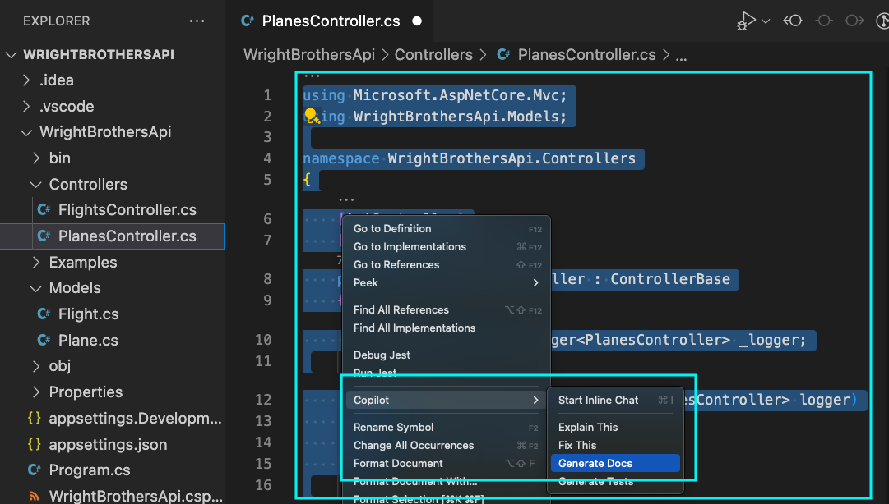
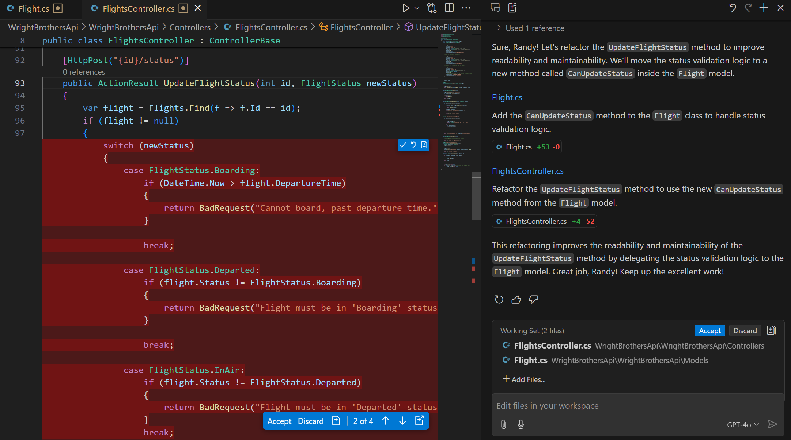
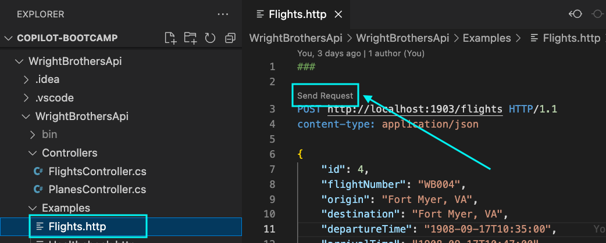

# Navigating the Code Clouds: Advanced Features of GitHub Copilot 
This lab exercise delves into GitHub Copilot's advanced features, teaching participants to enhance coding efficiency through complex tasks like adding new properties, generating documentation, refactoring code, and parsing strings, supplemented by optional labs on context understanding and regex parsing.

## Prerequisites
- The prerequisites steps are completed, see [Labs Prerequisites](https://github.com/XpiritBV/Copilot-Bootcamp#labs-prerequisites)

## Estimated time to complete
- 30 to 45 minutes, varying with optional labs.

## Objectives
- To master GitHub Copilot's advanced features for solving complex coding exercises and optimizing code.

### Step 1: - The Complete Wright Brothers Fleet

- Open the `Plane.cs` file located in the `Models` folder.

- Add a `ImageUrl` property to the model.

- Type `public string ImageUrl { get; set; }` in the `Plane.cs` file.

```csharp
public class Plane
{
    public int Id { get; set; }
    public string Name { get; set; }
    public int Year { get; set; }
    public string Description { get; set; }
    public int RangeInKm { get; set; }

    // New property
    public string ImageUrl { get; set; }
}
```

- Open the `Controllers/PlanesController.cs` file.

- Select all content of the `Planes` List.

- Right click and select the option `Copilot` -> `Start Inline Chat`.

- Type the following command

    ```
    Add the new ImageUrl property and the next plane from the Wright Brothers Fleet
    ```


> [!Note]
> Screenshot is made at 8th of February 2024. The UI of the Copilot Chat extension can be different at the time you are doing the lab. (Please notify us if the UI is different.)

- Accept the suggestion by selecting `Accept` or pressing `Enter`.

>[!Note]
> GitHub Copilot can do more than one thing at a time. It added the new property to each plane and next Wright Brothers plane to the list of planes.

### Step 2: - Flight Logbook - Logging Your Coding Journey

- Open the `PlanesController.cs` file.

- Select all content of the `PlanesController.cs` file.

- Right click and choose for the option `Copilot` -> `Generate Docs`.



> [!Note]
> Screenshot is made at 8th of February 2024. The UI of the Copilot Chat extension can be different at the time you are doing the lab. (Please notify us if the UI is different.)

- Accept the suggestion by selecting `Accept`.

> [!Note]
> GitHub Copilot used the `/docs` agent to generate the documentation for the entire file in a matter of seconds.

### Step 3: - Flying in Formation - Code Refactoring

- Open the `Controllers/FlightsController.cs` file.

- Navigate to the `UpdateFlightStatus` method.

```csharp
public class FlightsController : ControllerBase
{

    // Other methods

    [HttpPost("{id}/status")]
    public ActionResult UpdateFlightStatus(int id, FlightStatus newStatus)
    {
        var flight = Flights.Find(f => f.Id == id);
        if (flight != null)
        {
            switch (newStatus)
            {
                case FlightStatus.Boarding:
                    if (DateTime.Now > flight.DepartureTime)
                    {
                        return BadRequest("Cannot board, past departure time.");
                    }

                    break;

                case FlightStatus.Departed:
                    if (flight.Status != FlightStatus.Boarding)
                    {
                        return BadRequest("Flight must be in 'Boarding' status before it can be 'Departed'.");
                    }

                    break;

                case FlightStatus.InAir:
                    if (flight.Status != FlightStatus.Departed)
                    {
                        return BadRequest("Flight must be in 'Departed' status before it can be 'In Air'.");
                    }
                    break;

                case FlightStatus.Landed:
                    if (flight.Status != FlightStatus.InAir)
                    {
                        return BadRequest("Flight must be in 'In Air' status before it can be 'Landed'.");
                    }

                    break;

                case FlightStatus.Cancelled:
                    if (DateTime.Now > flight.DepartureTime)
                    {
                        return BadRequest("Cannot cancel, past departure time.");
                    }
                    break;

                case FlightStatus.Delayed:
                    if (flight.Status == FlightStatus.Cancelled)
                    {
                        return BadRequest("Cannot delay, flight is cancelled.");
                    }
                    break;

                default:
                    // Handle other statuses or unknown status
                    return BadRequest("Unknown or unsupported flight status.");
            }

            flight.Status = newStatus;

            return Ok($"Flight status updated to {newStatus}.");
        }
        else
        {
            return NotFound("Flight not found.");
        }
    }
}
```

> [!Note]
> Note that the `UpdateFlightStatus` method has a high code complexity rating of 13, calculated by the Cyclomatic Complexity metric. This is a good candidate for refactoring.

- Select all the content of the `UpdateFlightStatus` method.

- Open the Copilot Chat extension.

- Ask the following question:

    ```
    Refactor the selected code to make it more readable and maintainable.
    ```



> [!Note]
> Screenshot is made at 8th of February 2024. The UI of the Copilot Chat extension can be different at the time you are doing the lab. (Please notify us if the UI is different.)

> [!Note]
> GitHub Copilot Chat understands `the selected code`. It will use the selected code in your editor to generate the refactoring suggestions.

- Copilot Chat suggests a code improvement to extract some of the complex code to their own methods to make the code more readible and maintainable:

```csharp
[HttpPost("{id}/status")]
public ActionResult UpdateFlightStatus(int id, FlightStatus newStatus)
{
    var flight = Flights.Find(f => f.Id == id);
    if (flight == null)
    {
        return NotFound("Flight not found.");
    }

    var validationResult = ValidateStatusChange(flight, newStatus);
    if (validationResult != null)
    {
        return validationResult;
    }

    flight.Status = newStatus;
    return Ok($"Flight status updated to {newStatus}.");
}

private ActionResult ValidateStatusChange(Flight flight, FlightStatus newStatus)
{
    switch (newStatus)
    {
        case FlightStatus.Boarding:
            if (DateTime.Now > flight.DepartureTime)
            {
                return BadRequest("Cannot board, past departure time.");
            }
            break;

        case FlightStatus.Departed:
            if (flight.Status != FlightStatus.Boarding)
            {
                return BadRequest("Flight must be in 'Boarding' status before it can be 'Departed'.");
            }
            break;

        case FlightStatus.InAir:
            if (flight.Status != FlightStatus.Departed)
            {
                return BadRequest("Flight must be in 'Departed' status before it can be 'In Air'.");
            }
            break;

        case FlightStatus.Landed:
            if (flight.Status != FlightStatus.InAir)
            {
                return BadRequest("Flight must be in 'In Air' status before it can be 'Landed'.");
            }
            break;

        case FlightStatus.Cancelled:
            if (DateTime.Now > flight.DepartureTime)
            {
                return BadRequest("Cannot cancel, past departure time.");
            }
            break;

        case FlightStatus.Delayed:
            if (flight.Status == FlightStatus.Cancelled)
            {
                return BadRequest("Cannot delay, flight is cancelled.");
            }
            break;

        default:
            // Handle other statuses or unknown status
            return BadRequest("Unknown or unsupported flight status.");
    }

    return null;
}
```

> [!Note]
> The output of Copilot chat can vary, but the output should be a refactored method that is more readable and maintainable.

> [!Note]
> Note that GitHub Copilot Chat can make mistakes sometimes. Best practice is to have the method covered with unit tests before refactoring it. This is not a requirement for this lab, but it is a good practice to follow. These unit tests can be generated by GitHub Copilot as well, which is covered in a previous lab.

### Step 4: - Parsing Flight Show - Prompt Engineering

- Open the `Models/Flight.cs` file.

- Take a look at the `FlightLogSignature` property.

    ```csharp
    public class Flight
    {
        // Other properties
        // ...

        public string FlightLogSignature { get; set; }
    }
    ```

> [!Note]
> Note that the `FlightLogSignature` is a fictional property that is used to demonstrate the capabilities of GitHub Copilot. It is not a real aviation concept.

- Select all the content of `FlightLogSignature` property, including the comments above it.

- Open the Copilot Chat extension and ask the following question:

    ```
    @workspace create a c# model for a FlightLogSignature property.

    Example: 17121903-DEP-ARR-WB001
    
    17th of December 1903
    Departure from Kitty Hawk, NC
    Arrival at Manteo, NC
    Flight number WB001

    ## Technical Requirements
    - Create a FlightLog record type
    - Add a Parse method to the FlightLog record type
    - The Date must be a DateTime.
    ```


> [!Note]
> Screenshot is made at 8th of February 2024. The UI of the Copilot Chat extension can be different at the time you are doing the lab. (Please notify us if the UI is different.)

> [!Note]
> Note the prompt engineering for the 19th century context. This is a good example of how to instruct Copilot to generate code that is in line with the context of the application.

- Copilot will suggest a new `FlightLog` record type and a `Parse` method. The `Parse` method splits the string and assigns each part to a corresponding property.


    ```csharp
    // Make sure to add the System.Globalization namespace
    using System.Globalization;

    public record FlightLog
    {
        public DateTime Date { get; init; }
        public string Departure { get; init; }
        public string Arrival { get; init; }
        public string FlightNumber { get; init; }

        public static FlightLog Parse(string flightLogSignature)
        {
            var parts = flightLogSignature.Split('-');
            if (parts.Length != 4){
                throw new ArgumentException("Invalid flight log signature format.");
            }
         
            var dateString = parts[0];
            var date = DateTime.ParseExact(dateString, "ddMMyyyy", CultureInfo.InvariantCulture);

            return new FlightLog
            {
                Date = date,
                Departure = parts[1],
                Arrival = parts[2],
                FlightNumber = parts[3]
            };
        }
    }
    ```

> [!Note]
> A C# record type is a reference type that provides built-in functionality for encapsulating data. It is a reference type that is similar to a class, but it is immutable by default. It is a good choice for a simple data container.

> [!Note]
> GitHub Copilot is very good at understanding the context of the code. It understands that the `FlightLogSignature` is a string in a specific format and that it can be parsed into a `FlightLogSignature` model, to make the code more readable and maintainable.

- In the Copilot Chat extension window, click the ellipses `...` and select `Insert into new file` for the suggested `FlightLog` record as `WrightBrothersApi/Models/FlightLog.cs`.

- Copilot will add the code to a new empty file, but must be saved.
- Save the file by clicking pressing `Ctrl + S` or `Cmd + S`.
- Enter the file name `FlightLog.cs` and click `Save`.


> [!Note]
> Screenshot is made at 8th of February 2024. The UI of the Copilot Chat extension can be different at the time you are doing the lab. (Please notify us if the UI is different.)

> [!Note]
> GitHub Copilot has many quick actions that can be used to speed up the development process. In this case, it created a new file based on the code suggestions. 

- Now, let's add the new `FlightLog` property to the `Flight` model.

- Open the `Models/Flight.cs` file.

- Add the `FlightLog` property to the `Flight` model, by typing `public Fli`

    ```csharp
    public class Flight
    {
        // Other properties
        // ...

        // Existing property
        public string FlightLogSignature { get; set; }

        // New property
        public Fli <---- Place cursor here
    }
    ```

- Copilot will suggest the following code:

    ```csharp
    public class Flight
    {
        // Other properties
        // ...

        // Existing property
        public string FlightLogSignature { get; set; }

        // New property
        public FlightLog FlightLog
        {
            get
            {
                return FlightLog.Parse(FlightLogSignature);
            }
        }
    }
    ```

- Press `Tab` to accept the suggestion, then press `Enter` to add the new property.

- If the suggestion provided looks like this, you can type the following code manually:

    ```csharp
    public FlightLog FlightLog
    {
        get
        {
            return FlightLog.Parse(FlightLogSignature);
        }
    }
    ```

- Update code to look like this instead.

    ```csharp
    public class Flight
    {
        // Other properties

        // New property
        public FlightLog FlightLog
        {
            get
            {
                return FlightLog.Parse(FlightLogSignature);
            }
        }
    }
    ```

- Press `Tab` to accept the suggestion.

> [!Note]
> As explained in an earlier lab, Copilot used the new created `FlightLog.cs` file in its context and suggests the `FlightLog.Parse` method.

- Now, run the app and test the new functionality.

    ```bash
    cd WrightBrothersApi
    dotnet run
    ```

- Open `Examples/Flights.http` file in the Visual Studio code IDE and POST a new flight.



> [!Note]
> Screenshot is made at 8th of February 2024. The UI of the Copilot Chat extension can be different at the time you are doing the lab. (Please notify us if the UI is different.)

- Click the `Send Request` button for the first `POST`.

    ```json
    POST http://localhost:1903/flights HTTP/1.1
    ```

- The Rest Client response will now include the `FlightLog` property as follows:

    ```json
    HTTP/1.1 201 Created
    Connection: close
    {
        "id": 4,
        "flightLogSignature": "17091908-DEP-ARR-WB004",
        "flightLog": {
            "date": "1908-09-17T00:00:00",
            "departure": "DEP",
            "arrival": "ARR",
            "flightNumber": "WB004"
        },
    }
    ```
- Stop the app by pressing `Ctrl + C` or `Cmd + C` in the terminal.

## Optional

### Step 5: - Regex Aerobatics Show - Advanced Prompt Engineering


>[!CAUTION]
> Proceed at your own risk. This is an advanced lab exercise. We take Copilot to the edge of its capabilities. Retry the prompt provided later in the lab if you are not successful the first time. No airplanes were harmed in the making of this lab &#x2708; &#x1F60A;

- Open the `Flight.cs` file.

- Take a look at the `AerobaticSequenceSignature` property to the `Flight.cs` file.

    ```csharp
    public class Flight
    {
        
        // Other properties
        //
        // ...
        //
        // Existing property
        public string AerobaticSequenceSignature { get; set; }
    }

    ```

- The `AerobaticSequenceSignature` is a fictional property that is used to demonstrate the capabilities of GitHub Copilot. It is not a real aviation concept.

- Some examples of `AerobaticSequenceSignature` are:
    - L4B-H2C-R3A-S1D-T2E
    - L1A-H1B-R1C-T1E
    - L2A-H2B-R2C


- Let's prompt engineer Copilot to generate a solution for the `AerobaticSequenceSignature` property.

// TODO Explain One Shot - Few Shots and Chain of Thought

- Open the Copilot Chat extension and ask the following advanced prompt engineered question:

    ```
    Parse a AerobaticSequenceSignature property into a c# model.

    ## AerobaticSequence Examples
    - L4B-H2C-R3A-S1D-T2E
    - L1A-H1B-R1C-T1E
    - L2A-H2B-R2C

    ## Maneuver
    - L = Loop, H = Hammerhead, R = Roll, S = Spin, T = Tailslide
    - Number represents repeat count, 
    - The Letter represents difficulty (A-F)

    ## AerobaticSequence Difficulty Method
    - Add a difficulty calculation method with the following rules:
    - A roll after a loop is scored double
    - A spin after a tailslide is scored triple

    ## Chain of Thought reasoning
    Example
    L4B-R3A-H2C-T2E-S1D
    Difficulty multipliers
    - A = 1.0 
    - B = 1.2
    - C = 1.4
    - D = 1.6
    - E = 1.8
    - F = 2.0
    Maneuvers
    - Loop: 4 * 1.2 = 4.8
    - Roll: 3 * 1 * 2(roll after a loop) = 6.0
    - Hammerhead: 2 * 1.4 = 2.8
    - Tailslide: 2 * 1.8 = 3.6
    - Spin: 1 * 1.6 * 3(spin after a tailslide) = 4.8
    Total: 22

    ## Technical Requirements
    - Create a AerobaticSequence class with a list of Maneuvers and a difficulty property
    - Add the Maneuver class inside the AerobaticSequence class
    - Use static Parse method to parse the AerobaticSequenceSignature
    - Parse the signature with a Regex
    - include usings at the top of the file
    - Round the difficulty result to 2 decimal places

    Think step by step
    ```

- Prompt engineering is a technique to instruct Copilot to generate a very specific solution. We use zero shot, few shot and chain of thought to instruct Copilot to generate the solution.

- Few shot are the examples that are given to Copilot to generate the solution. In this case, the examples are `L4B-H2C-R3A-S1D-T2E` and `L1A-H1B-R1C-T1E`.

- Chain of Thought is used to describe how a solution is . In this case, the `AerobaticSequence Difficulty Method` and `Additional Rules`. Also note the `Think step by step` at the end of the prompt engineering. This is to make Copilot go through the process step by step, like a human would do.


- Copilot will suggest the following `AerobaticSequence` class:

    ```csharp
    using System;
    using System.Collections.Generic;
    using System.Text.RegularExpressions;

    public class AerobaticSequence : List<Maneuver>
    {
        private class Maneuver
        {
            public string Type { get; set; }
            public int RepeatCount { get; set; }
            public string Difficulty { get; set; }
        }

        public AerobaticSequence(string sequence)
        {
            var regex = new Regex(@"([A-Z])(\d+)([A-E])");
            var matches = regex.Matches(sequence);

            foreach (Match match in matches)
            {
                var maneuver = new Maneuver
                {
                    Type = match.Groups[1].Value,
                    RepeatCount = int.Parse(match.Groups[2].Value),
                    Difficulty = match.Groups[3].Value
                };

                this.Add(maneuver);
            }
        }
    }
    ```

> [!Note]
> We prompt engineered the `AerobaticSequence` class to instruct Copilot to generate a very specific solution.

- In the Copilot Chat extension window, click the ellipses `...` and select `Insert into new file` for the suggested `AerobaticSequence` record as `WrightBrothersApi/Models/AerobaticSequence.cs`.

- Copilot will add the code to a new empty file, but must be saved.
- Save the file by clicking pressing `Ctrl + S` or `Cmd + S`.
- Enter the file name `AerobaticSequence.cs` and click `Save`.

- Copilot sometimes makes a mistake with the Manouver reference in the `List<Maneuver>` class.

    ```csharp
    public class AerobaticSequence : List<Maneuver>
    ```

- Of course, you can use Copilot to fix this. First open the `AerobaticSequence.cs` file.

- Now open the Copilot Chat extension and ask the following question:

    ```
    @workspace /fix
    ```

- Copilot will suggest to change `List<Maneuver>` with `List<AerobaticSequence.Maneuver>`.    

    - Select all content of the `AerobaticSequence.cs` file.

    - In the Chat windows, click `Insert at cursor` to insert the suggested code from Copilot Chat.

- Copilot didn't suggest to change `List<Maneuver>` with `List<AerobaticSequence.Maneuver>`, no problem, you can do it manually.

    - Change `List<Maneuver>` with `List<AerobaticSequence.Maneuver>`.

    ```csharp
    public class AerobaticSequence : List<AerobaticSequence.Maneuver>
    ```

- Most likely the `Regex.*` will have red squiggles because the Regex class is not recognized in the current context. This is likely because the System.Text.RegularExpressions namespace, which contains the Regex class, has not been imported into your file.

- To fix this, you need to add a using directive at the top of your file:
    
    ```csharp
    using System.Text.RegularExpressions;
    ```

~~// TODO Screenshot~~

- Now, let's add the new `AerobaticSequence` property to the `Flight` model.

- Open the `Models/Flight.cs` file.

- Add the `AerobaticSequence` property to the `Flight` model.

    ```csharp
    public class Flight
    {
        // Other properties
        // ...

        // Existing property
        public string AerobaticSequenceSignature { get; set; }

        // New property
        public AerobaticSequence AerobaticSequence { get; set; }
    }
    ```

- Open the `FlightsController.cs` file.

- Navigate to the `Post` method.

- Add the following code to `Parse` the `AerobaticSequenceSignature` property to the `AerobaticSequence` property.

    ```csharp

    public class FlightsController : ControllerBase
    {
        /* Rest of the methods */

        [HttpPost]
        public ActionResult<Flight> Post(Flight flight)
        {
            // Rest of the method

            <------ Place cursor here 

            Flights.Add(flight);

            return CreatedAtAction(nameof(GetById), new { id = flight.Id }, flight);
        }

    }
    ```

- Type the following at the cursor

    ```csharp

    var aerobaticSequence
    ```

- Copilot will suggest the following code

    ```csharp

    var aerobaticSequence = new AerobaticSequence(flight.AerobaticSequenceSignature);
    ```

- Now press `Tab` to accept the suggestion.

- Now press `Enter` and Copilot will suggest the following code:

    ```csharp
    flight.AerobaticSequence = aerobaticSequence;
    ```

- Now press `Tab` to accept the suggestion.

- Now, run the app and test the new functionality.

    ```bash
    dotnet run
    ```

- Open `Examples/Flights.http` file in the Visual Studio code IDE and POST a new flight.


> [!Note]
> Screenshot is made at 8th of February 2024. The UI of the Copilot Chat extension can be different at the time you are doing the lab. (Please notify us if the UI is different.)


- Click the `Send Request` button for the first `POST`.

    ```json
    POST http://localhost:1903/flights HTTP/1.1
    ```

- The Rest Client response will now include the `AerobaticSequence` property as follows:

    ```json
    HTTP/1.1 201 Created
    Connection: close
    {
        "id": 4,
        "aerobaticSequenceSignature": "L4B-H2C-R3A-S1D-T2E",
        "aerobaticSequence": [
            {
                "type": "L",
                "repeatCount": 4,
                "difficulty": "B"
            },
            {
                "type": "H",
                "repeatCount": 2,
                "difficulty": "C"
            },
            {
                "type": "R",
                "repeatCount": 3,
                "difficulty": "A"
            },
            {
                "type": "S",
                "repeatCount": 1,
                "difficulty": "D"
            },
            {
                "type": "T",
                "repeatCount": 2,
                "difficulty": "E"
            }
        ]
    }
    ```

- Stop the app by pressing `Ctrl + C` or `Cmd + C` in the terminal.

### Congratulations you've made it to the end! &#9992; &#9992; &#9992;

#### And with that, you've now concluded this module. We hope you enjoyed it! &#x1F60A;
