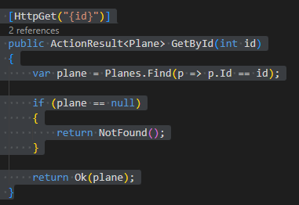
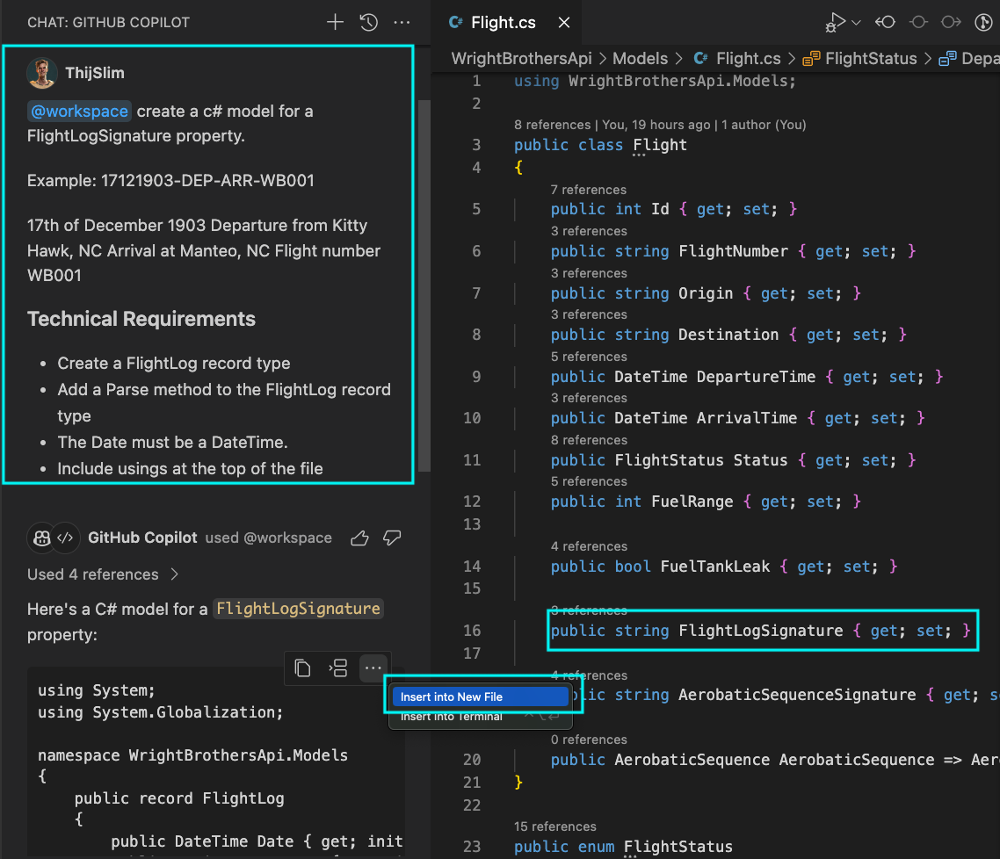
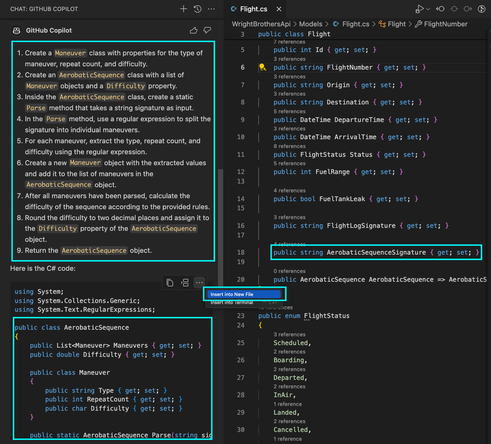

# Lab 2.3 - Navigating the Code Clouds: Additional Features of GitHub Copilot

This lab exercise delves into GitHub Copilot's advanced features, teaching participants to enhance coding efficiency through complex tasks like adding new properties, generating documentation, refactoring code, and parsing strings, supplemented by optional labs on context understanding and regex parsing.

## Prerequisites
- The prerequisites steps must be completed, see [Labs Prerequisites](../Lab%201.1%20-%20Pre-Flight%20Checklist/README.md)

## Estimated time to complete

- 30 minutes, times may vary with optional labs.

## Objectives

- To master GitHub Copilot's advanced features for solving complex coding exercises and optimizing code.
    - Step 1 - Flight Logbook - Logging Your Coding Journey
    - Step 2 - Flying in Formation - Code Refactoring
    - Step 3 - Parsing Flight Show - Prompt Engineering
    - Step 4 - Regex Aerobatics Show - Advanced Prompt Engineering (Optional)

### Step 1: - Flight Logbook - Logging Your Coding Journey
This step explores different ways to **document code using GitHub Copilot**. We'll focus on **the `GetById()` method in `PlanesController.cs`**, testing various documentation prompts and approaches.

Each section follows a **progressive structure**, introducing:
1. Simple documentation generation.
2. Instruction-based prompting.
3. Role-based documentation for API endpoints.
4. Chain-of-thought explanations for complex logic.
5. Meta-prompts for custom documentation strategies.
6. Automatic Documentation for Entire Files

#### Scenario 1: Simple Documentation using /doc
Quickly generate documentation using GitHub Copilot’s /doc feature for individual methods or an entire file.

- Open the `PlanesController.cs` file.

- Select all content of the method **`GetById()`** in `PlanesController.cs`.

- Right-click and choose `Copilot` -> `Generate Docs`.

- View the updates, then click `Discard` to try a different approach.

> [!NOTE]
> GitHub Copilot uses the `/doc` agent to generate documentation for a **single method or the entire file** within seconds. This is a fast way to document your codebase, but we will explore **more controlled methods** using Copilot Chat.

#### Scenario 2: Simple Instruction-Based Prompt
Use a direct Copilot Chat prompt to generate XML documentation, including method purpose, parameters, and return values.

- Select all content of the method **`GetById()`** in `PlanesController.cs`.



- Open **GitHub Copilot Chat**.

- Click `+` to clear prompt history.

- Type the following prompt:

    ```
    Document this C# function, including its purpose, parameters, and return value.
    ```

- Review the generated XML documentation.

- View the updates, then click `Discard` to try a different approach.

    - Note: To update the code, you would click `Apply in Editor` button if the documentation is correct.

    **Example Output:**
    ```csharp
    /// <summary>
    /// Retrieves a plane by its unique identifier.
    /// </summary>
    /// <param name="id">The unique identifier of the plane.</param>
    /// <returns>The plane object if found; otherwise, NotFound result.</returns>
    ```

> [!NOTE]
> This approach provides a **quick** way to generate function-level doc comments. However, for **API documentation**, we will use a more structured role-based prompt.

#### Scenario 3: Role-Based Prompt for API Documentation
Generate structured API documentation with request parameters, response formats, and inline comments for better developer understanding.

- Select all content of the method **`GetById()`** in `PlanesController.cs`.

- Open **GitHub Copilot Chat**.

- Click `+` to clear prompt history.

- Type the following command.

    ```
    You are a technical writer. Write detailed documentation for this API endpoint, explaining its request parameters, response format, and usage examples. Additionally, add detailed comments to the GetById method in the PlanesController class, explaining each step and including error handling.
    ```
- Review the generated API documentation and inline comments.

- View the updates, then click `Discard` to try a different approach.

    - Note: To update the code, you would click `Apply in Editor` button if the documentation is correct.

    **Example Output:**
    ```csharp
    /// <summary>
    /// Retrieves a plane by its unique identifier.
    /// </summary>
    /// <param name="id">The unique identifier of the plane.</param>
    /// <returns>
    /// Returns an HTTP 200 OK response with the plane object if found.
    /// Returns an HTTP 404 Not Found response if the plane does not exist.
    /// </returns>
    [HttpGet("{id}")]
    public IActionResult GetById(int id)
    {
        try
        {
            // Attempt to find the plane by ID.
            var plane = _planeService.GetPlaneById(id);
            
            // If no plane is found, return 404 Not Found.
            if (plane == null)
            {
                return NotFound($"Plane with ID {id} not found.");
            }

            // Return the found plane with an HTTP 200 OK response.
            return Ok(plane);
        }
        catch (Exception ex)
        {
            // Log the exception and return an error response.
            _logger.LogError($"Error retrieving plane: {ex.Message}");
            return StatusCode(500, "Internal server error");
        }
    }
    ```

> [!NOTE]
> This **role-based prompt** ensures **detailed API documentation** with structured response explanations and inline comments.

#### Scenario 4: Chain-of-Thought for Explaining Complex Logic
Break down complex logic step-by-step, adding inline comments for clarity and better maintainability.

- Select all content of the method **`GetById()`** in `PlanesController.cs`.

- Open **GitHub Copilot Chat**.

- Click `+` to clear prompt history.

- Type the following prompt:

    ```
    Explain the logic of this function step-by-step, then add inline comments for clarity.
    ```

- Review Copilot’s explanation and inline comments.

- View the updates, then click `Discard` to try a different approach.

    - Note: To update the code, you would click `Apply in Editor` button if the documentation is correct.

    **Example Explanation**
    ```
    1. The method receives an integer `id` as input.
    2. It calls `_planeService.GetPlaneById(id)` to fetch the plane details.
    3. If the plane is not found, it returns `NotFound()`.
    4. If the plane is found, it returns the plane with `Ok()`.
    5. If an exception occurs, it logs the error and returns a `500 Internal Server Error`.
    ```

    **Example Code with Enhanced Inline Comments**
    ```csharp
    public IActionResult GetById(int id)
    {
        try
        {
            // Fetch the plane based on the provided ID.
            var plane = _planeService.GetPlaneById(id);

            // Check if the plane exists.
            if (plane == null)
            {
                // If not found, return a 404 Not Found response.
                return NotFound($"Plane with ID {id} not found.");
            }

            // If found, return the plane with an HTTP 200 OK response.
            return Ok(plane);
        }
        catch (Exception ex)
        {
            // If an error occurs, log it and return a 500 Internal Server Error.
            _logger.LogError($"Error retrieving plane: {ex.Message}");
            return StatusCode(500, "Internal server error");
        }
    }
    ```

> [!NOTE]
> This **Chain-of-Thought** method helps **break down logic step-by-step** for complex functions.

#### Scenario 5: Meta Prompt for Custom Documentation Needs
Optimize Copilot prompts to generate clean, consistent documentation across large projects.

- Select all content of the method **`GetById()`** in `PlanesController.cs`.

- Open **GitHub Copilot Chat**.

- Click `+` to clear prompt history.

- Type the following meta-prompt:

    ```
    What’s the best way to prompt you to generate clean, consistent code documentation for large projects?
    ```

- Review Copilot’s recommendations.

- Use the suggested techniques to refine how you prompt Copilot for documentation.

> [!NOTE]
> This **meta-prompt** helps standardize documentation **across large projects**.

##### Scenario 6: Automatic Documentation for Entire Files
Generate bulk documentation for an entire file, ideal for legacy codebases and large projects.

- Do not select any content of the method in `PlanesController.cs`.

- Open **GitHub Copilot Chat**.

- Click `+` to clear prompt history.

- Type the following prompt:

    ```
    Generate OpenAPI-style documentation comments for this file, ensuring that all request parameters, response formats, and HTTP status codes are documented.
    ```

- Review the generated **class-level summary** and **method-level comments**.

- View the updates, then click `Discard` to try a different approach.

    - Note: To update the code, you would click `Apply in Editor` button if the documentation is correct.

    **Example Output:**
    ```csharp
    /// <summary>
    /// Controller for managing aircraft data.
    /// Provides endpoints for retrieving planes by ID.
    /// </summary>
    [ApiController]
    [Route("api/[controller]")]
    public class PlanesController : ControllerBase
    {
        /// <summary>
        /// Retrieves a plane by its unique identifier.
        /// </summary>
        /// <param name="id">The unique identifier of the plane.</param>
        /// <returns>
        /// Returns an HTTP 200 OK response with the plane object if found.
        /// Returns an HTTP 404 Not Found response if the plane does not exist.
        /// </returns>
        [HttpGet("{id}")]
        public IActionResult GetById(int id)
        {
            try
            {
                // Fetch the plane based on the provided ID.
                var plane = _planeService.GetPlaneById(id);

                // Check if the plane exists.
                if (plane == null)
                {
                    return NotFound($"Plane with ID {id} not found.");
                }

                return Ok(plane);
            }
            catch (Exception ex)
            {
                _logger.LogError($"Error retrieving plane: {ex.Message}");
                return StatusCode(500, "Internal server error");
            }
        }
    }
    ```


#### Compare Copilot’s Documentation to Manual Documentation  

- Review the **Copilot-generated documentation**.

- Ask the following questions:
    - **Is anything missing?** (e.g., exception handling, request examples)
    - **Are all parameters and return types well explained?**
    - **Does this match your team’s documentation style?**

- If improvements are needed, manually refine the documentation.

> [!NOTE]  
> This **bulk documentation approach** is perfect for **onboarding new developers** or documenting **large, legacy codebases**.

## Summary  

By automating documentation for **entire files**, you can:  
✅ Save time when working with **large codebases**.  
✅ Ensure **consistent** documentation across **all methods**.  
✅ Improve **API documentation** using OpenAPI-style comments.  

For best results, **review and refine** the generated docs to align with your project’s standards.


### Step 2: - Flying in Formation - Code Refactoring

- Open the `Controllers/FlightsController.cs` file.

- Navigate to the `UpdateFlightStatus` method.

```csharp
public class FlightsController : ControllerBase
{
    // Other methods

    [HttpPost("{id}/status")]
    public ActionResult UpdateFlightStatus(int id, FlightStatus newStatus)
    {
        var flight = Flights.Find(f => f.Id == id);
        if (flight != null)
        {
            switch (newStatus)
            {
                case FlightStatus.Boarding:
                    if (DateTime.Now > flight.DepartureTime)
                    {
                        return BadRequest("Cannot board, past departure time.");
                    }

                    break;

                case FlightStatus.Departed:
                    if (flight.Status != FlightStatus.Boarding)
                    {
                        return BadRequest("Flight must be in 'Boarding' status before it can be 'Departed'.");
                    }

                    break;

                case FlightStatus.InAir:
                    if (flight.Status != FlightStatus.Departed)
                    {
                        return BadRequest("Flight must be in 'Departed' status before it can be 'In Air'.");
                    }
                    break;

                case FlightStatus.Landed:
                    if (flight.Status != FlightStatus.InAir)
                    {
                        return BadRequest("Flight must be in 'In Air' status before it can be 'Landed'.");
                    }

                    break;

                case FlightStatus.Cancelled:
                    if (DateTime.Now > flight.DepartureTime)
                    {
                        return BadRequest("Cannot cancel, past departure time.");
                    }
                    break;

                case FlightStatus.Delayed:
                    if (flight.Status == FlightStatus.Cancelled)
                    {
                        return BadRequest("Cannot delay, flight is cancelled.");
                    }
                    break;

                default:
                    // Handle other statuses or unknown status
                    return BadRequest("Unknown or unsupported flight status.");
            }

            flight.Status = newStatus;

            return Ok($"Flight status updated to {newStatus}.");
        }
        else
        {
            return NotFound("Flight not found.");
        }
    }
}
```

> [!NOTE]
> Note that the `UpdateFlightStatus` method has a high code complexity rating of 13, calculated by the [Cyclomatic Complexity metric](https://en.wikipedia.org/wiki/Cyclomatic_complexity). This is a good candidate for refactoring.

- Select all the content of the `UpdateFlightStatus` method.

- Open GitHub Copilot Chat, click **+** to clear prompt history.

- Ask the following question:

  ```
  What is the cyclomatic complexity of this method UpdateFlightStatus?
  ```

> [!NOTE]
> In the case of the UpdateFlightStatus method, we can calculate the cyclomatic complexity by counting the number of decision points (if, switch-case, loops) plus 1. The cyclomatic complexity of the UpdateFlightStatus method is 10.

- Let's go ahead and refactor the code to make it more readable and maintainable.

- With the code still selected, ask the following question:

  ```
  Refactor my code #selection to make it more readable and maintainable.
  ```


> [!NOTE]
> GitHub Copilot Chat understands `the selected code`. It will use the selected code in your editor to generate the refactoring suggestions.

- GitHub Copilot Chat suggests a code improvement to extract some of the complex code to their own methods to make the code more readible and maintainable:

```csharp
[HttpPost("{id}/status")]
public ActionResult UpdateFlightStatus(int id, FlightStatus newStatus)
{
    var flight = Flights.Find(f => f.Id == id);
    if (flight == null)
    {
        return NotFound("Flight not found.");
    }

    var validationResult = ValidateStatusChange(flight, newStatus);
    if (validationResult != null)
    {
        return validationResult;
    }

    flight.Status = newStatus;
    return Ok($"Flight status updated to {newStatus}.");
}

private ActionResult ValidateStatusChange(Flight flight, FlightStatus newStatus)
{
    switch (newStatus)
    {
        case FlightStatus.Boarding:
            if (DateTime.Now > flight.DepartureTime)
            {
                return BadRequest("Cannot board, past departure time.");
            }
            break;

        case FlightStatus.Departed:
            if (flight.Status != FlightStatus.Boarding)
            {
                return BadRequest("Flight must be in 'Boarding' status before it can be 'Departed'.");
            }
            break;

        case FlightStatus.InAir:
            if (flight.Status != FlightStatus.Departed)
            {
                return BadRequest("Flight must be in 'Departed' status before it can be 'In Air'.");
            }
            break;

        case FlightStatus.Landed:
            if (flight.Status != FlightStatus.InAir)
            {
                return BadRequest("Flight must be in 'In Air' status before it can be 'Landed'.");
            }
            break;

        case FlightStatus.Cancelled:
            if (DateTime.Now > flight.DepartureTime)
            {
                return BadRequest("Cannot cancel, past departure time.");
            }
            break;

        case FlightStatus.Delayed:
            if (flight.Status == FlightStatus.Cancelled)
            {
                return BadRequest("Cannot delay, flight is cancelled.");
            }
            break;

        default:
            // Handle other statuses or unknown status
            return BadRequest("Unknown or unsupported flight status.");
    }

    return null;
}
```

> [!NOTE]
> The output of GitHub Copilot Chat can vary, but the output should be a refactored method that is more readable and maintainable.

> [!NOTE]
> Note that GitHub Copilot Chat can make mistakes sometimes. Best practice is to have the method covered with unit tests before refactoring it. This is not a requirement for this lab, but it is a good practice to follow. These unit tests can be generated by GitHub Copilot as well, which is covered in a previous lab.

### Step 3: - Parsing Flight Show - Prompt Engineering

- Open the `Models/Flight.cs` file.

- Take a look at the `FlightLogSignature` property.

    ```csharp
    public class Flight
    {
        // Other properties
        // ...

        public string FlightLogSignature { get; set; }
    }
    ```

- Open GitHub Copilot Chat, click `+` to clear prompt history, then ask the following question:

    ```
    Create a c# model for a FlightLogSignature property.

    Example: 17121903-DEP-ARR-WB001

    17th of December 1903
    Departure from Kitty Hawk, NC
    Arrival at Manteo, NC
    Flight number WB001

    ## Technical Requirements
    - Create a FlightLog record type
    - Add a Parse method to the FlightLog record type
    - The Date must be a DateTime.
    - Include usings at the top of the file
    ```

- The prompt contains a few-shot prompting example of a `FlightLogSignature` and a few technical requirements.

> [!NOTE]
> Few-Shot prompting is a concept of prompt engineering. In the prompt you provide a demonstration of the solution. In this case we provide examples of the input and also requirements for the output. This is a good way to instruct Copilot to generate specific solutions.

- Take a look at the following link to learn more about few-shot prompting: https://www.promptingguide.ai/techniques/fewshot

- Copilot will suggest a new `FlightLog` record type and a `Parse` method. The `Parse` method splits the string and assigns each part to a corresponding property.

    ```csharp
    using System.Globalization;

    public record FlightLog
    {
        public DateTime Date { get; init; }
        public string Departure { get; init; }
        public string Arrival { get; init; }
        public string FlightNumber { get; init; }

        public static FlightLog Parse(string flightLogSignature)
        {
            var parts = flightLogSignature.Split('-');
            if (parts.Length != 4)
            {
                throw new ArgumentException("Invalid flight log signature format.");
            }

            var dateString = parts[0];
            var date = DateTime.ParseExact(dateString, "ddMMyyyy", CultureInfo.InvariantCulture);

            return new FlightLog
            {
                Date = date,
                Departure = parts[1],
                Arrival = parts[2],
                FlightNumber = parts[3]
            };
        }
    }
    ```

> [!NOTE]
> A C# record type is a reference type that provides built-in functionality for encapsulating data. It is a reference type that is similar to a class, but it is immutable by default. It is a good choice for a simple data container.

> [!NOTE]
> GitHub Copilot is very good at understanding the context of the code. From the prompt we gave it, it understood that the `FlightLogSignature` is a string in a specific format and that it can be parsed into a `FlightLogSignature` model, to make the code more readable and maintainable.

- In GitHub Copilot Chat, click the ellipses `...` and select `Insert into New File` for the suggested `FlightLog` record as `WrightBrothersApi/Models/FlightLog.cs`.



> [!NOTE]
> GitHub Copilot has many quick actions that can be used to speed up the development process. In this case, it created a new file based on the code suggestions.

- Copilot will add the code to a new empty file, but must be saved.

- Save the file by clicking pressing `Ctrl + S` or `Cmd + S`.

- Navigate to folder `/WrightBrothersApi/Models` and save the file as `FlightLog.cs`.

- Now, let's add the new `FlightLog` property to the `Flight` model.

- Open the `Models/Flight.cs` file.

- Add the `FlightLog` property to the `Flight` model, by typing `public Fli`

    ```csharp
    public class Flight
    {
        // Other properties
        // ...

        // Existing property
        public string FlightLogSignature { get; set; }

        // New property
        public Fli <---- Place cursor here
    }
    ```

- Copilot will suggest the following code:

    ```csharp
    public class Flight
    {
        // Other properties
        // ...

        // Existing property
        public string FlightLogSignature { get; set; }

        // New property
        public FlightLog FlightLog => FlightLog.Parse(FlightLogSignature);
    }
    ```

- Press `Tab` to accept the suggestion, then press `Enter` to add the new property.

- If Copilot didn't suggest the code above, then update the code manually as follows:

    ```csharp
    public class Flight
    {
        // Other properties

        // New property
        public FlightLog FlightLog
        {
            get
            {
                return FlightLog.Parse(FlightLogSignature);
            }
        }
    }
    ```

> [!NOTE]
> Copilot used the newly created `FlightLog.cs` file in in its context and suggested the `FlightLog.Parse` method.

- Now, run the app and test the new functionality.

    ```bash
    cd WrightBrothersApi
    dotnet run
    ```

> [!NOTE]
> If you encounter an error message like `Project file does not exist.` or `Couldn't find a project to run.`, it's likely that you're executing the command from an incorrect directory. To resolve this, navigate to the correct directory using the command `cd ./WrightBrothersApi`. If you need to move one level up in the directory structure, use the command `cd ..`. The corrcect directory is the one that contains the `WrightBrothersApi.csproj` file.

- Open `WrightBrothersApi/Examples/Flights.http` file in the Visual Studio code IDE and POST a new flight.


- Click the `Send Request` button for the `POST` below:

    ```json
    POST http://localhost:1903/flights HTTP/1.1
    ```

- The Rest Client response will now include the `FlightLog` property as follows:

    ```json
    HTTP/1.1 201 Created
    Connection: close
    {
        "id": 4,
        "flightLogSignature": "17091908-DEP-ARR-WB004",
        "flightLog": {
            "date": "1908-09-17T00:00:00",
            "departure": "DEP",
            "arrival": "ARR",
            "flightNumber": "WB004"
        },
    }
    ```

- Note the `flightLog` property that is parsed based on the ` flightLogSignature`

- Stop the app by pressing `Ctrl + C` or `Cmd + C` in the terminal.

## Optional

### Step 4: - Regex Aerobatics Show - Advanced Prompt Engineering

> [!NOTE]
> This is an advanced lab exercise. We take Copilot to the edge of its capabilities. Retry the prompt provided later in the lab if you are not successful the first time.

- Open the `Flight.cs` file.

- Take a look at the `AerobaticSequenceSignature` property to the `Flight.cs` file.

    ```csharp
    public class Flight
    {
        // Other properties
        // ...

        // Existing property
        public string AerobaticSequenceSignature { get; set; }
    }
    ```

- The `AerobaticSequenceSignature` is a fictional property that is used to demonstrate the capabilities of GitHub Copilot. It is not a real aviation concept.

- Some examples of a `AerobaticSequenceSignature` are:
    - L4B-H2C-R3A-S1D-T2E
    - L1A-H1B-R1C-T1E
    - L2A-H2B-R2C

- Let's prompt engineer Copilot to generate a solution for the `AerobaticSequenceSignature` property.

- Open GitHub Copilot Chat, click `+` to clear prompt history, then ask the question:

    ```
    Parse a AerobaticSequenceSignature property into a c# model.

    ## AerobaticSequence Examples
    - L4B-H2C-R3A-S1D-T2E
    - L1A-H1B-R1C-T1E
    - L2A-H2B-R2C

    ## Maneuver
    - Manouvers: L = Loop, H = Hammerhead, R = Roll, S = Spin, T = Tailslide
    - Number represents repeat count
    - The Letter represents difficulty (A-E)
    - Difficulty multipliers: A = 1.0, B = 1.2, C = 1.4, D = 1.6, E = 1.8

    ## AerobaticSequence Difficulty Method
    - Add a difficulty calculation method with the following rules:
    - A roll after a loop is scored double
    - A spin after a tailslide is scored triple

    ## Chain-of-Thought reasoning
    Example: L4B-R3A-H2C-T2E-S1D

    - Loop: 4 * 1.2 = 4.8
    - Roll: 3 * 1 * 2(roll after a loop) = 6.0
    - Hammerhead: 2 * 1.4 = 2.8
    - Tailslide: 2 * 1.8 = 3.6
    - Spin: 1 * 1.6 * 3(spin after a tailslide) = 4.8

    Total: 22

    ## Technical Requirements
    - Create a AerobaticSequence class with a list of Maneuvers and a difficulty property
    - Add the Maneuver class inside the AerobaticSequence class
    - Use static Parse method to parse the AerobaticSequenceSignature
    - Parse the signature with a Regex
    - include usings at the top of the file
    - Round the difficulty result to 2 decimal places

    Let's think step by step.
    ```

> [!IMPORTANT]
> Sometimes the Copilot doens't complete the output of the prompt. Make sure to try the prompt again if you are not successful the first time.

- Note the `Chain-of-Thought reasoning` heading. In this case we add reasoning about how a difficulty is calculated based on the sequence of maneuvers.

> [!NOTE]
> Chain-of-Thought (CoT) prompting enables complex reasoning capabilities through intermediate reasoning steps. You can combine it with Few-Shot prompting to get better results on more complex tasks that require reasoning before responding. Read more about Chain-of-Thought prompting here: https://www.promptingguide.ai/techniques/cot

- Note the `Let's think step by step.` at the end of the prompt engineering. This is the final instruction for Chain-of-Thought to make Copilot go through the process step by step, like a human would do.

- Also note the Few-Shot examples in the `AerobaticSequence Examples` heading. Chain-of-Thought with Few-Shot combined is the currently the most powerful way to instruct Copilot to generate specific and accurate solutions. Still it doesn't guarantee that Copilot will generate the correct solution. That will require fine-tuning the prompt (prompt engineering).

- Copilot will output something that looks as follows after inserting the prompt above in Copilot Chat:

    ```
    1. Create a Maneuver class with properties for the type of maneuver, repeat count, and difficulty.
    2. Create an AerobaticSequence class with a list of Maneuver objects and a Difficulty property.
    3. Inside the AerobaticSequence class, create a static Parse method that takes a string signature as input.
    4. In the Parse method, use a regular expression to split the signature into individual maneuvers.
    5. For each maneuver, extract the type, repeat count, and difficulty using the regular expression.
    6. Create a new Maneuver object with the extracted values and add it to the list of maneuvers in the AerobaticSequence object.
    7. After all maneuvers have been parsed, calculate the difficulty of the sequence according to the provided rules.
    8. Round the difficulty to two decimal places and assign it to the Difficulty property of the AerobaticSequence object.
    9. Return the AerobaticSequence object.
    ```

- This is the output of the Chain-of-Thought reasoning. It is a step by step guide to create the `AerobaticSequence` class. Copilot is thinking step by step, like a human would do.

- Copilot will also suggest a `AerobaticSequence` class with an implementation that looks like this. The result varies, but the output should be a `AerobaticSequence` class with a `Maneuver` class, a `Parse` method and a `CalculateDifficulty` method.

    ```csharp
    using System;
    using System.Collections.Generic;
    using System.Text.RegularExpressions;

    public class AerobaticSequence
    {
        public List<Maneuver> Maneuvers { get; set; }
        public double Difficulty { get; set; }

        public class Maneuver
        {
            public string Type { get; set; }
            public int RepeatCount { get; set; }
            public char Difficulty { get; set; }
        }

        public static AerobaticSequence Parse(string signature)
        {
            var sequence = new AerobaticSequence { Maneuvers = new List<Maneuver>() };
            var maneuvers = Regex.Matches(signature, @"([LHRTS])(\d+)([A-F])");

            foreach (Match maneuver in maneuvers)
            {
                sequence.Maneuvers.Add(new Maneuver
                {
                    Type = maneuver.Groups[1].Value,
                    RepeatCount = int.Parse(maneuver.Groups[2].Value),
                    Difficulty = maneuver.Groups[3].Value[0]
                });
            }

            sequence.CalculateDifficulty();
            return sequence;
        }

        private void CalculateDifficulty()
        {
            double difficulty = 0;
            string previousManeuver = null;

            foreach (var maneuver in Maneuvers)
            {
                double multiplier = 1.0 + (maneuver.Difficulty - 'A') * 0.2;
                if (previousManeuver == "L" && maneuver.Type == "R") multiplier *= 2;
                if (previousManeuver == "T" && maneuver.Type == "S") multiplier *= 3;

                difficulty += maneuver.RepeatCount * multiplier;
                previousManeuver = maneuver.Type;
            }

            Difficulty = Math.Round(difficulty, 2);
        }
    }
    ```

- In GitHub Copilot Chat, click the ellipses `...` and select `Insert into New File` for the suggested `AerobaticSequence` class as `WrightBrothersApi/Models/AerobaticSequence.cs`.



- Copilot will add the code to a new empty file, but must be saved.

- Save the file by clicking pressing `Ctrl + S` or `Cmd + S`.

- Navigate to folder `/WrightBrothersApi/Models` and save the file as `AerobaticSequence.cs`.

> [!NOTE]
> The required file already exists. If your output does not align with the provided example, feel free to utilize this existing file.

- Now, let's add the new `AerobaticSequence` property to the `Flight` model.

- Open the `Models/Flight.cs` file.

- Add the `AerobaticSequence` property to the `Flight` model.

    ```csharp
    public class Flight
    {
        // Other properties
        // ...

        // Existing property
        public string AerobaticSequenceSignature { get; set; }

        // New property
        public Aero<---- Place cursor here
    }
    ```

- Copilot will suggest the following code:

    ```csharp
    public class Flight
    {
        // Other properties
        // ...

        // Existing property
        public string AerobaticSequenceSignature { get; set; }

        // New property
        public AerobaticSequence AerobaticSequence
        {
            get
            {
                return AerobaticSequence.Parse(AerobaticSequenceSignature);
            }
        }
    }
    ```

- Press `Tab` to accept the suggestion, then press `Enter` to add the new property.

- If Copilot didn't suggest the code above, then update the code manually as follows:

    ```csharp
    // New property
    public AerobaticSequence AerobaticSequence
    {
        get
        {
            return AerobaticSequence.Parse(AerobaticSequenceSignature);
        }
    }
    ```

- Now, run the app again and test the new functionality.

    ```bash
    dotnet run
    ```

> [!NOTE]
> If you encounter an error message like `Project file does not exist.` or `Couldn't find a project to run.`, it's likely that you're executing the command from an incorrect directory. To resolve this, navigate to the correct directory using the command `cd ./WrightBrothersApi`. If you need to move one level up in the directory structure, use the command `cd ..`. The corrcect directory is the one that contains the `WrightBrothersApi.csproj` file.

- Open `WrightBrothersApi/Examples/Flights.http` file in the Visual Studio code IDE and POST a new flight.


- Click the `Send Request` button for the `POST` below:

    ```json
    POST http://localhost:1903/flights HTTP/1.1
    ```

- The Rest Client response will now include the `AerobaticSequence` property as follows:

    ```json
    HTTP/1.1 201 Created
    Connection: close
    {
        "id": 4,
        "aerobaticSequenceSignature": "L4B-H2C-R3A-S1D-T2E",
        "aerobaticSequence": {
            "maneuvers": [
                {
                    "type": "L",
                    "repeatCount": 4,
                    "difficulty": "B"
                },
                {
                    "type": "H",
                    "repeatCount": 2,
                    "difficulty": "C"
                },
                {
                    "type": "R",
                    "repeatCount": 3,
                    "difficulty": "A"
                },
                {
                    "type": "S",
                    "repeatCount": 1,
                    "difficulty": "D"
                },
                {
                    "type": "T",
                    "repeatCount": 2,
                    "difficulty": "E"
                }
            ],
            "difficulty": 22
        }
    }
    ```

- Note the `aerobaticSequence` property that is parsed based on the ` aerobaticSequenceSignature`

- Stop the app by pressing `Ctrl + C` or `Cmd + C` in the terminal.

### Congratulations you've made it to the end! &#9992; &#9992; &#9992;

#### And with that, you've now concluded this module. We hope you enjoyed it! &#x1F60A;
