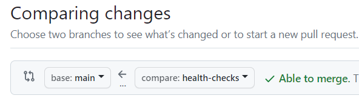
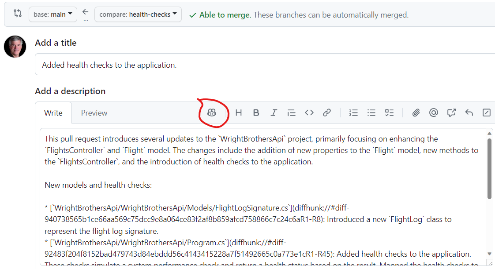
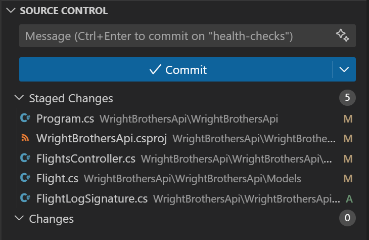
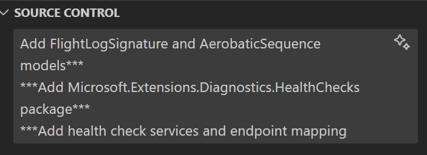

# Auto-Pilot Mode: AI Assistance in Software Development
This lab exercise demonstrates integrating GitHub Copilot into .NET application development to implement health checks, automate CI/CD pipelines for Azure deployment, and explore AI's role in enhancing software development efficiency through practical programming tasks.

## Prerequisites
- The prerequisites steps are completed, see [Labs Prerequisites](https://github.com/XpiritBV/Copilot-Bootcamp#labs-prerequisites)

## Estimated time to complete
- 30 min

## Objectives
- Recap of the day's learning, emphasizing the blend of AI assistance with human skills.
- Discussion on the future of AI in programming and its evolving role in software development.

### Step 1. Fasten your seatbelts, turbulance incoming - Committing Code Changes

- Open `Program.cs` in `WrightBrothersApi` folder

- Note the following code that adds a health check to the application. The healthcheck simulates a health check that sometimes is healthy, sometimes is degraded, and sometimes is unhealthy.

    ```csharp
    // Other code

    var builder = WebApplication.CreateBuilder(args);

    builder.Services.AddHealthChecks()
    .AddCheck("CruisingAltitudeCheck", () =>
    {
        bool atCruisingAltitude = CheckSystemPerformance(); 

        if (atCruisingAltitude)

        {
            return HealthCheckResult.Healthy("The application is cruising smoothly at optimal altitude.");
        }
        else
        {
            bool minorIssue = CheckIfMinorIssue();

            return minorIssue ?
                HealthCheckResult.Degraded("The application is experiencing turbulence but remains stable.") :
                HealthCheckResult.Unhealthy("The application is facing a system failure and needs immediate attention.");
        }

        bool CheckSystemPerformance()
        {
            // Simulate a check to determine if the application is "at cruising altitude"
            // For the sake of this example, we'll just return a random value
            Random random = new Random();
            int randomNumber = random.Next(1, 100);

            return randomNumber > 10;
        }

        bool CheckIfMinorIssue()
        {
            // Simulate a check to determine if the application is "at cruising altitude"
            // For the sake of this example, we'll just return a random value
            Random random = new Random();
            int randomNumber = random.Next(1, 100);

            return randomNumber > 50;
        }
    });

    // Other code
    ```


- Run the application to see the health check in action.

    ```sh
    cd WrightBrothersApi
    dotnet run
    ```

- Open `WrightBrothersApi/Examples/Healthcheck.http` file in the Visual Studio code IDE and POST a new flight.

// TODO Change Screenshot


> [!Note]
> Screenshot is made at 8th of February 2024. The UI of the Copilot Chat extension can be different at the time you are doing the lab. (Please notify us if the UI is different.)

- Click the `Send Request` button for the `GET` below:

    ```json
    GET http://localhost:1903/health HTTP/1.1
    ```

- The response should be `200 OK` with the following body:

    ```json
    {
        "status": "Healthy", // or "Degraded" or "Unhealthy"
        "totalDuration": "00:00:00.0000001"
    }
    ```

- Stop the application by pressing `Ctrl+C` in the terminal.

- Let's make a small change to the code. Change the `CheckSystemPerformance` method to return a random number greater than 50. This will simulate a more unstable system.

    ```csharp
    bool CheckSystemPerformance()
    {
        // Simulate a check to determine if the application is "at cruising altitude"
        // For the sake of this example, we'll just return a random value
        Random random = new Random();
        int randomNumber = random.Next(1, 100);

        return randomNumber > 50;
    }
    ```

- Create a new feature branch `feature/health-checks` from the `main` branch in your terminal

```sh
git checkout -b feature/health-checks
```

- Open the Source Control tab in VS Code

- In the `Changes` area, click the `+` icon to `Stage all changes`

- Click on the `Magic` icon to generate a commit message


> [!Note]
> GitHub Copilot Chat suggests a commit message based on the changes made to the code. This is a great way to get started with a commit message.


- Click the `✓ Commit & Sync` button to commit the changes.


- Click the `Publish branch` button to push the changes.

### Step 2. Turn on Autopilot Mode - Automating GitHub Pull Requests

> [!WARNING]  
> You must complete the previous lab before continuing.

> [!Note]
> Pull Request summaries in the GitHub.com portal is not yet supported for everyone. The trainer will demo this.

- Go to your `GitHub.com` repository.

- Click on the `Pull requests` tab.

- Click on the `New pull request` button

- Select the `main` branch for the base branch.
- Select the `feature/health-checks` branch as the compare branch



- Click the `Create pull request` button

- Click on the `Copilot` icon, select `Summary` to generate a summary of changes in this pull request.



- Click `Preview` to see the summary.


- Click `Create pull request` to create the pull request.

> [!IMPORTANT]  
> This is a `Copilot Enterprise` feature only! In order to use the Pull Request Summaries feature you need a Copilot Enterprise License and have this feature enabled in your GitHub account.

### Step 4. Changing Altitude to mitigate turbulence - Adjust Pull Request

> [!WARNING]  
> You must complete the previous lab before continuing.

- Change HealthCheck code to be more stable

```csharp
// Add the following health check
builder.Services.AddHealthChecks()
    .AddCheck("CruisingAltitudeCheck", () =>
    {
        // Rest of the code

        bool CheckSystemPerformance()
        {

            // Rest of the code

            return randomNumber > 50; <----- Change this to 10
        }

        // Rest of the code
    });
```

- Open the Source Control tab in VS Code

- Open the Source Control tab in VS Code


- In the `Changes` area, click the `+` icon to `Stage all changes`



- Click on the magic icon to generate a commit message



>![!Note]
> The commit message is now very detailed, due to the small changes in the code. Best practice when using Git is to make keep your commits small and concise.

- Click the `✓ Commit` button to commit the changes.

~~- Click the `Sync` button icon to push the changes~~

- Click the `Publish branch` button to push the changes.


- Go to your `GitHub.com` repository

- Click on the `Pull requests` tab

TODO: Add a Screenshot here!


- Click on the `feature/health-checks` pull request

TODO: Add a Screenshot here!


- Click on the `Copilot` icon, select `Summary` to generate a summary of changes in this pull request.

- Click `Preview` to see the summary.

TODO: Add a Screenshot here!


- Click `Create pull request` to create the pull request.

### Optional

### Step 5. Smooth Flying in the Cloud - Automating GitHub Pipelines
A build pipeline automates your software's build, test, and deployment processes, ensuring consistent and error-free releases while saving time and improving code quality. It streamlines development, enables quick feedback, and supports efficient version management.  Let's begin by
automating CI/CD pipelines for deployment to Azure.

- Open the GitHub Copilot Chat extension

- Type the following command

    ```
    @workspace create a build pipeline for the application
    ```

- GitHub Copilot Chat will suggest creating a GitHub Pipeline for the application. It also includes a build step and a test step.

- Note the list of `Used References` in the chat suggestion

> [!Note]
> Copilot Chat, "To create a build pipeline for your application, you can use GitHub Actions. Here's a basic example of a .NET Core build pipeline:"

TODO: Add a Screenshot here!


> [!Note]
> With the @workspace agent, GitHub Copilot understand that the current workspace is a .NET application with a Test project in it.

### Step 6. Ground Control - Something in the Cloud  - Deploying to Azure
Deploying your application to Azure facilitates scalable, secure, and efficient hosting, leveraging Microsoft's cloud infrastructure. This allows for easy scaling, robust disaster recovery, and global reach, enhancing your app's performance and accessibility while minimizing maintenance efforts and costs.

> [!WARNING]  
> You must complete the previous lab before continuing.

- Pre-requisite is a valid `*.yaml` build pipeline from previous step.

- Continue the conversation with deploying it to Azure

    ```
    @workspace create a deploy pipeline deploying the application to Azure
    ```

- GitHub Copilot Chat will suggest adding a deploy step to the pipeline, which is a Azure Web App deployment.

> [!Note]
> Copilot Chat, "To create a deployment pipeline for your application to Azure, you can use GitHub Actions. Here's a basic example of a .NET Core deployment pipeline:"

- Continue the conversation with hosting a Web App in Azure

    ```
    How about hosting a Web App in Azure?
    ```

- Copilot will give step by step instructions to create a Web App in Azure.
    - Hosting a Web App in Azure involves several steps:
        - Create a Web App in Azure
        - Deploy your application
        - Configure your application
        - Monitor your application

- Continue the conversation with creating a Web App through Infrastructure as Code

    ```
    @workspace create the Infrastructure as Code using Bicep that I need for a Web App in Azure
    ```

- Copilot will give components need to create a Web App in Azure. The script creates a free tier App Service Plan and a Web App within it.

- You can go on and on brainstorming with GitHub Copilot Chat to create a full CI/CD pipeline for your application.

### Step 7: Auto-pilot for your infrastructure: Set it, code it, forget it!

- Let's ask Copilot to build ALL the resources needed to build, test, create infrastructure, and deploy to Azure.

> [!IMPORTANT]
> This serves as a prime illustration of `prompt engineering` excellence. Constructing a well-defined `prompt` directly influences the precision and comprehensiveness of the responses from Copilot. It's important to note the iterative process of refining prompts based on outcomes to enhance effectiveness. Emphasizing specificity and clarity in crafting prompts can significantly improve the quality of Copilot's completions, illustrating the critical role of effective prompt engineering in achieving optimal results.

- Open the GitHub Copilot Chat extension

- Type the following command

    ```
    @workspace Create a build pipeline for this application. The create all the required Infrastructure as Code files using Bicep to deploy application to Azure. Next, create a deployment pipeline to build, test, and deploy to Azure
    ```

- Copilot Chat will tell you that creating a build and deployment pipeline involves several steps. Here's a high-level overview of how you might approach this:
    - Create a Bicep file for Azure resources.
    - Create a build pipeline.
    - Create a deployment pipeline, putting the build and bicep files together.


### Step 8. DocSets - Documentation for the win!

> [!Caution]
> NOT IN SCOPE - Suggestions for the Trainer - Remove this section before publishing


### Congratulations you've made it to the end! &#9992; &#9992; &#9992;

#### And with that, you've now concluded this module. We hope you enjoyed it! &#x1F60A;