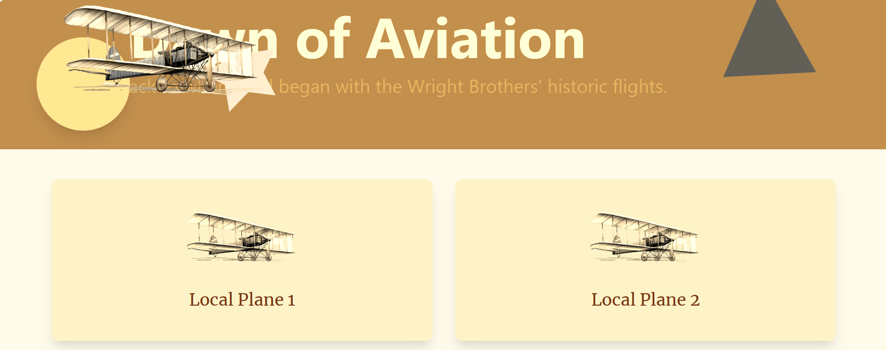
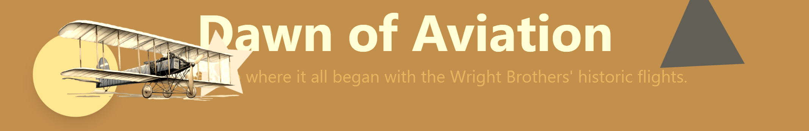

Frontend exercises
Setting up the Front-End Project

# Lab 3.1 - Dawn of Aviation ✈ Setting up the Front-End Project
This lab exercise guides participants through coding exercises using GitHub Copilot to understand its suggestions and capabilities. It involves TBD

## Prerequisites
- The prerequisites steps must be completed, see [Labs Prerequisites](./Labs/Lab%201.1%20-%20Pre-Flight%20Checklist)

## Estimated time to complete
- 20 minutes, times may vary with optional labs.

//TODO Make sure in the slides to mention that people should be able to follow the instructions that copilot give. Let them first try copilot instructions and then follow their own

## Objectives
- TBD

### Step 1: Sunset above the Clouds - Setup and Run the Frontend

// TODO PRe-install Node in CodeSpace
// TODO The frontend auto reloads, so the participants do not need to restart the frontend to see changes

- Open the terminal and navigate to the `WrightBrothersFrontend/` directory.

    ```bash
    cd WrightBrothersFrontend/
    ```

- Run the following command to install the dependencies:

    ```bash
    npm install
    ```

- Now, run the following command to start the frontend:

    ```bash
    npm run frontend
    ```

- Open your browser and navigate to [http://localhost:5173/](http://localhost:5173/)

- You should see the following page:



- Stop the frontend application by pressing `Ctrl + C` in the terminal.

### Step 2: Looking over the Horizon - Exploring the frontend application

- Open GitHub Copilot Chat

- Type the following in the chat window:

    ```bash
    @workspace explain the frontend repository
    ```
>[!NOTE]
> @workspace scans the repository to find relevant information about the question asked. It will provide a summary of the repository, including the technologies used, the purpose of the repository, and the structure of the repository.

- In the same chat window, type the following:

    ```bash
    What technology is used to run the frontend application and why?
    ```

- The frontend application uses Vite, a fast frontend build tool that provides a lightning-fast development experience. Currently it's one of the most popular tools for frontend development, replacing Webpack and Parcel.

- In the same chat window, type the following:

    ```bash
    @workspace what technology is used to style the frontend and explain me the core basics of this technology.
    ```

- GitHub Copilot will provide a summary about `Tailwind CSS`, a utility-first CSS framework that provides a set of utility classes to style the frontend application. This is a very popular CSS framework that is used to style components from scratch, for example for a custom design system.

>[!NOTE]
> If you encounter a new technology or concept it's always a good idea to understand the basics of it and how it works. GitHub Copilot can help you with that.

- In the same chat window, type the following:

    ```bash
    @workspace where can I find the entry point of the frontend application and where can I update the homepage?
    ```

- Copilot will give a suggestion that the entry point is `WrightBrothersFrontend/src/App.tsx` and the homepage can be updated in the `WrightBrothersFrontend/src/pages/HomePage.tsx` file.

- In this lab you learned how to use GitHub Copilot to understand the frontend repository and its structure. You also learned how to ask questions about the frontend repository and the technologies used in it.

- You are now ready to start coding the frontend.

### Step 3: In-flight Correction - Centering a div

- Let's do something that struggles many developers, centering HTML elements.

- Open the terminal and navigate to the `WrightBrothersFrontend/` directory.

    ```bash
    cd WrightBrothersFrontend/
    ```

- Start the frontend application:

    ```bash
    npm run frontend
    ```

- Browse to [http://localhost:5173/](http://localhost:5173/)

- Note how the UI is not centered.

    

- Open GitHub Copilot Chat, click **+** to clear prompt history.

- Ask ChatGPT why the UI is not centered:

    ```bash
    #file:Banner.tsx How can I center the banner title?
    ```

- Copilot will provide you with a solution to center the banner title.

>[!NOTE]
> GitHub Copilot understands UI and how elements are positioned. It will provide you with a solution to center the banner title.

- Try to implement the solution by following the steps given by GitHub Copilot.

<br>

<details>
<summary>Click for Solution</summary>

- Open the `WrightBrothersFrontend/src/components/Banner.tsx` file.

- Find the top level `div` element and add the following CSS classes `flex items-center justify-center` to the `div` element:

```html
<div className="{other classes} ... flex items-center justify-center">
    {/* ... */}
</div>
```

</details>

<br>

- Save the file and refresh the browser at [http://localhost:5173/](http://localhost:5173/).

- The banner title should now be centered.

### Step 4: Request for Extra Legroom - Spacing UI elements

- Open the terminal and navigate to the `WrightBrothersFrontend/` directory.

    ```bash
    cd WrightBrothersFrontend/
    ```

- Start the frontend application:

    ```bash
    npm run frontend
    ```

- The banner title and subtitle are too close to each other.



- Open GitHub Copilot Chat, click **+** to clear prompt history.

- Open the `WrightBrothersFrontend/src/components/Banner.tsx` file.

- Ask ChatGPT how to add spacing between the title and subtitle:

    ```md
    The content of #file feels very cramped, how to make it a lot more spacious?
    ```

- For `#file`, select `Banner.tsx` ~~~and select all the content of the file.~~~

- Now submit the prompt to GitHub Copilot.

- Copilot will provide you with a solution to add spacing between the title and subtitle.

>[!NOTE]
> You can always tell Copilot how a UI appeals to you and how you want to improve it. Copilot understands UI/UX and will provide a solution based on best practices.

- Implement the solution by following the steps provided by GitHub Copilot.

<br>

<details>
<summary>Click for Solution</summary>

- Add the `mt-4` class to the subtitle `p` element:

    ```html
    <p className="mt-4 text-xl leading-8 text-amber-200">
    Journey back to where it all began with the Wright Brothers' historic
    flights.
    </p>
    ```

</details>

<br>

- Save the file and refresh the browser at [http://localhost:5173/](http://localhost:5173/).

- The banner should now feel more spacious.

### Step 4: Emergency Exit Lights - Color Contrast

- Open the terminal and navigate to the `WrightBrothersFrontend/` directory.

    ```bash
    cd WrightBrothersFrontend/
    ```

- Start the frontend application:

    ```bash
    npm run frontend
    ```

- The subtitle of the banner is hard to read because it has almost the same color as the background.

    

- Open GitHub Copilot Chat, click **+** to clear prompt history.

- Open the `WrightBrothersFrontend/src/components/Banner.tsx` file.

- Ask ChatGPT what color you should use for the subtitle:

    ```md
    The subtitle in the banner at ~~~#selection~~~ is hard to read due to its color, what color do you suggest?
    ```

- Copilot understands colors and contrasts and will provide you with a color that has a good contrast with the background.

    ```html
    <p className="mt-6 text-xl leading-8 text-amber-200">
    Journey back to where it all began with the Wright Brothers' historic
    flights.
    </p>
    ```

- Implement the solution by changing the `text-amber-200` class to what was provided by GitHub Copilot.

- Save the file and refresh the browser at [http://localhost:5173/](http://localhost:5173/).

- The subtitle should now be more readable.

## Optional 

### Step 6: Notifying the Air Crew - Call to Action Buttons

- Open the terminal and navigate to the `WrightBrothersFrontend/` directory.

    ```bash
    cd WrightBrothersFrontend/
    ```

- Start the frontend application:

    ```bash
    npm run frontend
    ```

- The banner is missing call to action buttons.

- Open the `WrightBrothersFrontend/src/components/Banner.tsx` file.

- Open GitHub Copilot Chat, click **+** to clear prompt history.

- Ask ChatGPT how to add call to action buttons to the banner:

    ```md
   Create two call to action buttons in the banner at #selection. Place them below the subtitle and center them. The first button is primary and should have the text "Learn More" and the second button is secondary should have the text "Get Started". The buttons should match the design of the banner.
    ```

>[!NOTE]
> We can provide Copilot a detailed description of what we want to achieve in the UI and Copilot will figure out the best way to implement it in the current implemented design.

>[!NOTE]
> The buttons do not correspond to any existing page or functionality. They are just for demonstration purposes.

- Implement the solution by following the steps provided by GitHub Copilot.

<br>

<details>
<summary>Click for Solution</summary>

- Add the following code below the subtitle:

    ```html
    <div>
        <div>
            {/* ...existing code... */}

            <p className="mt-6 text-xl leading-8 text-amber-200">
                Journey back to where it all began with the Wright Brothers' historic
                flights.
            </p>

            {/* Add this block for the buttons */}
            <div className="mt-6 flex justify-center">
                <button className="mx-2 py-2 px-4 bg-amber-500 text-amber-100 rounded-md shadow-md hover:bg-amber-700">
                Learn More
                </button>
                <button className="mx-2 py-2 px-4 bg-amber-300 text-amber-900 rounded-md shadow-md hover:bg-amber-500">
                Get Started
                </button>
            </div>
        </div>
    </div>
    {/* ...rest of code... */}
    ```

</details>

<br>

- Save the file and refresh the browser at [http://localhost:5173/](http://localhost:5173/).

- The banner should now have two call to action buttons.

### Congratulations you've made it to the end! &#9992; &#9992; &#9992;

#### And with that, you've now concluded this module. We hope you enjoyed it! &#x1F60A;
