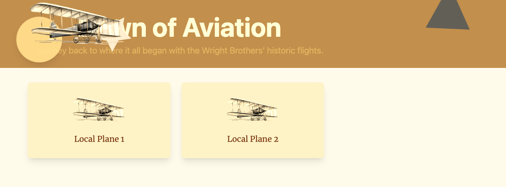

# Lab 3.1 - Dawn of Aviation ✈ Setting up the Front-End Project
This practical lab designed to teach participants frontend setup and management using GitHub Copilot. It focuses on implementing and adjusting UI components, exploring frontend technologies, and enhancing usability and accessibility, all facilitated by GitHub Copilot's interactive coding assistance.

## Prerequisites
- The prerequisites steps must be completed, see [Labs Prerequisites](./Labs/Lab%201.1%20-%20Pre-Flight%20Checklist)

## Estimated time to complete
- 20 minutes, times may vary with optional labs.

> [!IMPORTANT]
> Ensure error-free results by meticulously following each step of the lab instructions.

## Objectives
- Teach frontend setup and management.
- Implement and adjust UI components.
- Explore frontend technologies while enhancing usability and accessibility.

    ### Journey
    - Step 1 - Sunset above the Clouds - Setup and Run the Frontend
    - Step 2 - Looking over the Horizon - Exploring the frontend application.
    - Step 3 - In-flight Correction - Centering a div.
    - Step 4 - Request for Extra Legroom - Spacing UI elements
    - Step 5 - Emergency Exit Lights - Color Contrast
    - Step 6 - Notifying the Air Crew - Call to Action Buttons.
    - Step 7 - Check for WCAG Guidelines (Optional)

### Step 1: Sunset above the Clouds - Setup and Run the Frontend

>[!NOTE]
> When working with the frontend, you'll benefit from the auto-reload feature. This means that after making changes, there's no need to manually restart; the system will automatically reload for you. However, please note that the API does require a restart after modifications.

- Open the terminal and navigate to the `WrightBrothersFrontend/` directory.

    ```bash
    cd WrightBrothersFrontend/
    ```

- Run the following command to install the dependencies:

    ```bash
    npm install
    ```

- Now, run the following command to start the frontend:

    ```bash
    npm run frontend
    ```

- Click `Open in Browser` or navigate to [http://localhost:5173/](http://localhost:5173/)

- You should see the following page:



- Stop the frontend application by pressing `Ctrl + C` in the terminal.

### Step 2: Looking over the Horizon - Exploring the frontend application

- Open GitHub Copilot Chat

- Type the following in the chat window:

    ```bash
    @workspace explain the frontend repository
    ```
>[!NOTE]
> @workspace scans the repository to find relevant information about the question asked. It will provide a summary of the repository, including the technologies used, the purpose of the repository, and the structure of the repository.

- In the same chat window, type the following:

    ```bash
    What technology is used to run the frontend application and why?
    ```

- The frontend application uses Vite, a fast frontend build tool that provides a lightning-fast development experience. Currently it's one of the most popular tools for frontend development, replacing Webpack and Parcel.

- In the same chat window, type the following:

    ```bash
    @workspace what technology is used to style the frontend and explain the core basics of this technology.
    ```

- GitHub Copilot will provide a summary about `Tailwind CSS`, a utility-first CSS framework that provides a set of utility classes to style the frontend application. This is a very popular CSS framework that is used to style components from scratch, for example for a custom design system.

>[!NOTE]
> If you encounter a new technology or concept it's always a good idea to understand the basics of it and how it works. GitHub Copilot can help you with that.

- In the same chat window, type the following:

    ```bash
    @workspace where can I find the entry point of the frontend application and where can I update the homepage?
    ```

- Copilot will give a suggestion that the entry point is `WrightBrothersFrontend/src/App.tsx` and the homepage can be updated in the `WrightBrothersFrontend/src/pages/HomePage.tsx` file.

- In this lab you learned how to use GitHub Copilot to understand the frontend repository and its structure. You also learned how to ask questions about the frontend repository and the technologies used in it.

- You are now ready to start coding the frontend.

### Step 3: In-flight Correction - Centering a div

- Let's tackle a common challenge many developers face: centering HTML elements.

- Open the terminal and navigate to the `WrightBrothersFrontend/` directory.

    ```bash
    cd WrightBrothersFrontend/
    ```

- Start the frontend application:

    ```bash
    npm run frontend
    ```

- Click `Open in Browser` or navigate to [http://localhost:5173/](http://localhost:5173/)

- Note how the UI is not centered.

    

- Open the `WrightBrothersFrontend/src/components/Banner.tsx` file.

- Open GitHub Copilot Chat, then click `+` to clear prompt history.

- Select all the contents of `Banner.tsx` file.

- Ask Copilot Chat why the UI is not centered:

    ```md
    How can I center the banner title in the middle of the banner?
    ```
- Copilot will provide you with a solution to center the banner title.

>[!NOTE]
> GitHub Copilot understands UI and how elements are positioned. It will provide you with a solution to center the banner title.

- Try to implement the solution by following the steps given by GitHub Copilot.

- In the Copilot Chat window, click `Insert at Cursor` or `Apply in Editor`.

- When using `Apply in Editor`, be sure to click `Accept Changes` for each change.

<br>

<details>
<summary>Click for Solution</summary>

- Find the top level `div` element and add the following CSS classes `flex items-center justify-center` to the `div` element:

```html
<div className="{other classes} ... flex items-center justify-center">
    {/* ... */}
</div>
```

</details>

<br>

- Save the file and refresh the browser.

- The banner title should now be centered.

- Stop the frontend application by pressing `Ctrl + C` in the terminal.

### Step 4: Request for Extra Legroom - Spacing UI elements

- The banner title and subtitle are too close to each other.


- Open GitHub Copilot Chat, then click `+` to clear prompt history.

- Select all the contents of `Banner.tsx` file.

- Ask Copilot Chat to make the content more spacious:

    ```md
    The content feels very cramped. How can I make it a lot more spacious?
    ```

- Submit the prompt to GitHub Copilot.

- Copilot will provide you with a solution to add spacing between the title and subtitle.

>[!NOTE]
> You can always tell Copilot how a UI appeals to you and how you want to improve it. Copilot understands UI/UX and will provide a solution based on best practices.

- Replace the content of the `Banner.tsx` file with the solution provided by GitHub Copilot.

- In the Copilot Chat window, click `Insert at Cursor` or `Apply in Editor`.

- When using `Apply in Editor`, be sure to click `Accept Changes` for each change.

<br>
<details>
<summary>Click for Solution</summary>

```tsx
import React from "react";
import { Airplane } from "./Airplane";
const Banner: React.FC = () => {
    return (
        <div className="relative vintage-filter bg-amber-600 overflow-hidden p-10 flex items-center justify-center">
            <div className="h-40 px-8 sm:px-10 lg:px-12 max-w-screen-md flex flex-col text-center m-10">
                <h1 className="text-5xl leading-none font-bold text-amber-100 sm:text-6xl sm:leading-tight">
                Dawn of Aviation
                </h1>
                <p className="text-xl leading-8 text-amber-500 mt-5">
                Journey back to where it all began with the Wright Brothers' historic
                flights.
                </p>
            </div>
            <div className="absolute top-10 left-10">
                <div className="circle shadow-lg pulse-gentle"></div>{" "}
                {/* Sun with pulsing effect */}
            </div>
            <div className="absolute bottom-40 right-40">
                <div className="triangle drift-slow"></div>{" "}
                {/* Triangle with drifting effect */}
            </div>
            <div className="absolute left-16 bottom-8">
                <div className="absolute bottom-0 left-0">
                <PropellerSVG /> {/* Propeller with shadow */}
                </div>
                <div className="absolute bottom-0 left-0 mt-16 float-gentle">
                <Airplane />
                </div>
            </div>
        </div>
    );
};
const PropellerSVG = () => (
    <svg
        className="absolute bottom-0 left-40 rotate-slow"
        xmlns="http://www.w3.org/2000/svg"
        viewBox="0 0 24 24"
        width="100"
        height="100"
    >
        <path
        d="M12 2L15 8L22 9L17 14L18 21L12 18L6 21L7 14L2 9L9 8L12 2Z"
        fill="#D1D5DB"
        />
    </svg>
);
export default Banner;
```

</details>

<br>

- Save the file and refresh the browser.

- The banner should now feel more spacious.

    

> [!IMPORTANT]
> Copilot does not always provide the exact solution you are looking for. Try the prompt again or provide more context to get a better solution.

- Stop the frontend application by pressing `Ctrl + C` in the terminal.

### Step 5: Emergency Exit Lights - Color Contrast

- The subtitle of the banner is hard to read because it has almost the same color as the background.

    

- Open GitHub Copilot Chat, then click `+` to clear prompt history.

- Select all the contents of `Banner.tsx` file.

- Ask Copilot Chat what color you should use for the subtitle:

    ```md
    The subtitle in the banner is hard to read due to its color. Can you suggest a color which would better fit the existing color pallette while still improving readability?
    ```

- Now submit the prompt to GitHub Copilot.

- Copilot understands colors and contrasts and will provide you with a color that has a good contrast with the background.

<br>
<details>
<summary>Click for Solution</summary>

```html
<p className="mt-6 text-xl leading-8 text-amber-200">
Journey back to where it all began with the Wright Brothers' historic
flights.
</p>
```

</details>

<br>

- Implement the solution by changing the `text-amber-200` class to what was provided by GitHub Copilot.

- In the Copilot Chat window, click `Insert at Cursor` or `Apply in Editor`.

- When using `Apply in Editor`, be sure to click `Accept Changes` for each change.

- Save the file and refresh the browser.

- The subtitle should now be more readable.

- Stop the frontend application by pressing `Ctrl + C` in the terminal.

### Step 6 (Optional): Notifying the Air Crew - Call to Action Buttons

- The banner is missing call to action buttons.

- Open GitHub Copilot Chat, then click `+` to clear prompt history.

- Select all the contents of `Banner.tsx` file.

- Ask Copilot Chat how to add call to action buttons to the banner:

    ```md
   Create two call to action buttons in the banner at #selection. Place them below the subtitle and center them. The first button is primary and should have the text "Learn More" and the second button is secondary should have the text "Get Started". The buttons should match the design of the banner.
    ```

>[!NOTE]
> We can provide Copilot a detailed description of what we want to achieve in the UI and Copilot will figure out the best way to implement it in the current implemented design.

>[!NOTE]
> The buttons do not correspond to any existing page or functionality. They are just for demonstration purposes.

- Implement the solution by following the steps provided by GitHub Copilot.

<br>

<details>
<summary>Click for Solution</summary>

- Add the following code below the subtitle:

    ```html
    <div>
        <div>
            {/* ...existing code... */}

            <p className="mt-6 text-xl leading-8 text-amber-200">
                Journey back to where it all began with the Wright Brothers' historic
                flights.
            </p>

            {/* Add this block for the buttons */}
            <div className="mt-6 flex justify-center">
                <button className="mx-2 py-2 px-4 bg-amber-500 text-amber-100 rounded-md shadow-md hover:bg-amber-700">
                Learn More
                </button>
                <button className="mx-2 py-2 px-4 bg-amber-300 text-amber-900 rounded-md shadow-md hover:bg-amber-500">
                Get Started
                </button>
            </div>
        </div>
    </div>
    {/* ...rest of code... */}
    ```
</details>

<br>

- Save the file and refresh the browser at [http://localhost:5173/](http://localhost:5173/).

- The banner should now have two call to action buttons.

   

- Hover over the buttons to see the hover effect.

## Optional

### Step 7 (Optional) - Check for WCAG Guidelines (Optional)

The Web Content Accessibility Guidelines (WCAG) are international standards for making web content accessible to people with disabilities. They are based on four principles, summarized as POUR:

- Perceivable: Content must be perceivable to users, with text alternatives for non-text content and sufficient contrast.
- Operable: Interface and navigation must be usable, with keyboard accessibility and seizure-safe content.
- Understandable: Information and operations must be clear, with readable text and predictable navigation.
- Robust: Content must be compatible with various user agents, including assistive technologies, using clean HTML.

WCAG guidelines have three levels of conformance:
- A (Lowest): Minimum accessibility.
- AA (Mid-range): Addresses common accessibility barriers.
- AAA (Highest): Ensures the highest level of accessibility.

These guidelines ensure web content is accessible to people with various disabilities, including visual, auditory, physical, speech, cognitive, language, learning, and neurological disabilities.

- Open GitHub Copilot Chat, then click `+` to clear prompt history.

- Select all the contents of `Banner.tsx` file.

- Ask Copilot Chat if the UI is WCAG compliant.

    ```md
    Does the UI meet the specified WCAG guidelines?
    ```

- Copilot will provide you with guidance and suggestions on how to make the UI WCAG compliant.

- Free free to click "Apply in Editor" to make the changes.

### Congratulations you've made it to the end! &#9992; &#9992; &#9992;

#### And with that, you've now concluded this module. We hope you enjoyed it! &#x1F60A;
