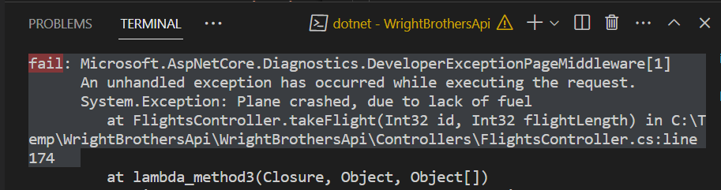

# Air Crash Investigation: Troubleshooting with GitHub Copilot
The module simulates airplane crash scenarios using GitHub Copilot to identify and fix the root causes, enhancing understanding of Copilot's limitations and emphasizing human oversight in coding challenges.

A reference to the [Air Crash Investigation](https://en.wikipedia.org/wiki/Mayday_(Canadian_TV_series)) TV show, where the investigators try to find the root cause of an airplane crash. In this module, we will simulate a few airplane crashes and use GitHub Copilot to troubleshoot and fix the issues.

## Prerequisites
- The prerequisites steps must be completed, see [Labs Prerequisites](./Labs/Lab%201.1%20-%20Pre-Flight%20Checklist)

## Estimated time to complete
- 30 to 45 minutes, varying with optional labs.

## Objectives
- Understanding the limitations of GitHub Copilot and learning how to troubleshoot its suggestions.
- Group challenge to fix a set of buggy codes using Copilot, highlighting the importance of human oversight.

### Step 1. Flight Crash Investigation - Fuel Depletion Scenario

- Open `FlightsController.cs` file located in the `Controllers` folder.

- Navigate to the `takeFlight` method.

> [!Note]
> The method simulates a flight and throws an exception if the flight runs out of fuel.

```csharp
public class FlightsController : ControllerBase
{
    [HttpPost("{id}/takeFlight/{flightLength}")]
    public ActionResult takeFlight(int id, int flightLength)
    {
        var flight = Flights.Find(f => f.Id == id);

        for (int i = 0; i < flightLength; i++)
        {
            if (flight.FuelRange == 0)
            {
                throw new Exception("Plane crashed, due to lack of fuel");
            }
            else
            {
                var fuelConsumption = 1;
                
                if (flight.FuelTankLeak)
                {
                    fuelConsumption = 2;
                }

                flight.FuelRange -= fuelConsumption;
            }
        }

        return Ok($"Flight took off and flew {flightLength} kilometers/miles.");
    }
}
```

- Open a terminal and navigate to the `WrightBrothersApi` folder
- Run the application

    ```sh
    dotnet run
    ```

- Now go to `Examples/Flights.http` file and execute the `takeFlight` request.

```
POST http://localhost:1903/flights/1/takeFlight/75 HTTP/1.1
content-type: application/json
```

~~TODO [Screenshot] pointing to the POST request option in VSCode~~
~~~~

> [!Note]
> You must have the `Rest Client` with identifier `humao.rest-client` extension installed in Visual Studio Code to execute the request. Rest Client is a very useful extension to quickly execute HTTP requests and commit them to Git.

- You will see that the flight is taking off and the response is `200 OK`.

> [!Note]
> The flight is taking off and the response is `200 OK`. The flight that is simulated did not run out of fuel.


    ```json
    HTTP/1.1 200 OK
    Connection: close
    ```

- Now execute the request again, but now for flight `3`.

- Change the `1` to `3` in the request and execute it again.

```
POST http://localhost:1903/flights/3/takeFlight/75 HTTP/1.1
content-type: application/json
```

- You will see that the flight is taking off and the response is `500 Internal Server Error`. The flight that is simulated ran out of fuel and crashed.

- The Rest Client response will now include the `FlightLog` property as follows:

    ```json
    HTTP/1.1 500 Internal Server Error
    Connection: close

    System.Exception: Plane crashed, due to lack of fuel
   at FlightsController.takeFlight(Int32 id, Int32 flightLength) in C:\Temp\WrightBrothersApi\WrightBrothersApi\Controllers\FlightsController.cs:line 174
    ```

- Stop the app by pressing `Ctrl + C` or `Cmd + C` in the terminal.

- Now, let's debug it with GitHub Copilot

- Navigate to the `Terminal` and select the content of the throw exception.

// FIX Screenshot with Right -> Click Explain This


> [!Note]
> GitHub Copilot will explain the code in a human readable format.

- Stop the app by pressing `Ctrl + C` or `Cmd + C` in the terminal, or by clicking on the 'Stop' button in the debugger panel

### Step 2. Lightning Strikes, Unexpected Flight Crash - Stack Overflow Scenario

- Open `FlightsController.cs` file located in the `Controllers` folder.

- Navigate to the `lightningStrike` method.

> [!Note]
> The method simulates a lightning strike and causes recursion.

```csharp
public class FlightsController : ControllerBase
{
    // Rest of the FlightsController.cs file

    [HttpPost("{id}/lightningStrike")]
    public ActionResult lightningStrike(int id)
    {
        // Lightning caused recursion on an inflight instrument
        lightningStrike(id);

        return Ok($"Recovers from lightning strike.");
    }
}
```

- Open a terminal and navigate to the `WrightBrothersApi` folder
- Run the application

    ```sh
    dotnet run
    ```

- Go to the `Examples/Flights.http` file and execute the `lightningStrike` request.

    ```
    POST http://localhost:1903/flights/1/lightningStrike HTTP/1.1
    content-type: application/json
    ```

- The application will crash.

    ```json
   Stack overflow.
   at FlightsController.lightningStrike(Int32)

    ```

- Now, let's debug it with GitHub Copilot

- Navigate to the `Terminal` and select the content of the throw exception.

TODO Screenshot


- Right click the terminal and select `Copilot: Explain this` from the context menu.

TODO Screenshot


> [!Note]
> GitHub Copilot will explain the code in a human readable format.

- Move the conversation to the Copilot Chat extension window.

TODO Screenshot


- Now ask GitHub Copilot to fix the code.

    ```sh
    @workspace how to fix this?
    ```

> [!Note]
> GitHub Copilot will suggest how to handle recursion. Using @workspace with the question will make Github Copilot use more context to generate the suggestion.

### Optional

### Step 3. Aerodynamics of an Airplane - Performance Optimization

- Open `FlightsController.cs` file located in the `Controllers` folder.

- Navigate to the `calculateAerodynamics` method.

> [!Note]
> The method is calculating prime numbers.

```csharp
public class FlightsController : ControllerBase
{
    [HttpPost("{id}/calculateAerodynamics")]
    public ActionResult calculateAerodynamics(int id)
    {
        Stopwatch stopwatch = new Stopwatch();
        stopwatch.Start();

        List<int> primes = CalculatePrimes(2, 300000);

        stopwatch.Stop();
        Console.WriteLine($"Found {primes.Count} prime numbers.");
        Console.WriteLine($"Elapsed Time: {stopwatch.ElapsedMilliseconds / 1000.0} seconds");

        return Ok($"Calculated aerodynamics.");
    }

    public static List<int> CalculatePrimes(int start, int end)
    {
        List<int> primes = new List<int>();
        for (int number = start; number <= end; number++)
        {
            if (IsPrime(number))
            {
                primes.Add(number);
            }
        }
        return primes;
    }

    public static bool IsPrime(int number)
    {
        if (number <= 1) return false;
        for (int i = 2; i < number; i++)
        {
            if (number % i == 0) return false;
        }
        return true;
    }
}
```

- Open a terminal and navigate to the `WrightBrothersApi` folder
- Run the application

    ```sh
    dotnet run
    ```

- Now go to `Examples/Flights.http` file click `Send Request` to execute the `calculateAerodynamics` request.

    POST http://localhost:1903/flights/1/calculateAerodynamics HTTP/1.1
    content-type: application/json
    ```

- Response will be:

    ```json
    HTTP/1.1 200 OK
    Connection: close
    ```

- Terminal will show:

    ```json
    Found 25997 prime numbers.
    Elapsed Time: 4.863 seconds
    ```

- The application will calculate the prime numbers in more than 5 seconds.

- Now, let's optimize it with GitHub Copilot

- Open the Copilot Chat extension window.

- Select all the code for the `calculateAerodynamics` method.

- Ask the following question in GitHub Copilot chat window:

    ```
    Can you optimize the selected code?
    ```

- Copilot will optimize the code.

- Now go to `Examples/Flights.http` file and execute the `calculateAerodynamics` request again.

    ```
    POST http://localhost:1903/flights/1/calculateAerodynamics HTTP/1.1
    content-type: application/json
    ```

Example output:

    ```
    Found 25997 prime numbers.
    Elapsed Time: 0.014 seconds
    ```

- The application will now calculate the prime numbers in less than 50 milliseconds.

> [!Note]
> GitHub Copilot has knowledge of many algorithmic optimizations and can help you optimize your code performance.


### Congratulations you've made it to the end! &#9992; &#9992; &#9992;

#### And with that, you've now concluded this module. We hope you enjoyed it! &#x1F60A;
