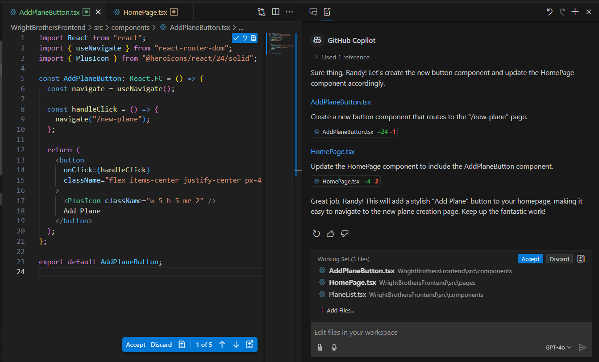
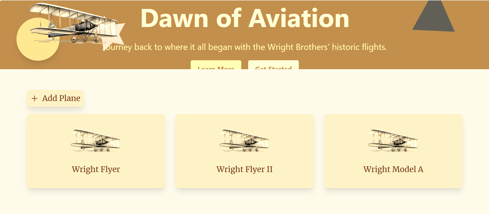
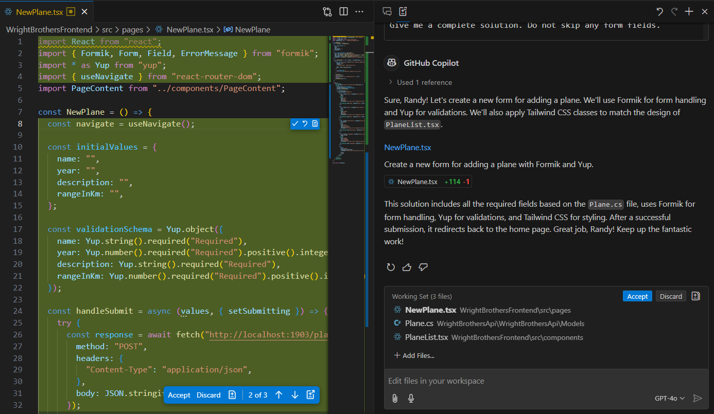
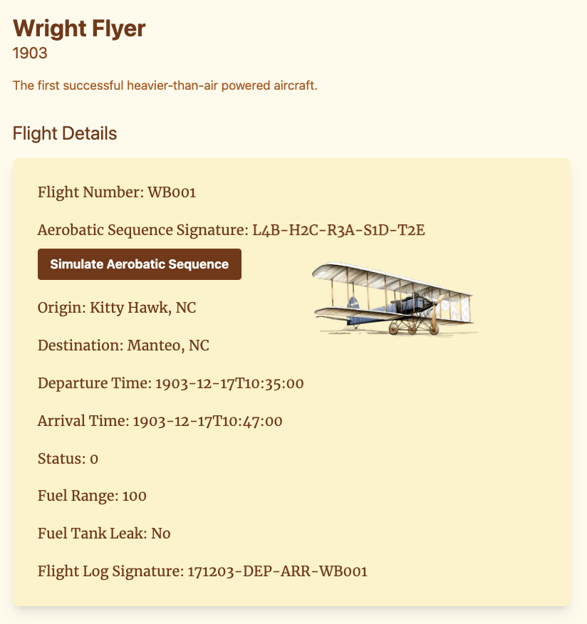

# Lab 3.3 - In-Flight Entertainment ✈ Creating Interactive Components
This lab exercise is focused on integrating styled buttons and forms to enhance user interactions, with emphasis on design consistency and functional integration. The lab aims to improve skills in component creation, event handling, and API interactions in a React environment, utilizing GitHub Copilot for code generation.

## Prerequisites
- The prerequisites steps must be completed, see [Labs Prerequisites](./Labs/Lab%201.1%20-%20Pre-Flight%20Checklist)

## Estimated time to complete
- 20 minutes, times may vary with optional labs.

> [!IMPORTANT]
> Ensure error-free results by meticulously following each step of the lab instructions.

## Objectives
- Enhance user interactions through the integration of styled buttons and forms.
- Improve skills in UI component creation.
- Develop proficiency in event handling and API interactions.

    ### Journey
    - Step 1: Push to Start - Create a Styled Button
    - Step 2: Fill in the Form - Create a Styled Form
    - Step 3: Advanced Form Integration with Open API (Optional)

### Step 1 - Push to Start - Create a Styled Button 

- Close any files that are opened.

- Open GitHub Copilot `Edits` (Ctrl+Shift+I) (icon with + on it next to Copilot Chat), then click `+` for `New Edit Session`.

- Add the following files to the `Working Set` near the bottom of Copilot Edits window.

- Click the `+ Add files` button, then select these:
    - `PlaneList.tsx`

> [!NOTE]
> You can multi-select these files from the file explorer by holding the `Ctrl` down and `Left-Clicking` on each file. Then simply drag-n-drop them into Copilot Edits working set window.

- Copy/Paste the following in the Copilot Edits Chat window:

    ```
    Create a new button component and route the button to the "/new-plane" page

    ## Design
    - Create new component named "AddPlaneButton.tsx" in the src/components folder.
    - Create a button that is in the same style as #file:PlaneList.tsx
    - Button text is "Add Plane"
    - Add a plus icon left of the text
    - Spacing on the top and bottom of the button
    - Elevate the button when hovered
    - Update the HomePage.tsx file by adding the following:
      - a new import statement near the top of the file to import the AddPlaneButton component.
      - Add the AddPlaneButton component below the Banner component inside the PageContent component.

    ## Technical Requirements
    - Create a new button component
    - use "@heroicons/react/24/solid" for the plus icon
    ```

>[!NOTE]
> Note the `#file:PlaneList.tsx` reference. This is a hint to match the style of the button to the existing  `<PlaneList />` component. 



- Press `Enter` to submit the prompt.

- You can choose to `Accept` or `Discard` the changes in the file editor or the `Working Set` window.

- Copilot created a new `AddPlaneButton` component and added it to the `HomePage` banner.

- Click `Accept` to save the changes, then click `Done` in the `Copilot Edits` window to complete this task.

- If Copilot didn't suggest the code above, then update the code manually as follows:

<Br>

<details>
<summary>Click for Solution - AddPlaneButton</summary>

```tsx
import React from "react";
import { useNavigate } from "react-router-dom";
import { PlusIcon } from "@heroicons/react/24/solid";

const AddPlaneButton: React.FC = () => {
  const navigate = useNavigate();

  const handleClick = () => {
    navigate("/new-plane");
  };

  return (
    <button
      onClick={handleClick}
      className="flex items-center justify-center px-4 py-2 bg-amber-100 text-amber-900 rounded-lg shadow-lg hover:shadow-xl transition-shadow duration-300"
    >
      <PlusIcon className="w-5 h-5 mr-2" />
      Add Plane
    </button>
  );
};

export default AddPlaneButton;
```

</details>

<Br>

<details>
<summary>Click for Solution - Homepage</summary>

```tsx
import Banner from "../components/Banner";
import PlaneList from "../components/PlaneList";
import PageContent from "../components/PageContent";
import AddPlaneButton from "../components/AddPlaneButton";

const HomePage: React.FC = () => {
  const planes = [
    { id: 1, name: "Local Plane 1" },
    { id: 2, name: "Local Plane 2" },
  ];

  return (
    <div>
      <Banner />
      <PageContent>
        <AddPlaneButton />
        <PlaneList planes={planes} />
      </PageContent>
    </div>
  );
};

export default HomePage;
```

</details>

<Br>

>[!IMPORTANT]
> Sometimes it will suggest `@heroicons/react/solid` without the size. Make sure to add the size `24` to the import, change the import to `@heroicons/react/24/solid`

- In the Copilot Chat window for install `Heroicons package`, click `Insert into Terminal` for command npm install react-query.

    ```bash
    npm install @heroicons/react
    ```

- From the `WrightBrothersFrontend/` directory, run the frontend and backend with the following command. This command will start the frontend and backend at the same time.

    ```bash
    npm run frontend-and-backend
    ```

- Click `Open in Browser` or navigate to [http://localhost:5173/](http://localhost:5173/)

- You should see the new button based on the `PlaneList.tsx` component.

    

- The button should be styled and have a plus icon and a hover effect.

- Now, Click the button to navigate to the new plane page.

- Stop the Frontend and API by pressing `Ctrl + C` in the terminal.

### Step 2 - Form Creation

- In this step, we will create a form for adding a new plane.

- Close any files that are opened.

- Open GitHub Copilot `Edits` (Ctrl+Shift+I) (icon with + on it next to Copilot Chat), then click `+` for `New Edit Session`.

- Add the following files to the `Working Set` near the bottom of Copilot Edits window.

- Click the `+ Add files` button, then select these:
    - `PlaneList.tsx`
    - `NewPlane.tsx`
    - `Plane.cs`

> [!NOTE]
> You can multi-select these files from the file explorer by holding the `Ctrl` down and `Left-Clicking` on each file. Then simply drag-n-drop them into Copilot Edits working set window.

- Copy/Paste the following in the Copilot Edits Chat window:

    ```
    Create new input fields for a POST to http://localhost:1903/planes

    ## Design
    - Apply tailwind classes to match the design of #file:PlaneList.tsx
    - Every input should have a label

    ## Technical Requirements
    - Create fields based on file #file:Plane.cs
    - Use Formik for form handling
    - Use Yup for validations
    - Every input should have an ID
    - Redirect back to the home page after successful submission

    Give me a complete solution. Do not skip any form fields.
  ```

>[!NOTE]
> If the result is incomplete or doesn't work, simply retry the prompt.



- Press `Enter` to submit the prompt.

- You can choose to `Accept` or `Discard` the changes in the file editor or the `Working Set` window.

- Copilot updated the `NewPlane` component with all the input fields based on the `Plane.cs` model.

- Click `Accept` to save the changes, then click `Done` in the `Copilot Edits` window to complete this task.

- If Copilot didn't suggest the code above, then update the code manually as follows:

<Br>

<details>
<summary>Click for Solution - NewPlane</summary>

```tsx
import React from "react";
import { Formik, Form, Field, ErrorMessage } from "formik";
import * as Yup from "yup";
import { useNavigate } from "react-router-dom";
import PageContent from "../components/PageContent";

const NewPlane = () => {
  const navigate = useNavigate();

  const initialValues = {
    name: "",
    year: "",
    description: "",
    rangeInKm: "",
  };

  const validationSchema = Yup.object({
    name: Yup.string().required("Required"),
    year: Yup.number().required("Required").positive().integer(),
    description: Yup.string().required("Required"),
    rangeInKm: Yup.number().required("Required").positive().integer(),
  });

  const handleSubmit = async (values, { setSubmitting }) => {
    try {
      const response = await fetch("http://localhost:1903/planes", {
        method: "POST",
        headers: {
          "Content-Type": "application/json",
        },
        body: JSON.stringify(values),
      });

      if (!response.ok) {
        throw new Error("Network response was not ok");
      }

      navigate("/");
    } catch (error) {
      console.error("Error submitting form:", error);
    } finally {
      setSubmitting(false);
    }
  };

  return (
    <PageContent>
      <h1 className="text-2xl font-bold mb-4">New Plane</h1>
      <Formik
        initialValues={initialValues}
        validationSchema={validationSchema}
        onSubmit={handleSubmit}
      >
        {({ isSubmitting }) => (
          <Form className="space-y-4">
            <div>
              <label htmlFor="name" className="block text-sm font-medium text-gray-700">
                Name
              </label>
              <Field
                type="text"
                id="name"
                name="name"
                className="mt-1 block w-full shadow-sm sm:text-sm border-gray-300 rounded-md"
              />
              <ErrorMessage name="name" component="div" className="text-red-500 text-sm" />
            </div>

            <div>
              <label htmlFor="year" className="block text-sm font-medium text-gray-700">
                Year
              </label>
              <Field
                type="number"
                id="year"
                name="year"
                className="mt-1 block w-full shadow-sm sm:text-sm border-gray-300 rounded-md"
              />
              <ErrorMessage name="year" component="div" className="text-red-500 text-sm" />
            </div>

            <div>
              <label htmlFor="description" className="block text-sm font-medium text-gray-700">
                Description
              </label>
              <Field
                type="text"
                id="description"
                name="description"
                className="mt-1 block w-full shadow-sm sm:text-sm border-gray-300 rounded-md"
              />
              <ErrorMessage name="description" component="div" className="text-red-500 text-sm" />
            </div>

            <div>
              <label htmlFor="rangeInKm" className="block text-sm font-medium text-gray-700">
                Range (in Km)
              </label>
              <Field
                type="number"
                id="rangeInKm"
                name="rangeInKm"
                className="mt-1 block w-full shadow-sm sm:text-sm border-gray-300 rounded-md"
              />
              <ErrorMessage name="rangeInKm" component="div" className="text-red-500 text-sm" />
            </div>

            <div>
              <button
                type="submit"
                disabled={isSubmitting}
                className="inline-flex items-center px-4 py-2 border border-transparent text-sm font-medium rounded-md shadow-sm text-white bg-amber-600 hover:bg-amber-700 focus:outline-none focus:ring-2 focus:ring-offset-2 focus:ring-amber-500"
              >
                Submit
              </button>
            </div>
          </Form>
        )}
      </Formik>
    </PageContent>
  );
};

export default NewPlane;
```

- Next, since we are running in a Codespace, we need to update the API URL for `localhost:1903`.

- Identify Your Codespace Name from the browser URL.

- Construct the URL for the API
    - Prefix the URL with your codespace name.
    - Append **-1903.app.github.dev/planes/** to the end.
    - Update line to match the example.

- Example
    - `axios.get("https://super-duper-space-robot-4v6rvqwggx25xq7-1903.app.github.dev/planes/")`
    
- Save the file.

- From the `WrightBrothersFrontend/` directory, run the frontend and backend with the following command. This command will start the frontend and backend at the same time.

    ```bash
    npm run frontend-and-backend
    ```
  
  - If you haven't done so already, we need to make port `1903` public instead of private to allow access to list of planes.

    - Click the `PORTS` button (near bottom center).

    - With your cursor over port 1903, `Right-Click`, select `Port Visability`, then click `Public`.

      > [!NOTE]
      > Making port 1903 public is necessary to allow external access to the service running on that port. In this context, the service provides a list of planes, and making the port public ensures that users can access this information from outside the local development environment (a Codespace).

- Open the browser and navigate to your URL `/new-plane`.
  - i.e. `https://super-duper-space-robot-4v6rvqwggx25xq7-5173.app.github.dev/new-plane`

> [!NOTE]
> When using a Codespace, the URL will differ from your local setup. The URL is constructed in the format `localhost:5173/new-plane`. Please replace `localhost` with the name of your Codespace. Additionally, to make the port accessible, navigate to the Ports tab, right-click on the desired port, and change its visibility to `Public`.

- You should see a form with fields for adding a new plane. The form should be styled and have validation

- Fill in the form and click the `Submit` button.

- You are now redirected back to the home page and the new plane should be visible in the list.

- Now stop the Frontend and API by pressing `Ctrl + C` in the terminal.

### Step 3 (Optional) - Flight Aerobatics Show - Advanced animation

- In this lab, we will animate the aerobatics sequence that was introduced in lab 2.3 (Regex Aerobatics Show). We are going to explain the aerobatics sequence and how to animate it. GitHub Copilot will then generate the code for the animation.


> [!WARNING]  
> Critical content may have potential risks.
> You may choose to skip this step if you prefer, as it can sometimes produce inconsistent results.


- Close any files that are opened.

- From the `WrightBrothersFrontend/` directory, run the frontend and backend with the following command. This command will start the frontend and backend at the same time.

    ```bash
    npm run frontend-and-backend
    ```

- Click `Open in Browser` or navigate to [http://localhost:5173/](http://localhost:5173/).

- Click on one of the planes in the list.

- This will take you to the plane details page. The aerobatics sequence is displayed in the details.

- Note the `Simulate Aerobatics Sequence` button. This button is going to trigger the animation of the aerobatics sequence.



- Now stop the Frontend and API by pressing `Ctrl + C` in the terminal.

- Open GitHub Copilot Chat, then click `+` to clear prompt history.

- Type the following in the chat window to create the animation:

  ```
  I want you to create an React animation of an airplane doing manouvers. Implement the following function: `export const animateManeuvers = (airplaneRef: MutableRefObject<null>, maneuvers: string)`.

  ## AerobaticSequence Examples
  - L4B-H2C-R3A-S1D-T2E
  - L1A-H1B-R1C-T1E
  - L2A-H2B-R2C

  ## Maneuver
  - Manouvers: L = Loop, H = Hammerhead, R = Roll, S = Spin, T = Tailslide
  - Number represents repeat count
  - The Letter represents difficulty (A-E)

  ## Animation
  - The manouvers should follow up eachother and not go at the same time
  - Use the UTF8 icon of an airplane for the airplane
  - Difficulty translates into an increased duration of the animation
  - The Looping is a 360 full circle using a gsap motion path
  - The Hammerhead should be a 180 degree turn on the vertical axis and go right at the same time
  - The Roll should be going up and down and a 360 degree roll on the horizontal axis at the same time
  - The Spin should be a 360 degree turn on the vertical axis
  - The Tailslide should 180 degree turn and the plane going backwards at the same time
  - During the animation the airplane is moving forward constantly

  ## Technical Requirements
  - Use GSAP library for the animations
  - Use a gsap timeline.to for the animations
  - Use GSAP Motion for the Looping

  Give me a complete solution. Do not skip any GSAP animation.
  ```

- Press `Enter` to submit the question

- The result will be a complete animation of an airplane doing manouvers as described in the prompt.

<Br>

<details>
<summary>Click for Solution</summary>

```tsx
export const animateManeuvers = (airplaneRef: MutableRefObject<null>, maneuvers: string) => {
  const timeline = gsap.timeline();

  const maneuversArray = maneuvers.split('-');
  maneuversArray.forEach((maneuver) => {
    const type = maneuver.charAt(0);
    const repeatCount = parseInt(maneuver.charAt(1));
    const difficulty = maneuver.charCodeAt(2) - 65; // A-E mapped to 0-4

    switch (type) {
      case 'L': // Loop
        timeline.to(airplaneRef.current, {
          motionPath: {
            path: [{ x: 0, y: 0 }, { x: 100, y: 0 }, { x: 100, y: 100 }, { x: 0, y: 100 }],
            alignOrigin: [0.5, 0.5],
            autoRotate: true,
          },
          duration: 1 + difficulty,
          repeat: repeatCount,
        });
        break;
      case 'H': // Hammerhead
        timeline.to(airplaneRef.current, {
          rotation: 180,
          x: '+=100',
          duration: 1 + difficulty,
          repeat: repeatCount,
        });
        break;
      case 'R': // Roll
        timeline.to(airplaneRef.current, {
          y: '+=100',
          rotation: 360,
          duration: 1 + difficulty,
          repeat: repeatCount,
          yoyo: true,
        });
        break;
      case 'S': // Spin
        timeline.to(airplaneRef.current, {
          rotation: 360,
          duration: 1 + difficulty,
          repeat: repeatCount,
        });
        break;
      case 'T': // Tailslide
        timeline.to(airplaneRef.current, {
          rotation: 180,
          x: '-=100',
          duration: 1 + difficulty,
          repeat: repeatCount,
        });
        break;
      default:
        break;
    }
  });
};
```

</details>

<Br>

>[!NOTE]
> The animation is a sequence of maneuvers that are performed by the airplane. The maneuvers are represented by a string that contains the type of maneuver, the number of times the maneuver should be repeated, and the difficulty of the maneuver. The animation uses the GSAP library to create the animations. The airplane is moved along a motion path for the looping maneuver, rotated for the hammerhead, rolled for the roll, spun for the spin, and moved backward for the tailslide. The difficulty of the maneuver is used to determine the duration of the animation.

- Open the animation helpers file at `WrightBrothersFrontend/src/animationHelpers.ts` and add only the function `export const animateManeuvers = (airplaneRef, maneuvers)` provided by GitHub Copilot.

```tsx
export const animateManeuvers = (airplaneRef, maneuvers) => {
  // Rest of the component
};
```

- Open the Flight Details component `WrightBrothersFrontend/src/components/FlightDetails.tsx` and replace `// insert animateManeuvers function here` with the following code.

```tsx
// Rest of the component
const onSimulateAerobaticSequence = () => {
  animateManeuvers(planeRef, flight.aerobaticSequenceSignature);
}
```

- Click `Open in Browser` or navigate to [http://localhost:5173/](http://localhost:5173/).

- Click on one of the planes in the list.

- Click the `Simple Aerobatics Sequence` button to trigger the animation of the aerobatics sequence.

- You have successfully animated the aerobatics sequence of the airplane. The animation should be displayed in the details of the plane.

- Now stop the Frontend and API by pressing `Ctrl + C` in the terminal.

### Congratulations you've made it to the end! &#9992; &#9992; &#9992;

#### And with that, you've now concluded this module. We hope you enjoyed it! &#x1F60A;
