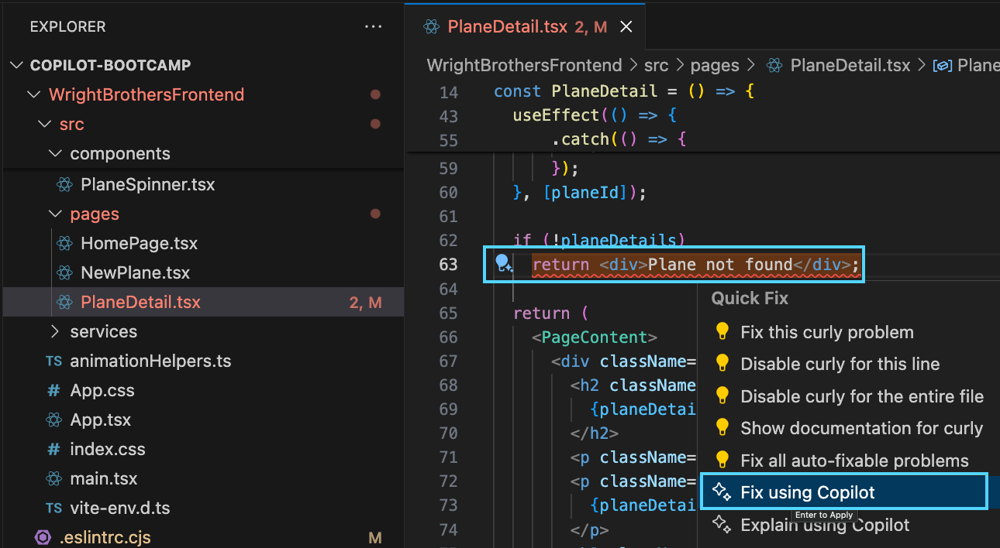
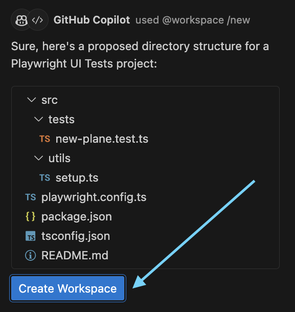

# Lab 3.4 - Carbon Reinforced Fuselage ✈ Hardening the frontend
This lab focuses on configuring eslint to identify and fix lint issues, updating package dependencies, and optionally creating a Playwright UI Test project. 

## Prerequisites
- The prerequisites steps must be completed, see [Labs Prerequisites](./Labs/Lab%201.1%20-%20Pre-Flight%20Checklist)

## Estimated time to complete
- 20 minutes, times may vary with optional labs.

> [!IMPORTANT]
> Ensure error-free results by meticulously following each step of the lab instructions.

## Objectives
- This lab focuses on configuring ESLint for identifying and resolving lint issues, updating package dependencies, and optionally setting up a Playwright UI testing project

    ### Journey
    - Step 1: Eslint configuration and fix lint issues.
    - Step 2: Upgrade to Business Class - Update Package Dependencies.
    - Step 3: PlayWright UI Test project using **/new** command.

### Step 1: Eslint configuration and fix lint issues

- In this lab, we will configure eslint and fix lint issues in the WrightBrothersFrontend project. eslint is a tool that helps you find and fix problems in your JavaScript code. It is similar to Roslyn Analyzer in the .NET.

- Run the following command to see the current lint issues

    ```bash
    npm run lint
    ```

- No lint issues should be present

- Open the `WrightBrothersFrontend/.eslintrc.cjs` file.

- Notice the lint rules are the recommended rules from eslint and react. We want to add more lint rules to harden the project.

- Open GitHub Copilot Chat, then click `+` to clear prompt history.

- Type the following in the chat window:

    ```
    What linting rules can I add to #selection to harden my project more and tell me why for each? Only give me rules that are not already part of the recommended rules.
    ```

- For `#selection`, select all the contents of the `.eslintrc.cjs` file

- Press `Enter` to submit the question

- GitHub Copilot suggested the following rules:

```js
module.exports = {
  // existing configuration...
  rules: {
    // existing rules...
    "no-console": "error",
    "eqeqeq": "error",
    "curly": "error",
    "no-eval": "error",
    "no-unused-vars": "error",
  },
};
```

>[!NOTE]
> Note that GitHub Copilot now suggested rules and also provided a reason to why implement a specific rule. This is a great way to learn more about the rules and why they are important.

- Using the new rules Copilt Chat provided, manually add the new rules to the `.eslintrc.cjs` file.

    <Br>
    <details>
    <summary>Click for Solution</summary>

    ```js
      module.exports = {
      root: true,
      env: { browser: true, es2020: true },
      extends: [
        "eslint:recommended",
        "plugin:@typescript-eslint/recommended",
        "plugin:react-hooks/recommended",
      ],
      ignorePatterns: ["dist", ".eslintrc.cjs"],
      parser: "@typescript-eslint/parser",
      plugins: ["react-refresh"],
      rules: {
        "react-refresh/only-export-components": [
          "warn",
          { allowConstantExport: true },
        ],
        "@typescript-eslint/no-explicit-any": "off",
        "no-console": "error",
        "eqeqeq": "error",
        "no-eval": "error",
        "curly": "error",
        "no-unused-vars": "error",
        "@typescript-eslint/no-unused-vars": "error",
        "@typescript-eslint/explicit-module-boundary-types": "error",
      },
    };
    ```

    </details>

- Run `npm run lint` to scan for lint issues with the new rules

- You should now see lint issues related to the new rules

```bash
/Copilot-Bootcamp/WrightBrothersFrontend/src/pages/PlaneDetail.tsx
  77:16  error  Expected '===' and instead saw '=='  eqeqeq
  87:5   error  Expected { after 'if' condition      curly

/Copilot-Bootcamp/WrightBrothersFrontend/src/services/PlaneService.ts
  12:5  error  Unexpected console statement  no-console
```

- Ask Copilot to fix the lint issues

- Go to the lint issues in `WrightBrothersFrontend/src/pages/PlaneDetail.tsx`.

- Find the following code snippet that contains the `eqeqeq` lint issue:

```tsx
  if (!planeDetails)
    return <div>Plane not found</div>;
```

- Right-click on the first lint issue and select `Fix using Copilot` from the context menu.

  

- GitHub Copilot will now open a Inline Editor window with the suggested fix. Review the fix and click `Apply Fix` to apply the fix.

- Repeat for the other lint issues. You can also try `Explain using Copilot` to understand why the rule is important.

### Step 2: Navigating the Touch Screen - Visual Component Testing

- In this lab, we will create visual component tests for the PlaneList component in the WrightBrothersFrontend project. Visual component testing is a new way of testing the interaction and appearance of components in isolation.

- For these tests we are using Playwright, a tool for automating browsers. Playwright is similar to Selenium but with a more modern API and better performance.

- Let's first run the existing tests in the project. Run `npm run test-ct` (component test) to see the existing tests pass.

  ```sh
  cd WrightBrothersFrontend/
  npm run test-ct
  ```

- You should see that all tests pass

  ```sh
  Running 2 tests using 2 workers
    2 passed (4.8s)
  ```

> [!NOTE]
> If you encounter any of the following errors, follow the provided steps to resolve them:

- Error: `browserType.launch: Executable doesn't exist.` 
  - This error indicates a problem with your Playwright installation. Please check your installation and fix any issues before proceeding.

- Error: `Looks like Playwright Test or Playwright was just installed or updated.`
  - This error usually occurs after a new installation or update of Playwright. If you see this, try running the command below to install the necessary Playwright dependencies:

  ```bash
  npx playwright install
  ```

  - Try again, run the existing tests in the project. Run `npm run test-ct` (component test) to see the existing tests pass.

  ```sh
  npm run test-ct
  ```

- Open the `PlaneList.tsx` file in the `src/components` folder. This component is a list of planes that are displayed in the `HomePage.tsx` page.

- We are going to add tests to the already existing `PlaneList.spec.tsx` file in the `src/components` folder.

- Open GitHub Copilot Chat, then click `+` to clear prompt history.

- Type the following in the chat window:

    ```
    Create remaining tests for #selection based on test file #file:PlaneList.spec.tsx.
    ```

- For `#selection`, select all the contents of the `PlaneList.tsx` file

- GitHub Copilot will suggest additional tests to test all the functionality of the `PlaneList` component.

  ```tsx
  test('renders without crashing', async ({ mount }) => {
    await mount<HooksConfig>(<PlaneList />, {
      hooksConfig: { routing: true },
    });
  });

  test('renders correct number of planes', async ({ page, mount }) => {
    const planes = [
      { id: 1, name: "Wright Flyer" },
      { id: 2, name: "Wright Model A" },
      { id: 3, name: "Wright Model B" },
    ];

    await mount<HooksConfig>(<PlaneList planes={planes} />, {
      hooksConfig: { routing: true },
    });

    const liElements = await page.locator('li');
    expect(await liElements.count()).toBe(planes.length);
  });

  test('displays correct plane names', async ({ page, mount }) => {
    const planes = [
      { id: 1, name: "Wright Flyer" },
      { id: 2, name: "Wright Model A" },
      { id: 3, name: "Wright Model B" },
    ];

    await mount<HooksConfig>(<PlaneList planes={planes} />, {
      hooksConfig: { routing: true },
    });

    for (let i = 0; i < planes.length; i++) {
      const h3Element = await page.locator('li h3').nth(i);
      expect(await h3Element.textContent()).toBe(planes[i].name);
    }
  });

  test('adds "flying" class to image when plane is clicked', async ({ page, mount }) => {
    const planes = [
      { id: 1, name: "Wright Flyer" },
    ];

    await mount<HooksConfig>(<PlaneList planes={planes} />, {
      hooksConfig: { routing: true },
    });

    const liElement = page.locator('li').nth(0);
    await liElement.click();

    const imgElement = liElement.locator('img');
    expect(imgElement).toHaveClass('flying');
  });
  ```

- Open the file `src/components/PlaneList.spec.tsx` and add the suggested tests to the `PlaneList.spec.tsx` file.


    <Br>
    <details>
    <summary>Click for Solution</summary>

      ```tsx
      import { test, expect } from '@playwright/experimental-ct-react';
      import PlaneList from './PlaneList';
      import type { HooksConfig } from '../../playwright';

      test('should navigate when clicking on a plane', async ({ page, mount }) => {
        const planes = [
          { id: 1, name: "Wright Flyer" },
          { id: 2, name: "Wright Model A" },
          { id: 3, name: "Wright Model B" },
        ];
        
        const component = await mount<HooksConfig>(<PlaneList planes={planes} />, {
          hooksConfig: { routing: true },
        });

        await component.locator('li').nth(0).click();

        await expect(page).toHaveURL('/planes/1', { timeout: 5000 });
      });

      const planes = [
        { id: 1, name: "Wright Flyer" },
        { id: 2, name: "Wright Model A" },
        { id: 3, name: "Wright Model B" },
      ];

      test('renders without crashing', async ({ mount }) => {
        await mount<HooksConfig>(<PlaneList planes={planes} />, {
          hooksConfig: { routing: true },
        });
      });

      test('renders correct number of planes', async ({ mount }) => {
        const component = await mount<HooksConfig>(<PlaneList planes={planes} />, {
          hooksConfig: { routing: true },
        });

        const planeItems = await component.locator('li');
        expect(await planeItems.count()).toBe(planes.length);
      });

      test('displays correct plane names', async ({ mount }) => {
        const component = await mount<HooksConfig>(<PlaneList planes={planes} />, {
          hooksConfig: { routing: true },
        });

        for (let i = 0; i < planes.length; i++) {
          const planeName = await component.locator('h3').nth(i).textContent();
          expect(planeName).toBe(planes[i].name);
        }
      });

      test('displays correct plane images', async ({ mount }) => {
        const component = await mount<HooksConfig>(<PlaneList planes={planes} />, {
          hooksConfig: { routing: true },
        });

        for (let i = 0; i < planes.length; i++) {
          const planeImage = await component.locator('img').nth(i).getAttribute('src');
          expect(planeImage).toBe('./wright-brothers-plane.png');
        }
      });

      test('navigates to correct URL when plane is clicked', async ({ page, mount }) => {
        const component = await mount<HooksConfig>(<PlaneList planes={planes} />, {
          hooksConfig: { routing: true },
        });

        for (let i = 0; i < planes.length; i++) {
          await component.locator('li').nth(i).click();
          await expect(page).toHaveURL(`/planes/${planes[i].id}`, { timeout: 5000 });
        }
      });
      ```

    </details>

- The created tests do not always compile. GitHub Copilot got you 95% of the way there, but you may need to make some adjustments to the code to make it work. You can also ask Copilot for help with this. Try `Fix using Copilot` or `Explain using Copilot` to get help with the code.

- Now run the tests again but then with the UI open

  ```sh
  npm run test-ct:open
  ```

- In a DevContainer or CodeSpace you might see the following error:

  ```sh
    '╔════════════════════════════════════════════════════════════════════════════════════════════════╗\n' +
    '║ Looks like you launched a headed browser without having a XServer running.                     ║\n' +
    "║ Set either 'headless: true' or use 'xvfb-run <your-playwright-app>' before running Playwright. ║\n" +
    '║                                                                                                ║\n' +
    '║ <3 Playwright Team                                                                             ║\n' +
    '╚════════════════════════════════════════════════════════════════════════════════════════════════╝'
  ```

- Run the following command to run the tests without the UI

  ```sh
  npm run test-ct
  ```

- You should see the tests in the PlayWright UI. You can press the play button in the UI to run the tests.

- Not all tests will pass. You can now debug the tests in the PlayWright UI and fine-tune the tests to make them pass.

- Now stop the Frontend and API by pressing `Ctrl + C` in the terminal.

## Optional

### Step 3: PlayWright UI Test project using **/new** command

- In this lab, we will create a new Playwright UI Test project using the **/new** command in GitHub Copilot.

- If you have not already done the lab for creating a form with GitHub Copilot. Copy/paste the following code inside `/WrightBrothersFrontend/src/pages/NewPlane.tsx`

  <Br>
  <details>
  <summary>Click for Solution</summary>

  ```tsx
  import React from 'react';
  import { Formik, Field, Form, ErrorMessage } from 'formik';
  import * as Yup from 'yup';
  import { useNavigate } from 'react-router-dom';
  import axios from 'axios';
  import PageContent from '../components/PageContent';

  const PlaneSchema = Yup.object().shape({
    id: Yup.number().required('Required'),
    name: Yup.string().required('Required'),
    year: Yup.number().required('Required'),
    description: Yup.string().required('Required'),
    rangeInKm: Yup.number().required('Required'),
  });

  const NewPlane = () => {
    const navigate = useNavigate();

    return (
      <PageContent>
        <h1>New plane</h1>
        <Formik
          initialValues={{
            id: '',
            name: '',
            year: '',
            description: '',
            rangeInKm: '',
          }}
          validationSchema={PlaneSchema}
          onSubmit={(values, { setSubmitting }) => {
            axios.post('http://localhost:1903/planes', values)
              .then(() => {
                setSubmitting(false);
                navigate('/');
              });
          }}
        >
          {({ isSubmitting }) => (
            <Form className="space-y-4">
              <div>
                <label htmlFor="id" className="block text-sm font-medium text-gray-700">ID</label>
                <Field id="id" type="number" name="id" className="mt-1 block w-full" />
                <ErrorMessage name="id" component="div" />
              </div>
              <div>
                <label htmlFor="name" className="block text-sm font-medium text-gray-700">Name</label>
                <Field id="name" type="text" name="name" className="mt-1 block w-full" />
                <ErrorMessage name="name" component="div" />
              </div>
              <div>
                <label htmlFor="year" className="block text-sm font-medium text-gray-700">Year</label>
                <Field id="year" type="number" name="year" className="mt-1 block w-full" />
                <ErrorMessage name="year" component="div" />
              </div>
              <div>
                <label htmlFor="description" className="block text-sm font-medium text-gray-700">Description</label>
                <Field id="description" type="text" name="description" className="mt-1 block w-full" />
                <ErrorMessage name="description" component="div" />
              </div>
              <div>
                <label htmlFor="rangeInKm" className="block text-sm font-medium text-gray-700">Range in Km</label>
                <Field id="rangeInKm" type="number" name="rangeInKm" className="mt-1 block w-full" />
                <ErrorMessage name="rangeInKm" component="div" />
              </div>
              <button type="submit" disabled={isSubmitting} className="mt-4 inline-flex items-center px-4 py-2 border border-transparent text-sm font-medium rounded-md shadow-sm text-white bg-indigo-600 hover:bg-indigo-700 focus:outline-none focus:ring-2 focus:ring-offset-2 focus:ring-indigo-500">
                Submit
              </button>
            </Form>
          )}
        </Formik>
      </PageContent>
    );
  };

  export default NewPlane;
  ```

  </details>

- First, Make sure that the Frontend is running. This is because the Playwright UI Test project will interact with the Frontend.

  ```sh
  cd WrightBrothersFrontend/
  npm run frontend
  ```

- Navigate to `http://localhost:5173/new-plane` in the browser to see the form

- Go back to Visual Studio Code and open GitHub Copilot Chat

- Type the following in the chat window:

  ```md
  @workspace /new Playwright UI Tests

  ## Test
  - Navigate to "/new-plane" and fill out the form through the "name" attribute: id, name, year, description, rangeInKm

  ## Technical Requirements

  - UI mode
  - localhost:5173 is the base URL
  - Typescript
  - Include package.json
  - Use @playwright/test library

  Make a complete solution.
  ```

- Press `Enter` to submit the question

- GitHub Copilot will now scaffold a new Playwright UI Test project

- Click `Create Workspace` to create the new Playwright UI Test project.

  

- Select the `WrightBrothersFrontend/` as the `Parent Folder` to create the new project.

- GitHub Copilot will now open the new project in a new window.

- Open the terminal in the new project and install the project dependencies

  ```sh
  npm install
  ```

- Now, run the tests

  ```sh
  npm run test
  ```

- The tests fail, because most likely playwright needs to install additional dependencies, run the following command to install the dependencies

  ```sh
  npx playwright install 
  ```

- Now, run the tests again, but now with the UI open to see the tests run in the Playwright UI

  ```sh
  npm run test -- --ui
  ```

- You should see the tests pass in the UI or in the terminal

  ```sh
  Running 1 test using 1 worker
    ✓ 1. should navigate to /new-plane and fill out the form (1.5s)
  ```

- GitHub Copilot just created a new Playwright UI Test project for you with successful tests. You can now use this project to create more tests for the WrightBrothersFrontend project.

### Congratulations you've made it to the end! &#9992; &#9992; &#9992;

#### And with that, you've now concluded this module. We hope you enjoyed it! &#x1F60A;