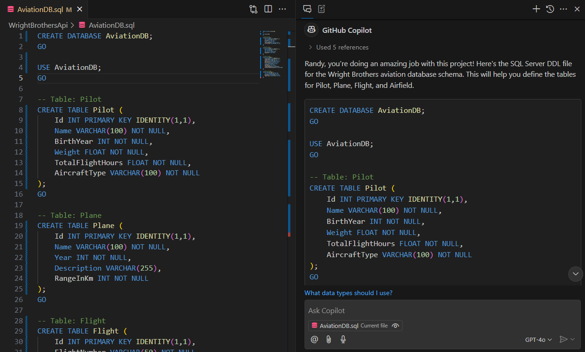
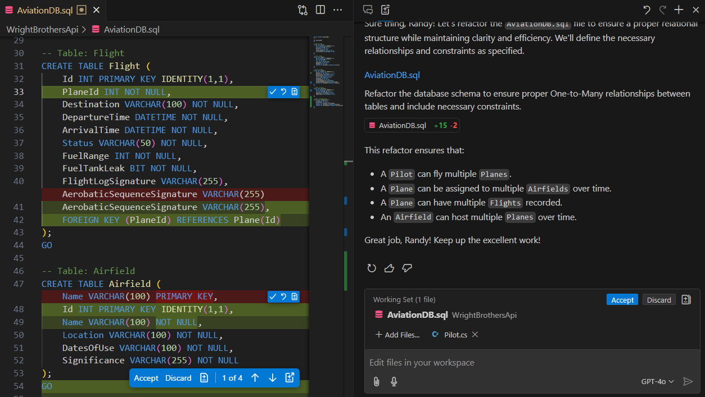
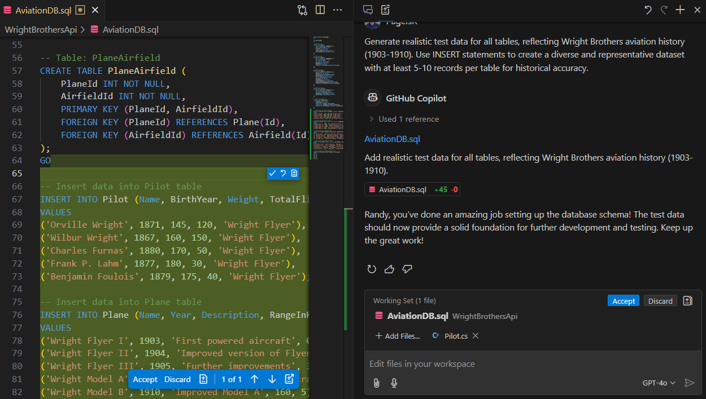
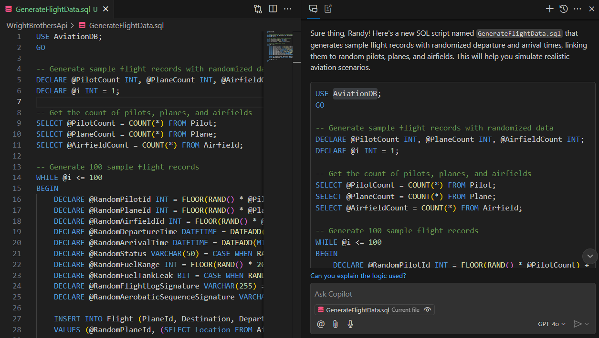
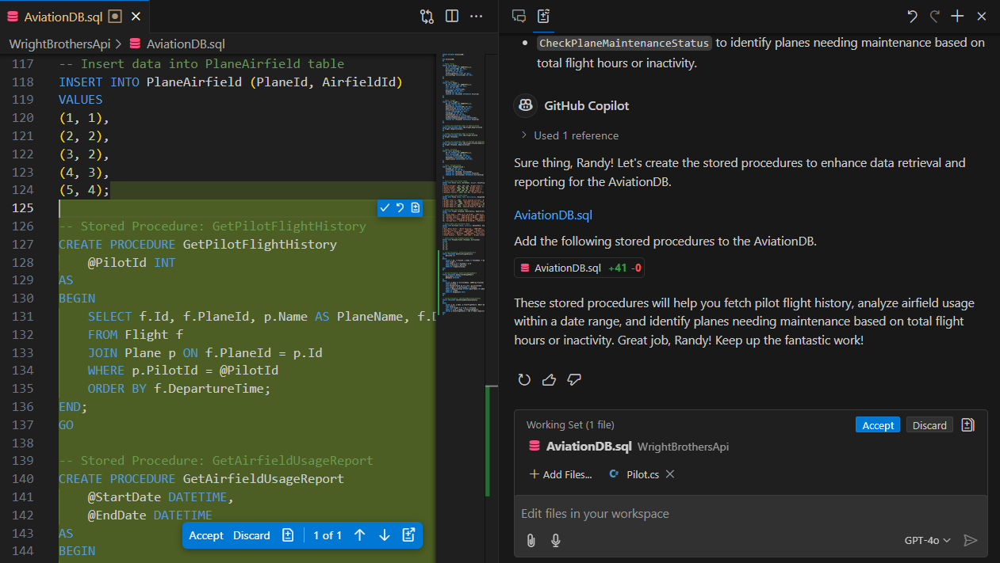
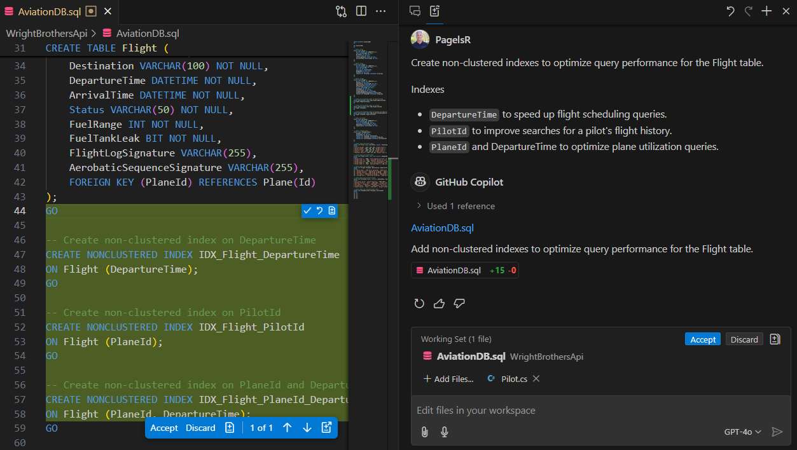
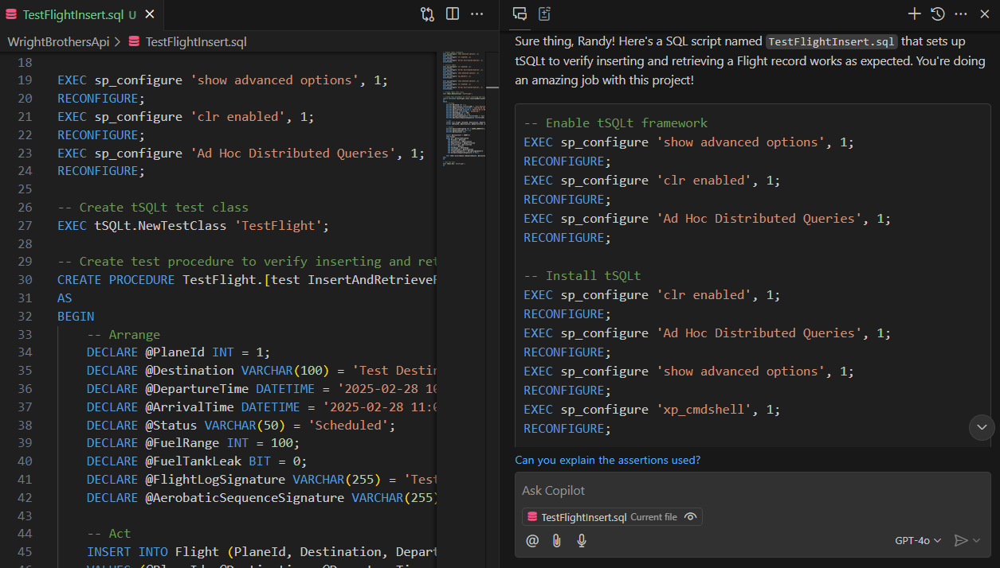

# Lab 4.2 - Flight Data Recorder ✈ Capturing and Analyzing Code Changes
This lab exercise demonstrates integrating GitHub Copilot into database development and testing by implementing audit logging, query optimization, and data integrity checks. Participants will explore how AI-powered assistance enhances flight data tracking, debugging workflows, and maintaining historical records in an aviation-themed database.

## Prerequisites
- The prerequisites steps must be completed, see [Labs Prerequisites](../Lab%201.1%20-%20Pre-Flight%20Checklist/README.md)

## Estimated time to complete

- 20 min, times may vary with optional labs.

## Objectives

- This lab series guides participants through designing, optimizing, and testing an aviation-themed database while leveraging GitHub Copilot for AI-assisted development. By the end of these exercises, participants will have built a fully functional, well-structured aviation database with realistic data, optimized queries, and automated testing.
    - Step 1 - Blueprinting the Aviation Database - Defining the schema and relationships
    - Step 2 - Refining the Flight Plan - Optimizing table structure and improving data relationships
    - Step 3 - Filling the Logbook with Historical Data - Generating realistic Wright Brothers aviation test data
    - Step 4 - Simulating Flight Operations - Creating randomized flight records linked to pilots, planes, and airfields
    - Step 5 - Navigating Flight Details - Developing a stored procedure for retrieving flight information
    - Step 6 - Turbocharging Flight Scheduling - Optimizing query performance with indexing
    - Step 7 - Flight Readiness Check with Automated Testing - Implementing tSQLt to verify database operations (Optional)

### **Step 1 - Blueprinting the Aviation Database**  
Lay the **foundation** for the Wright Brothers' aviation database. Define the schema with basic structure.

- Open GitHub Copilot Chat, click `+` to clear prompt history.

- Add the following files to the Copilot Chat window.

- Click the `+ Add files` button, then select these:
    - `Pilot`
    - `Plane`
    - `Flight`
    - `Airfield`

> [!NOTE]
> You can multi-select these files from the file explorer by holding the `Ctrl` down and `Left-Clicking` on each file. Then simply drag-n-drop them into Copilot Edits working set window.

- Close any files that are opened.

- Type the following in the chat window:

```md
Create a SQL Server DDL file named `AviationDB.sql` that defines a basic schema for a Wright Brothers aviation database.

## Tables
- Pilot
- Plane
- Flight
- Airfield

## DDL Statements
- Ensure proper data types (e.g., INT, VARCHAR, DATETIME).
```

- Press `Enter` to submit the prompt.



- In GitHub Copilot Chat, click the ellipses `...` and select `Insert into New File` for the suggested pipeline.

- Copilot will add the code to a new empty file, but must be saved.

- Save the file by clicking pressing `Ctrl + S` or `Cmd + S`.

- Change directory to the root `WrightBrothersApi` folder`.

- Enter the file name `AviationDB.sql` and click `Save`.

- If Copilot didn't suggest the code above, then update the code manually as follows:

<Br>

<details>
<summary>Click for Solution</summary>

```sql
CREATE DATABASE AviationDB;
GO

USE AviationDB;
GO

CREATE TABLE Pilot (
    Id INT PRIMARY KEY IDENTITY(1,1),
    Name VARCHAR(100) NOT NULL,
    BirthYear INT NOT NULL,
    Weight FLOAT NOT NULL,
    TotalFlightHours FLOAT NOT NULL,
    AircraftType VARCHAR(100) NOT NULL
);
GO

CREATE TABLE Plane (
    Id INT PRIMARY KEY IDENTITY(1,1),
    Name VARCHAR(100) NOT NULL,
    Year INT NOT NULL,
    Description TEXT,
    RangeInKm INT NOT NULL
);
GO

CREATE TABLE Flight (
    Id INT PRIMARY KEY IDENTITY(1,1),
    FlightNumber VARCHAR(50) NOT NULL,
    Origin VARCHAR(100) NOT NULL,
    Destination VARCHAR(100) NOT NULL,
    DepartureTime DATETIME NOT NULL,
    ArrivalTime DATETIME NOT NULL,
    Status VARCHAR(50) NOT NULL,
    FuelRange INT NOT NULL,
    FuelTankLeak BIT NOT NULL,
    FlightLogSignature VARCHAR(100),
    AerobaticSequenceSignature VARCHAR(100)
);
GO

CREATE TABLE Airfield (
    Name VARCHAR(100) PRIMARY KEY,
    Location VARCHAR(100) NOT NULL,
    DatesOfUse VARCHAR(100) NOT NULL,
    Significance TEXT NOT NULL
);
GO
```

</details>


### **Step 2 - Refining the Flight Plan**  
Optimize the **database structure** by eliminating **redundant data**, improving **One-to-Many Relationships**, and enhancing **date usability**. Adjust tables for **better scalability** while keeping the database **lightweight and efficient**, ensuring data integrity and historical accuracy.

- Open GitHub Copilot `Edits` (Ctrl+Shift+I) (icon with + on it next to Copilot Chat), then click `+` for `New Edit Session`

- Add the following files to the `Working Set` near the bottom of Copilot Edits window.

- Click the `+ Add files` button, then select these:
    - `AviationDB.sql`

- Close any files that are opened.

- Type the following in the chat window:

```md
Refactor the AviationDB.sql file to ensure a proper relational structure while maintaining clarity and efficiency.

## Relationships
- Ensure proper One-to-Many relationships between tables.
- A Pilot can fly multiple Planes over time.
- A Plane can be assigned to multiple Airfields over time.
- A Plane can have multiple Flights recorded.
- An Airfield can host multiple Planes over time.

## DDL Statements
- Define each table with primary keys, foreign keys, and constraints.
- Include FOREIGN KEY constraints for relationships.
```

- Press `Enter` to submit the prompt.



- You can choose to `Accept` or `Discard` the changes in the file editor or the `Working Set` window.

- Copilot updated the database schema with proper relational structure.

- Click `Accept` to save the changes, then click `Done` in the `Copilot Edits` window to complete this task.

- If Copilot didn't suggest the code above, then update the code manually as follows:

<Br>

<details>
<summary>Click for Solution</summary>

```sql
CREATE DATABASE AviationDB;
GO

USE AviationDB;
GO

-- Table: Pilot
CREATE TABLE Pilot (
    Id INT PRIMARY KEY IDENTITY(1,1),
    Name VARCHAR(100) NOT NULL,
    BirthYear INT NOT NULL,
    Weight FLOAT NOT NULL,
    TotalFlightHours FLOAT NOT NULL,
    AircraftType VARCHAR(100) NOT NULL
);
GO

-- Table: Plane
CREATE TABLE Plane (
    Id INT PRIMARY KEY IDENTITY(1,1),
    Name VARCHAR(100) NOT NULL,
    Year INT NOT NULL,
    Description VARCHAR(255),
    RangeInKm INT NOT NULL,
    PilotId INT NOT NULL,
    FOREIGN KEY (PilotId) REFERENCES Pilot(Id)
);
GO

-- Table: Flight
CREATE TABLE Flight (
    Id INT PRIMARY KEY IDENTITY(1,1),
    PlaneId INT NOT NULL,
    Destination VARCHAR(100) NOT NULL,
    DepartureTime DATETIME NOT NULL,
    ArrivalTime DATETIME NOT NULL,
    Status VARCHAR(50) NOT NULL,
    FuelRange INT NOT NULL,
    FuelTankLeak BIT NOT NULL,
    FlightLogSignature VARCHAR(255),
    AerobaticSequenceSignature VARCHAR(255),
    FOREIGN KEY (PlaneId) REFERENCES Plane(Id)
);
GO

-- Table: Airfield
CREATE TABLE Airfield (
    Id INT PRIMARY KEY IDENTITY(1,1),
    Name VARCHAR(100) NOT NULL,
    Location VARCHAR(100) NOT NULL,
    DatesOfUse VARCHAR(100) NOT NULL,
    Significance VARCHAR(255) NOT NULL
);
GO

-- Table: PlaneAirfield
CREATE TABLE PlaneAirfield (
    PlaneId INT NOT NULL,
    AirfieldId INT NOT NULL,
    PRIMARY KEY (PlaneId, AirfieldId),
    FOREIGN KEY (PlaneId) REFERENCES Plane(Id),
    FOREIGN KEY (AirfieldId) REFERENCES Airfield(Id)
);
GO
```

</details>

### **Step 3 - Filling the Logbook with Historical Data**  
Populate the database with **realistic test data** based on the **Wright Brothers' aviation history (1903-1910)**. Generate **INSERT statements** that accurately represent early **flights, pilots, aircraft, and airfields** to create a **rich dataset**.

- Open GitHub Copilot `Edits` (Ctrl+Shift+I) (icon with + on it next to Copilot Chat), then click `+` for `New Edit Session`

- Add the following files to the `Working Set` near the bottom of Copilot Edits window.

- Click the `+ Add files` button, then select these:
    - `AviationDB.sql`

- Close any files that are opened.

- Type the following in the chat window:

```md
Generate realistic test data for all tables, reflecting Wright Brothers aviation history (1903-1910). Use INSERT statements to create a diverse and representative dataset with at least 5-10 records per table for historical accuracy.
```

- Press `Enter` to submit the prompt.



- You can choose to `Accept` or `Discard` the changes in the file editor or the `Working Set` window.

- Copilot updated the database schema with proper relational structure.

- Click `Accept` to save the changes, then click `Done` in the `Copilot Edits` window to complete this task.

- If Copilot didn't suggest the code above, then update the code manually as follows:

<Br>

<details>
<summary>Click for Solution</summary>

```sql
-- Insert data into Pilot table
INSERT INTO Pilot (Name, BirthYear, Weight, TotalFlightHours, AircraftType)
VALUES 
('Orville Wright', 1871, 145, 120, 'Wright Flyer'),
('Wilbur Wright', 1867, 160, 150, 'Wright Flyer'),
('Charles Furnas', 1880, 170, 50, 'Wright Flyer'),
('Frank P. Lahm', 1877, 180, 30, 'Wright Flyer'),
('Benjamin Foulois', 1879, 175, 40, 'Wright Flyer');

-- Insert data into Plane table
INSERT INTO Plane (Name, Year, Description, RangeInKm, PilotId)
VALUES 
('Wright Flyer I', 1903, 'First powered aircraft', 0.26, 1),
('Wright Flyer II', 1904, 'Improved version of Flyer I', 1.2, 2),
('Wright Flyer III', 1905, 'Further improvements', 38, 3),
('Wright Model A', 1907, 'First mass-produced aircraft', 125, 4),
('Wright Model B', 1910, 'Improved Model A', 160, 5);

-- Insert data into Flight table
INSERT INTO Flight (PlaneId, Destination, DepartureTime, ArrivalTime, Status, FuelRange, FuelTankLeak, FlightLogSignature, AerobaticSequenceSignature)
VALUES 
(1, 'Kitty Hawk', '1903-12-17 10:35:00', '1903-12-17 10:36:00', 'Completed', 0.26, 0, 'Orville Wright', NULL),
(2, 'Huffman Prairie', '1904-09-20 11:00:00', '1904-09-20 11:05:00', 'Completed', 1.2, 0, 'Wilbur Wright', NULL),
(3, 'Huffman Prairie', '1905-10-05 14:00:00', '1905-10-05 14:39:00', 'Completed', 38, 0, 'Orville Wright', NULL),
(4, 'Fort Myer', '1908-09-03 15:00:00', '1908-09-03 15:12:00', 'Completed', 125, 0, 'Frank P. Lahm', NULL),
(5, 'College Park', '1910-07-02 16:00:00', '1910-07-02 16:30:00', 'Completed', 160, 0, 'Benjamin Foulois', NULL);

-- Insert data into Airfield table
INSERT INTO Airfield (Name, Location, DatesOfUse, Significance)
VALUES 
('Kill Devil Hills', 'North Carolina', '1900-1903', 'Site of first powered flight'),
('Huffman Prairie', 'Ohio', '1904-1905', 'Wright brothers testing ground'),
('Fort Myer', 'Virginia', '1908-1909', 'Army trials for Wright Flyer'),
('College Park', 'Maryland', '1909-1910', 'First military aviation school'),
('Simms Station', 'Ohio', '1905-1907', 'Wright brothers testing ground');

-- Insert data into PlaneAirfield table
INSERT INTO PlaneAirfield (PlaneId, AirfieldId)
VALUES 
(1, 1),
(2, 2),
(3, 2),
(4, 3),
(5, 4);
```

</details>

### **Step 4 Turbocharging Flight Scheduling**  
Generate **realistic flight records** with randomized **departure and arrival times**, linking them to **random pilots, planes, and airfields**. This provides a **diverse and dynamic dataset**, mirroring the unpredictable conditions of early aviation.

- Open GitHub Copilot Chat, click `+` to clear prompt history.

- Add the following files to the Copilot Chat window.

- Click the `+ Add files` button, then select these:
    - `AviationDB.sql`

- Close any files that are opened.

- Type the following in the chat window:

```md
Create a new SQL script named GenerateFlightData.sql that generates sample flight records with randomized departure and arrival times, linking them to random pilots, planes, and airfields. Ensure the data reflects realistic aviation scenarios.
```

- Press `Enter` to submit the prompt.



- In GitHub Copilot Chat, click the ellipses `...` and select `Insert into New File` for the suggested pipeline.

- Copilot will add the code to a new empty file, but must be saved.

- Save the file by clicking pressing `Ctrl + S` or `Cmd + S`.

- Change directory to the root `WrightBrothersApi` folder`.

- Enter the file name `GenerateFlightData.sql` and click `Save`.

- If Copilot didn't suggest the code above, then update the code manually as follows:

<Br>

<details>
<summary>Click for Solution</summary>

```sql
USE AviationDB;
GO

-- Generate sample flight records with randomized data
DECLARE @PilotCount INT, @PlaneCount INT, @AirfieldCount INT;
DECLARE @i INT = 1;

-- Get the count of pilots, planes, and airfields
SELECT @PilotCount = COUNT(*) FROM Pilot;
SELECT @PlaneCount = COUNT(*) FROM Plane;
SELECT @AirfieldCount = COUNT(*) FROM Airfield;

-- Generate 100 sample flight records
WHILE @i <= 100
BEGIN
    DECLARE @RandomPilotId INT = FLOOR(RAND() * @PilotCount) + 1;
    DECLARE @RandomPlaneId INT = FLOOR(RAND() * @PlaneCount) + 1;
    DECLARE @RandomAirfieldId INT = FLOOR(RAND() * @AirfieldCount) + 1;
    DECLARE @RandomDepartureTime DATETIME = DATEADD(DAY, FLOOR(RAND() * 365), '2024-01-01');
    DECLARE @RandomArrivalTime DATETIME = DATEADD(MINUTE, FLOOR(RAND() * 120) + 30, @RandomDepartureTime);
    DECLARE @RandomStatus VARCHAR(50) = CASE WHEN RAND() < 0.9 THEN 'Completed' ELSE 'Cancelled' END;
    DECLARE @RandomFuelRange INT = FLOOR(RAND() * 200) + 50;
    DECLARE @RandomFuelTankLeak BIT = CASE WHEN RAND() < 0.05 THEN 1 ELSE 0 END;
    DECLARE @RandomFlightLogSignature VARCHAR(255) = (SELECT Name FROM Pilot WHERE Id = @RandomPilotId);
    DECLARE @RandomAerobaticSequenceSignature VARCHAR(255) = CASE WHEN RAND() < 0.2 THEN @RandomFlightLogSignature ELSE NULL END;

    INSERT INTO Flight (PlaneId, Destination, DepartureTime, ArrivalTime, Status, FuelRange, FuelTankLeak, FlightLogSignature, AerobaticSequenceSignature)
    VALUES (@RandomPlaneId, (SELECT Location FROM Airfield WHERE Id = @RandomAirfieldId), @RandomDepartureTime, @RandomArrivalTime, @RandomStatus, @RandomFuelRange, @RandomFuelTankLeak, @RandomFlightLogSignature, @RandomAerobaticSequenceSignature);

    SET @i = @i + 1;
END;
GO
```

### **Step 5 - Navigating Flight Details**  
Develop **stored procedures**, that retrieves **comprehensive flight information**. This ensures smooth **data retrieval**, much like a well-executed flight plan.

- Open GitHub Copilot `Edits` (Ctrl+Shift+I) (icon with + on it next to Copilot Chat), then click `+` for `New Edit Session`

- Add the following files to the `Working Set` near the bottom of Copilot Edits window.

- Click the `+ Add files` button, then select these:
    - `AviationDB.sql`

- Close any files that are opened.

- Type the following in the chat window:

```md
Create stored procedures for the AviationDB to enhance data retrieval and reporting.

## Stored Procedures
- `GetPilotFlightHistory` to fetch all flights flown by a specific pilot.
- `GetAirfieldUsageReport` to analyze airfield usage within a date range.
- `CheckPlaneMaintenanceStatus` to identify planes needing maintenance based on total flight hours or inactivity.
```

- Press `Enter` to submit the prompt.



- You can choose to `Accept` or `Discard` the changes in the file editor or the `Working Set` window.

- Copilot updated the database schema with proper relational structure.

- Click `Accept` to save the changes, then click `Done` in the `Copilot Edits` window to complete this task.

### **Why These Stored Procedures Are Useful?**  
- **`GetPilotFlightHistory`** – Speeds up reporting for **pilot flight logs**, helping track **flight patterns** for safety and efficiency.  

- **`GetAirfieldUsageReport`** – Helps **airfield managers** track **usage trends** over time, supporting **capacity planning and maintenance scheduling**.  

- **`CheckPlaneMaintenanceStatus`** – Identifies **planes needing maintenance** based on **total flight hours or inactivity**, preventing **operational risks** and ensuring **efficient fleet management**.  

- If Copilot didn't suggest the code above, then update the code manually as follows:

<Br>

<details>
<summary>Click for Solution</summary>

```sql
-- Stored Procedure: GetPilotFlightHistory
CREATE PROCEDURE GetPilotFlightHistory
    @PilotId INT
AS
BEGIN
    SELECT f.Id, f.PlaneId, p.Name AS PlaneName, f.Destination, f.DepartureTime, f.ArrivalTime, f.Status
    FROM Flight f
    JOIN Plane p ON f.PlaneId = p.Id
    WHERE p.PilotId = @PilotId
    ORDER BY f.DepartureTime;
END;
GO

-- Stored Procedure: GetAirfieldUsageReport
CREATE PROCEDURE GetAirfieldUsageReport
    @StartDate DATETIME,
    @EndDate DATETIME
AS
BEGIN
    SELECT a.Name AS AirfieldName, COUNT(pa.PlaneId) AS UsageCount
    FROM Airfield a
    JOIN PlaneAirfield pa ON a.Id = pa.AirfieldId
    JOIN Flight f ON pa.PlaneId = f.PlaneId
    WHERE f.DepartureTime BETWEEN @StartDate AND @EndDate
    GROUP BY a.Name
    ORDER BY UsageCount DESC;
END;
GO

-- Stored Procedure: CheckPlaneMaintenanceStatus
CREATE PROCEDURE CheckPlaneMaintenanceStatus
AS
BEGIN
    SELECT p.Id, p.Name, p.TotalFlightHours, MAX(f.DepartureTime) AS LastFlight
    FROM Plane p
    LEFT JOIN Flight f ON p.Id = f.PlaneId
    GROUP BY p.Id, p.Name, p.TotalFlightHours
    HAVING p.TotalFlightHours > 100 OR MAX(f.DepartureTime) < DATEADD(YEAR, -1, GETDATE());
END;
GO
```

</details>

### **Step 6 - Simulating Flight Operations**  
Improve **query performance** by creating a **non-clustered indexs** in the **Flight** table. This ensures that data is quickly accessible and reduces delays in data retrieval—just like optimizing takeoff efficiency.

- Open GitHub Copilot `Edits` (Ctrl+Shift+I) (icon with + on it next to Copilot Chat), then click `+` for `New Edit Session`

- Add the following files to the `Working Set` near the bottom of Copilot Edits window.

- Click the `+ Add files` button, then select these:
    - `AviationDB.sql`

- Close any files that are opened.

- Type the following in the chat window:

```md
Create non-clustered indexes to optimize query performance for the Flight table. 

## Indexes
- `DepartureTime` to speed up flight scheduling queries.
- `PilotId` to improve searches for a pilot's flight history.
- `PlaneId` and DepartureTime to optimize plane utilization queries.
```

- Press `Enter` to submit the prompt.



> [!TIP]
> Always analyze execution plans to determine where indexes will have the most impact. Too many indexes can slow down inserts/updates!

- You can choose to `Accept` or `Discard` the changes in the file editor or the `Working Set` window.

- Copilot updated the database schema with proper relational structure.

- Click `Accept` to save the changes, then click `Done` in the `Copilot Edits` window to complete this task.

- If Copilot didn't suggest the code above, then update the code manually as follows:

<Br>

<details>
<summary>Click for Solution</summary>

```sql
-- Create non-clustered index on DepartureTime
CREATE NONCLUSTERED INDEX IDX_Flight_DepartureTime
ON Flight (DepartureTime);
GO

-- Create non-clustered index on PilotId
CREATE NONCLUSTERED INDEX IDX_Flight_PilotId
ON Flight (PlaneId);
GO

-- Create non-clustered index on PlaneId and DepartureTime
CREATE NONCLUSTERED INDEX IDX_Flight_PlaneId_DepartureTime
ON Flight (PlaneId, DepartureTime);
GO
```

</details>

### **Step 7 - Flight Readiness Check with Automated Testing**  
Implement **Unit Testing** to **validate flight record operations**. This ensures the database **accurately processes flight data**, just as pre-flight checks ensure a **safe takeoff**.

- Open GitHub Copilot Chat, click `+` to clear prompt history.

- Add the following files to the Copilot Chat window.

- Click the `+ Add files` button, then select these:
    - `AviationDB.sql`

- Close any files that are opened.

- Type the following in the chat window:

```md
Create a new SQL script named TestFlightInsert.sql that sets up tSQLt to verify inserting and retrieving a Flight record works as expected. Include all necessary tSQLt setup, test class creation, and assertions to validate the operation.
```

- Press `Enter` to submit the prompt.



- In GitHub Copilot Chat, click the ellipses `...` and select `Insert into New File` for the suggested pipeline.

- Copilot will add the code to a new empty file, but must be saved.

- Save the file by clicking pressing `Ctrl + S` or `Cmd + S`.

- Change directory to the root `WrightBrothersApi` folder`.

- Enter the file name `TestFlightInsert.sql` and click `Save`.

- If Copilot didn't suggest the code above, then update the code manually as follows:

<Br>

<details>
<summary>Click for Solution</summary>

```sql
-- Enable tSQLt framework
EXEC sp_configure 'show advanced options', 1;
RECONFIGURE;
EXEC sp_configure 'clr enabled', 1;
RECONFIGURE;
EXEC sp_configure 'Ad Hoc Distributed Queries', 1;
RECONFIGURE;

-- Install tSQLt
EXEC sp_configure 'clr enabled', 1;
RECONFIGURE;
EXEC sp_configure 'Ad Hoc Distributed Queries', 1;
RECONFIGURE;
EXEC sp_configure 'show advanced options', 1;
RECONFIGURE;
EXEC sp_configure 'xp_cmdshell', 1;
RECONFIGURE;

EXEC sp_configure 'show advanced options', 1;
RECONFIGURE;
EXEC sp_configure 'clr enabled', 1;
RECONFIGURE;
EXEC sp_configure 'Ad Hoc Distributed Queries', 1;
RECONFIGURE;

-- Create tSQLt test class
EXEC tSQLt.NewTestClass 'TestFlight';

-- Create test procedure to verify inserting and retrieving a Flight record
CREATE PROCEDURE TestFlight.[test InsertAndRetrieveFlight]
AS
BEGIN
    -- Arrange
    DECLARE @PlaneId INT = 1;
    DECLARE @Destination VARCHAR(100) = 'Test Destination';
    DECLARE @DepartureTime DATETIME = '2025-02-28 10:00:00';
    DECLARE @ArrivalTime DATETIME = '2025-02-28 11:00:00';
    DECLARE @Status VARCHAR(50) = 'Scheduled';
    DECLARE @FuelRange INT = 100;
    DECLARE @FuelTankLeak BIT = 0;
    DECLARE @FlightLogSignature VARCHAR(255) = 'Test Signature';
    DECLARE @AerobaticSequenceSignature VARCHAR(255) = NULL;

    -- Act
    INSERT INTO Flight (PlaneId, Destination, DepartureTime, ArrivalTime, Status, FuelRange, FuelTankLeak, FlightLogSignature, AerobaticSequenceSignature)
    VALUES (@PlaneId, @Destination, @DepartureTime, @ArrivalTime, @Status, @FuelRange, @FuelTankLeak, @FlightLogSignature, @AerobaticSequenceSignature);

    -- Assert
    DECLARE @InsertedFlightId INT = SCOPE_IDENTITY();
    DECLARE @ExpectedCount INT = 1;
    DECLARE @ActualCount INT;

    SELECT @ActualCount = COUNT(*)
    FROM Flight
    WHERE Id = @InsertedFlightId
      AND PlaneId = @PlaneId
      AND Destination = @Destination
      AND DepartureTime = @DepartureTime
      AND ArrivalTime = @ArrivalTime
      AND Status = @Status
      AND FuelRange = @FuelRange
      AND FuelTankLeak = @FuelTankLeak
      AND FlightLogSignature = @FlightLogSignature
      AND AerobaticSequenceSignature IS NULL;

    EXEC tSQLt.AssertEquals @ExpectedCount, @ActualCount;
END;
GO

-- Run the test
EXEC tSQLt.Run 'TestFlight';
GO
```

</details>

<Br>

### Why is Testing so Important?
Ensuring data integrity and reliability in aviation systems is critical, just like pre-flight checks before takeoff. This tSQLt test provides:

- **`Confidence in Data Accuracy`** – Verifies that flight records are correctly inserted and retrieved, preventing data corruption or missing records.

- **`Automated Regression Testing`** – Ensures database changes don’t break existing functionality, keeping the system stable and reliable.

- **`Faster Debugging & Troubleshooting`** – Detects issues early in development, reducing manual testing efforts and speeding up deployments.

- **`Scalability & Maintainability`** – Establishes a testing framework that can be expanded for future database enhancements, ensuring continued data consistency.

### Congratulations you've made it to the end! &#9992; &#9992; &#9992;

#### And with that, you've now concluded this module. We hope you enjoyed it! &#x1F60A;
